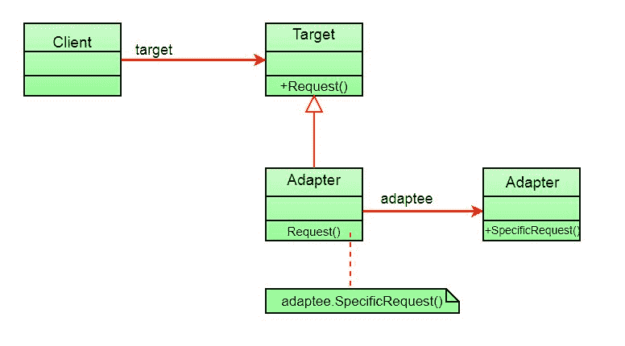
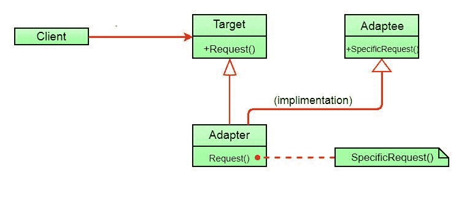

# 适配器模式

> 原文:[https://www.geeksforgeeks.org/adapter-pattern/](https://www.geeksforgeeks.org/adapter-pattern/)

这种模式很容易理解，因为现实世界充满了适配器。例如，考虑一个 USB 到以太网适配器。当我们一端有以太网接口，另一端有 USB 接口时，我们就需要这个。因为它们彼此不相容。我们使用将一个转换成另一个的适配器。这个例子非常类似于面向对象适配器。在设计中，当我们有一个类(客户端)期望某种类型的对象，而我们有一个对象(适配器)提供相同的功能，但公开不同的接口时，就使用适配器。

要使用适配器:

1.  客户端通过使用目标接口调用适配器上的方法向适配器发出请求。
2.  适配器使用适配器接口在适配器上翻译该请求。
3.  客户端接收调用的结果，并且不知道适配器的存在。

***定义:***

适配器模式将一个类的接口转换成客户端期望的另一个接口。适配器允许类一起工作，否则由于不兼容的接口而无法工作。

**类图:**


客户端只看到目标接口，而看不到适配器。适配器实现目标接口。适配器将所有请求委托给适配器。

**示例:**

假设您有一个带有 fly()和 makeSound()方法的 Bird 类。还有一个带有 squeak()方法的 ToyDuck 类。让我们假设您缺少玩具鸭对象，并且您希望使用鸟对象来代替它们。Birds 有一些类似的功能，但是实现了不同的接口，所以我们不能直接使用它们。所以我们将使用适配器模式。在这里，我们的客户将是玩具鸭，改编者将是伯德。

下面是它的 Java 实现。

```
// Java implementation of Adapter pattern

interface Bird
{
    // birds implement Bird interface that allows
    // them to fly and make sounds adaptee interface
    public void fly();
    public void makeSound();
}

class Sparrow implements Bird
{
    // a concrete implementation of bird
    public void fly()
    {
        System.out.println("Flying");
    }
    public void makeSound()
    {
        System.out.println("Chirp Chirp");
    }
}

interface ToyDuck
{
    // target interface
    // toyducks dont fly they just make
    // squeaking sound
    public void squeak();
}

class PlasticToyDuck implements ToyDuck
{
    public void squeak()
    {
        System.out.println("Squeak");
    }
}

class BirdAdapter implements ToyDuck
{
    // You need to implement the interface your
    // client expects to use.
    Bird bird;
    public BirdAdapter(Bird bird)
    {
        // we need reference to the object we
        // are adapting
        this.bird = bird;
    }

    public void squeak()
    {
        // translate the methods appropriately
        bird.makeSound();
    }
}

class Main
{
    public static void main(String args[])
    {
        Sparrow sparrow = new Sparrow();
        ToyDuck toyDuck = new PlasticToyDuck();

        // Wrap a bird in a birdAdapter so that it 
        // behaves like toy duck
        ToyDuck birdAdapter = new BirdAdapter(sparrow);

        System.out.println("Sparrow...");
        sparrow.fly();
        sparrow.makeSound();

        System.out.println("ToyDuck...");
        toyDuck.squeak();

        // toy duck behaving like a bird 
        System.out.println("BirdAdapter...");
        birdAdapter.squeak();
    }
}
```

输出:

```
Sparrow...
Flying
Chirp Chirp
ToyDuck...
Squeak
BirdAdapter...
Chirp Chirp
```

**解释:**
假设我们有一只会发声的鸟()，我们有一只会吱吱叫的塑料玩具鸭()。现在假设我们的客户改变了需求，他想让玩具鸭发出声音？
简单的解决方案是，我们只需将实现类更改为新的适配器类，并告诉客户端将 bird 的实例(它想要 squeak())传递给该类。
**之前:**toy duck toy duck = new plastic toy duck()；
**后:**toy duck toy duck = new bird adapter(麻雀)；
你可以看到，只改变一行，玩具鸭现在就可以做唧唧喳喳！！

**对象适配器 Vs 类适配器**
我们上面实现的适配器模式被称为对象适配器模式，因为适配器持有 adaptee 的一个实例。还有一种类型叫做类适配器模式，它使用继承而不是合成，但是您需要多个继承来实现它。
类适配器模式的类图:



这里，适配器(组合)中没有 adaptee 对象来利用它的功能，而是继承 adaptee。

由于多重继承不被包括 java 在内的许多语言所支持，并且与许多问题相关联，所以我们没有展示使用类适配器模式的实现。

**优势:**

*   有助于实现可重用性和灵活性。
*   客户端类并不因为必须使用不同的接口而变得复杂，并且可以使用多态性在不同的适配器实现之间进行交换。

**缺点:**

*   所有请求都被转发，因此开销略有增加。
*   有时，为了达到所需的类型，需要沿着适配器链进行许多调整。

**进一步阅读:**[Python 中的适配器方法](https://www.geeksforgeeks.org/adapter-method-python-design-patterns/)

**参考文献:**
首个设计模式(书籍)

本文由**苏拉布·库马尔供稿。**如果你喜欢 GeeksforGeeks 并想投稿，你也可以写一篇文章，把你的文章邮寄到 review-team@geeksforgeeks.org。看到你的文章出现在极客博客主页上，帮助其他极客。

如果您发现任何不正确的地方，或者您想分享关于上面讨论的主题的更多信息，请写评论