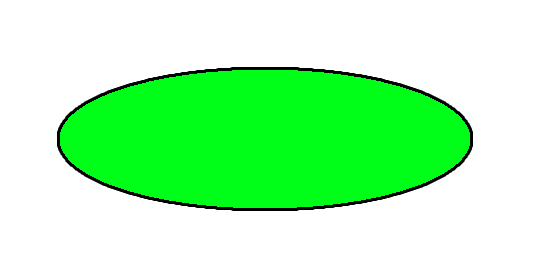
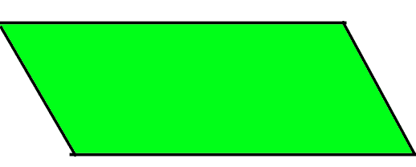
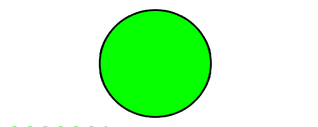
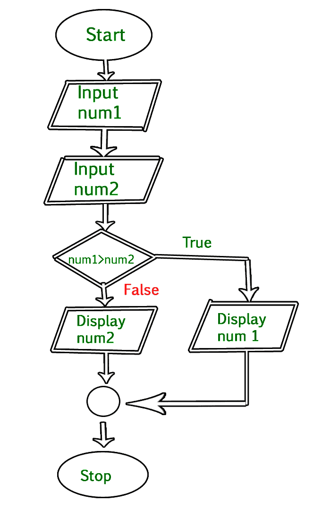

# 流程图介绍

> 原文:[https://www . geeksforgeeks . org/an-简介-流程图/](https://www.geeksforgeeks.org/an-introduction-to-flowcharts/)

**什么是流程图？**
流程图是算法的图形表示。程序员经常使用它作为解决问题的程序规划工具。它利用相互连接的符号来表示信息的流动和处理。
为算法绘制流程图的过程称为“流程图”。

**流程图设计中使用的基本符号**

1.  **终端:**椭圆形符号表示程序逻辑流程中的开始、停止和暂停。在某些错误条件下，暂停/暂停通常用在程序逻辑中。终端是流程图中的第一个和最后一个符号。



*   **输入/输出:**平行四边形表示任何输入/输出类型的函数。从输入设备获取输入并在输出设备上显示输出的程序指令在流程图中用平行四边形表示。



*   **处理:**一个方框代表算术指令。所有算术过程，如加、减、乘、除，都用动作或过程符号表示。


*   **决策**菱形符号代表决策点。流程图中的菱形表示基于决策的操作，如是/否问题或真/假。


*   **连接符:**每当流程图变得复杂或扩展到一页以上时，使用连接符来避免混淆是很有用的。它用一个圆来表示。



*   **流程线:**流程线表示指令执行的确切顺序。箭头表示控制流的方向和流程图不同符号之间的关系。

**流程图优势:**

*   流程图是传达系统逻辑的更好方式。
*   流程图在程序设计过程中充当蓝图的向导。
*   流程图有助于调试过程。
*   借助流程图，程序可以很容易地被分析。
*   它提供了更好的文档。
*   流程图是一个很好的文档。

**流程图的缺点:**

*   大型复杂程序很难画出流程图。
*   在这方面，他们没有标准来确定细节的数量。
*   难以重现流程图。
*   修改流程图非常困难。

**示例:** **画流程图输入用户两个数字，显示两个数字中最大的**



## C

```
// C program to find largest of two numbers

#include <stdio.h>

int main()
{
    int num1, num2, largest;

    /*Input two numbers*/
    printf("Enter two numbers:\n");
    scanf("%d%d", &num1, &num2);

    /*check if a is greater than b*/
    if (num1 > num2)
        largest = num1;
    else
        largest = num2;

    /*Print the largest number*/
    printf("%d", largest);

    return 0;
}
```

## C++

```
// C++ program to find largest of two numbers
#include <iostream>
using namespace std;
int main()
{
    int num1, num2, largest;

    /*Input two numbers*/
    cout << "Enter two numbers:\n";
    cin >> num1;
    cin >> num2;

    /*check if a is greater than b*/
    if (num1 > num2)
        largest = num1;
    else
        largest = num2;

    /*Print the largest number*/
    cout << largest;

    return 0;
}
```

## Java 语言(一种计算机语言，尤用于创建网站)

```
// Java program to find largest of two numbers
import java.util.Scanner;
public class largest {
    public static void main(String args[])
    {
        int num1, num2, max;

        /*Input two numbers*/
        Scanner sc = new Scanner(System.in);
        System.out.println("Enter two numbers:");

        num1 = sc.nextInt();
        num2 = sc.nextInt();

        /*check whether a is greater than b or not*/
        if (num1 > num2)
            max = num1;
        else
            max = num2;

        /*Print the largest number*/
        System.out.println(max);
    }
}
```

## C#

```
// C# program to find largest of two numbers
using System;
using System.IO;

class GFG
{
    static public void Main ()
    {

        int num1, num2, max;

        /*Input two numbers*/
        Console.WriteLine("Enter two numbers:");

        num1 = Convert.ToInt32(Console.ReadLine());
        num2 = Convert.ToInt32(Console.ReadLine());

        /*check whether a is greater than b or not*/
        if (num1 > num2)
            max = num1;
        else
            max = num2;

        /*Print the largest number*/
        Console.WriteLine(max);
    }
}

// This code is contributed by NamrataSrivastava1
```

**输出**

```
Enter two numbers:
10 30
30
```

**参考文献:**
帕拉德普·k·辛哈和普里蒂·辛哈的《计算机基础》