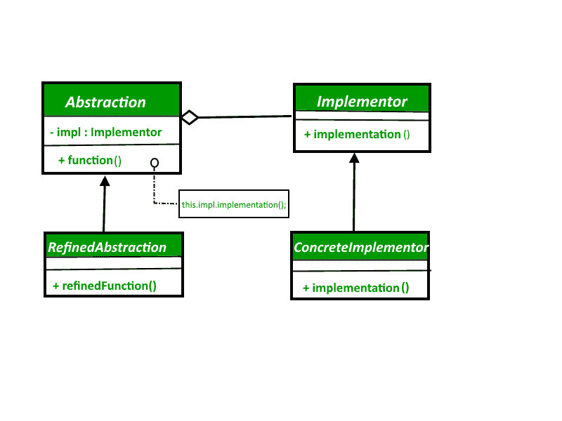
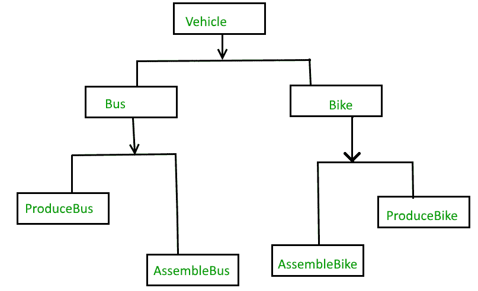
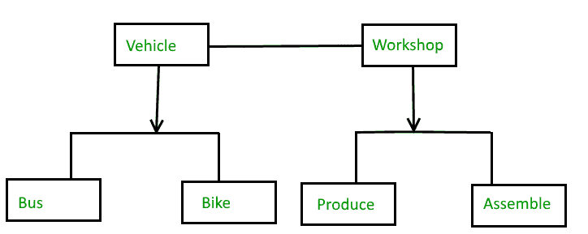

# 桥梁设计模式

> 原文:[https://www.geeksforgeeks.org/bridge-design-pattern/](https://www.geeksforgeeks.org/bridge-design-pattern/)

Bridge 设计模式允许您将抽象与实现分开。它是一种结构设计模式。

**桥梁设计模式有 2 个部分:**

1.  抽象
2.  履行

这是一种在接口类内部封装实现类的设计机制。

*   桥模式允许抽象和实现独立开发，客户端代码只能访问抽象部分，而不关心实现部分。
*   抽象是接口或抽象类，实现者也是接口或抽象类。
*   抽象包含对实现者的引用。抽象的子代被称为精炼的抽象，实现者的子代是具体的实现者。因为我们可以更改抽象中对实现者的引用，所以我们可以在运行时更改抽象的实现者。对实现者的更改不会影响客户端代码。
*   它增加了类抽象及其实现之间的松散耦合。

**桥梁设计模式 UML 图**



**桥梁设计模式要素**

*   **抽象**——桥梁设计模式的核心，定义症结所在。包含对实现者的引用。
*   **细化抽象**–扩展抽象，将更精细的细节降低一级。对实现者隐藏更好的元素。
*   **实现者**–定义实现类的接口。这个接口不需要直接对应抽象接口，可以有很大的不同。抽象 imp 根据实现者接口提供的操作来提供实现。
*   **具体实现**–通过提供具体实现来实现上述实现者。

**我们来看一个桥梁设计模式的例子:**

## Java 语言(一种计算机语言，尤用于创建网站)

```
// Java code to demonstrate
// bridge design pattern

// abstraction in bridge pattern
abstract class Vehicle {
    protected Workshop workShop1;
    protected Workshop workShop2;

    protected Vehicle(Workshop workShop1, Workshop workShop2)
    {
        this.workShop1 = workShop1;
        this.workShop2 = workShop2;
    }

    abstract public void manufacture();
}

// Refine abstraction 1 in bridge pattern
class Car extends Vehicle {
    public Car(Workshop workShop1, Workshop workShop2)
    {
        super(workShop1, workShop2);
    }

    @Override
    public void manufacture()
    {
        System.out.print("Car ");
        workShop1.work();
        workShop2.work();
    }
}

// Refine abstraction 2 in bridge pattern
class Bike extends Vehicle {
    public Bike(Workshop workShop1, Workshop workShop2)
    {
        super(workShop1, workShop2);
    }

    @Override
    public void manufacture()
    {
        System.out.print("Bike ");
        workShop1.work();
        workShop2.work();
    }
}

// Implementor for bridge pattern
interface Workshop
{
    abstract public void work();
}

// Concrete implementation 1 for bridge pattern
class Produce implements Workshop {
    @Override
    public void work()
    {
        System.out.print("Produced");
    }
}

// Concrete implementation 2 for bridge pattern
class Assemble implements Workshop {
    @Override
    public void work()
    {
        System.out.print(" And");
        System.out.println(" Assembled.");
    }
}

// Demonstration of bridge design pattern
class BridgePattern {
    public static void main(String[] args)
    {
        Vehicle vehicle1 = new Car(new Produce(), new Assemble());
        vehicle1.manufacture();
        Vehicle vehicle2 = new Bike(new Produce(), new Assemble());
        vehicle2.manufacture();
    }
}
```

输出:

```
Car Produced And Assembled.
Bike Produced And Assembled.
```

在这里，我们使用 Bridge 设计模式生产和组装两种不同的车辆。

**当我们需要桥梁设计图案时**

Bridge 模式是旧建议的应用，“重组合轻继承”。当您必须以相互正交的方式对不同的时间进行子类化时，这就变得很方便了。
例如，上面的例子也可以这样做:

**无桥设计模式**



但是上面的解决方案有一个问题。如果您想更改总线类，那么您可能最终也会更改生产总线和组装总线，如果更改是车间特定的，那么您可能也需要更改自行车类。

**带桥设计图案**

您可以通过以下方式分离车辆和车间接口来解决上述问题。



**优势**

1.  桥模式将抽象与其实现解耦，因此两者可以独立变化。
2.  它主要用于实现平台无关特性。
3.  它增加了一个方法级重定向来实现这个目标。
4.  在单独的继承层次结构中发布抽象接口，并将实现放在自己的继承层次结构中。
5.  使用桥模式来实现运行时绑定。
6.  使用桥模式映射正交类层次结构
7.  Bridge 是预先设计的，让抽象和实现独立变化。

**进一步阅读:**Python 中的[桥法](https://www.geeksforgeeks.org/bridge-method-python-design-patterns/)

本文由 [**Saket Kumar**](https://github.com/saketkumar95) 供稿。如果你喜欢 GeeksforGeeks 并想投稿，你也可以使用[write.geeksforgeeks.org](https://write.geeksforgeeks.org)写一篇文章或者把你的文章邮寄到 review-team@geeksforgeeks.org。看到你的文章出现在极客博客主页上，帮助其他极客。
如果发现有不正确的地方，或者想分享更多关于上述话题的信息，请写评论。