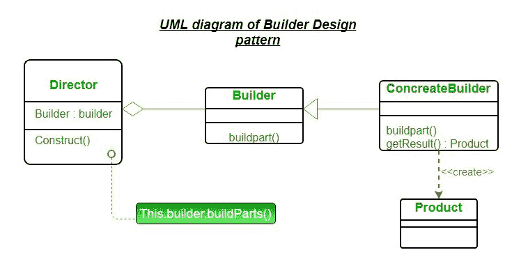

# 建造者设计模式

> 原文:[https://www.geeksforgeeks.org/builder-design-pattern/](https://www.geeksforgeeks.org/builder-design-pattern/)

构建器模式旨在“将复杂对象的构建与其表示分离，以便相同的构建过程可以创建不同的表示。”它用于逐步构造复杂的对象，最后一步将返回该对象。构建对象的过程应该是通用的，以便可以用来创建同一对象的不同表示。

**构建器设计模式的 UML 图**



资料来源:[维基百科](https://en.wikipedia.org/wiki/Builder_pattern)

*   **产品–**产品类定义了构建器模式要生成的复杂对象的类型。
*   **Builder–**这个抽象基类定义了正确创建产品必须采取的所有步骤。每个步骤通常都是抽象的，因为构建器的实际功能是在具体的子类中实现的。GetProduct 方法用于返回最终产品。生成器类经常被简单的接口所取代。
*   **混凝土构建器–**可能有任意数量的混凝土构建器类继承自构建器。这些类包含创建特定复杂产品的功能。
*   **Director–**Director 类控制生成最终产品对象的算法。控制器对象被实例化，并调用其构造方法。该方法包括一个参数，用于捕获将用于生成产品的特定具体生成器对象。然后，控制器以正确的顺序调用具体构建器的方法来生成产品对象。完成该过程后，可以使用 builder 对象的 GetProduct 方法返回产品。

**我们来看一个 Builder 设计模式的例子:**
考虑一个家的建造。家是最终的最终产品(对象)，它将作为构建过程的输出返回。它将有许多步骤，如地下室建设，墙壁建设，等等屋顶建设。最后，返回整个 home 对象。在这里，使用相同的过程，你可以建造具有不同属性的房屋。

## Java 语言(一种计算机语言，尤用于创建网站)

```
interface HousePlan
{
    public void setBasement(String basement);

    public void setStructure(String structure);

    public void setRoof(String roof);

    public void setInterior(String interior);
}

class House implements HousePlan
{

    private String basement;
    private String structure;
    private String roof;
    private String interior;

    public void setBasement(String basement)
    {
        this.basement = basement;
    }

    public void setStructure(String structure)
    {
        this.structure = structure;
    }

    public void setRoof(String roof)
    {
        this.roof = roof;
    }

    public void setInterior(String interior)
    {
        this.interior = interior;
    }

}

interface HouseBuilder
{

    public void buildBasement();

    public void buildStructure();

    public void buildRoof();

    public void buildInterior();

    public House getHouse();
}

class IglooHouseBuilder implements HouseBuilder
{
    private House house;

    public IglooHouseBuilder()
    {
        this.house = new House();
    }

    public void buildBasement()
    {
        house.setBasement("Ice Bars");
    }

    public void buildStructure()
    {
        house.setStructure("Ice Blocks");
    }

    public void buildInterior()
    {
        house.setInterior("Ice Carvings");
    }

    public void buildRoof()
    {
        house.setRoof("Ice Dome");
    }

    public House getHouse()
    {
        return this.house;
    }
}

class TipiHouseBuilder implements HouseBuilder
{
    private House house;

    public TipiHouseBuilder()
    {
        this.house = new House();
    }

    public void buildBasement()
    {
        house.setBasement("Wooden Poles");
    }

    public void buildStructure()
    {
        house.setStructure("Wood and Ice");
    }

    public void buildInterior()
    {
        house.setInterior("Fire Wood");
    }

    public void buildRoof()
    {
        house.setRoof("Wood, caribou and seal skins");
    }

    public House getHouse()
    {
        return this.house;
    }

}

class CivilEngineer
{

    private HouseBuilder houseBuilder;

    public CivilEngineer(HouseBuilder houseBuilder)
    {
        this.houseBuilder = houseBuilder;
    }

    public House getHouse()
    {
        return this.houseBuilder.getHouse();
    }

    public void constructHouse()
    {
        this.houseBuilder.buildBasement();
        this.houseBuilder.buildStructure();
        this.houseBuilder.buildRoof();
        this.houseBuilder.buildInterior();
    }
}

class Builder
{
    public static void main(String[] args)
    {
        HouseBuilder iglooBuilder = new IglooHouseBuilder();
        CivilEngineer engineer = new CivilEngineer(iglooBuilder);

        engineer.constructHouse();

        House house = engineer.getHouse();

        System.out.println("Builder constructed: "+ house);
    }
}
```

输出:

```
Builder constructed: House@6d06d69c
```

**建设者设计模式的优势**

*   构造函数的参数被减少，并在可读性很高的方法调用中提供。
*   生成器设计模式还有助于最小化构造函数中的参数数量，因此不需要将可选参数的 null 传递给构造函数。
*   对象总是以完整的状态实例化
*   在对象构建过程中，不可变对象可以在没有太多复杂逻辑的情况下构建。

**建造者设计模式的缺点**

*   在构建器模式中，代码行数至少增加了一倍，但是在设计灵活性和更易读的代码方面，这种努力是有回报的。
*   需要为每种不同类型的产品创建单独的混凝土构建器。

**进一步阅读:**[Python 中的 Builder 方法](https://www.geeksforgeeks.org/builder-method-python-design-patterns/)。
本文由 [**Saket Kumar**](https://github.com/saketkumar95) 供稿。如果你喜欢 GeeksforGeeks 并想投稿，你也可以使用[write.geeksforgeeks.org](https://write.geeksforgeeks.org)写一篇文章或者把你的文章邮寄到 review-team@geeksforgeeks.org。看到你的文章出现在极客博客主页上，帮助其他极客。
如果发现有不正确的地方，或者想分享更多关于上述话题的信息，请写评论。