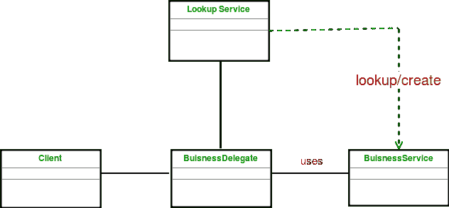

# 业务代表模式

> 原文:[https://www.geeksforgeeks.org/business-delegate-pattern/](https://www.geeksforgeeks.org/business-delegate-pattern/)

业务委托充当客户端业务抽象，它为业务服务的实现提供抽象，从而隐藏业务服务的实现。它减少了表示层客户端和系统业务服务之间的耦合。

**UML 图业务委托模式**

[](https://media.geeksforgeeks.org/wp-content/uploads/uml-buisness-delegate-pattern.png)

**设计组件**

*   **业务委托:**客户端实体提供业务服务方法访问的单一入口点类。
*   **LookUp Service:**LookUp Service 对象负责获取相关的业务实现，并提供业务对象对业务委托对象的访问。
*   **业务服务:**业务服务界面。具体的类实现这个业务服务来提供实际的业务实现逻辑。

**我们来看一个业务委托模式的例子。**

```
interface BusinessService
{
    public void doProcessing();
}

class OneService implements BusinessService
{
    public void doProcessing() 
    {
        System.out.println("Processed Service One");
    }
}

class TwoService implements BusinessService 
{
    public void doProcessing() 
    {
        System.out.println("Processed Service Two");
    }
}

class BusinessLookUp 
{
    public BusinessService getBusinessService(String serviceType)
    {
        if(serviceType.equalsIgnoreCase("One"))
        {
            return new OneService();
        }
        else
        {
            return new TwoService();
        }
   }
}

class BusinessDelegate
{
    private BusinessLookUp lookupService = new BusinessLookUp();
    private BusinessService businessService;
    private String serviceType;

    public void setServiceType(String serviceType)
    {
        this.serviceType = serviceType;
    }

    public void doTask()
    {
        businessService = lookupService.getBusinessService(serviceType);
        businessService.doProcessing();        
    }
}

class Client 
{
    BusinessDelegate businessService;

    public Client(BusinessDelegate businessService)
    {
        this.businessService  = businessService;
    }

    public void doTask()
    {        
        businessService.doTask();
    }
}

class BusinessDelegatePattern
{
    public static void main(String[] args)
    {
        BusinessDelegate businessDelegate = new BusinessDelegate();
        businessDelegate.setServiceType("One");

        Client client = new Client(businessDelegate);
        client.doTask();

        businessDelegate.setServiceType("Two");
        client.doTask();
    }
}
```

输出:

```
Processed Service One
Processed Service Two

```

**优势:**

*   业务委托减少了表示层客户端和业务服务之间的耦合。
*   业务委托隐藏了业务服务的底层实现细节。

**缺点:**

*   由于增加了应用程序中的类数量的额外的层而导致的维护。

本文由 **[Saket Kumar](https://github.com/saketkumar95)** 供稿。如果你喜欢 GeeksforGeeks 并想投稿，你也可以使用[contribute.geeksforgeeks.org](http://www.contribute.geeksforgeeks.org)写一篇文章或者把你的文章邮寄到 contribute@geeksforgeeks.org。看到你的文章出现在极客博客主页上，帮助其他极客。

如果你发现任何不正确的地方，或者你想分享更多关于上面讨论的话题的信息，请写评论。