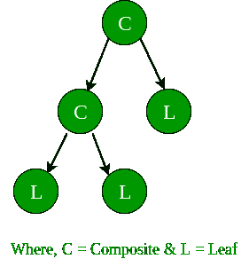
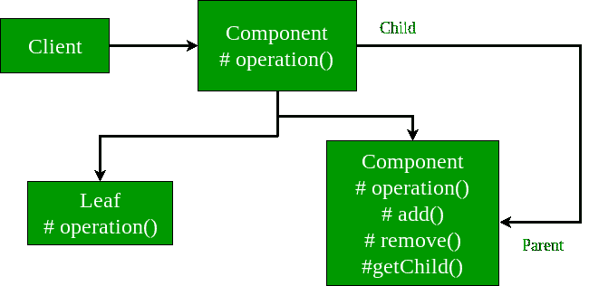

# 复合设计模式

> 原文:[https://www.geeksforgeeks.org/composite-design-pattern/](https://www.geeksforgeeks.org/composite-design-pattern/)

复合模式是一种分区设计模式，它描述了一组对象，这些对象被视为同一类型对象的单个实例。复合的目的是将对象“组合”成树形结构来表示部分-整体层次结构。它允许您拥有一个树结构，并要求树结构中的每个节点执行一项任务。

*   正如 Gof 所描述的，“将对象组成树形结构来表示**部分-整体层次结构**。复合允许客户统一处理单个对象和对象的组合”。
*   当处理树形结构数据时，程序员经常需要区分叶节点和分支。这使得代码更加复杂，因此容易出错。解决方案是**界面**，允许统一处理复杂和原始对象。
*   In object-oriented programming, a composite is an object designed as a composition of one-or-more similar objects, all exhibiting similar functionality. This is known as a **“has-a”** relationship between objects.

    关键概念是，您可以操纵对象的单个实例，就像操纵一组实例一样。您可以对所有复合对象执行的操作通常具有最小公分母关系。
    **合成模式有四个参与者:**

    1.  **组件–**组件声明组合中对象的接口，以及访问和管理其子组件的接口。它还实现了所有类通用的接口的默认行为。
    2.  **叶–**叶定义了组合中原始对象的行为。它表示组合中的叶对象。
    3.  **Composite–**Composite 存储子组件，在组件接口实现子相关操作。
    4.  **客户端–**客户端通过组件接口操纵组合中的对象。

    客户端使用组件类接口与组合结构中的对象进行交互。如果收件人是叶，则直接处理请求。如果接收者是一个组合，那么它通常会将请求转发给它的子组件，可能会在转发之前和之后执行额外的操作。

    **现实生活中的例子**

    在一个组织中，它有总经理，在总经理之下，可以有经理，在经理之下可以有开发人员。现在，您可以设置一个树结构，并要求每个节点执行类似 getSalary()的常见操作。
    复合设计模式以两种方式对待每个节点:
    1) **复合**–复合意味着它下面可以有其他对象。
    2) **叶子**–叶子表示它下面没有物体。

    **树形结构:**

    
    上图展示了一个典型的 Composite 对象结构。如您所见，一个单亲家长可以有多个孩子，即复合家长，但每个孩子只能有一个家长。

    **界面 Component.java**

    ```
    public interface Employee
    {
        public void showEmployeeDetails();
    }
    ```

    **Leaf.java**

    ```
    public class Developer implements Employee
    {
        private String name;
        private long empId;
        private String position;

        public Developer(long empId, String name, String position)
        {
            this.empId = empId;
            this.name = name;
                    this.position = position;
        }

        @Override
        public void showEmployeeDetails() 
        {
            System.out.println(empId+" " +name+);
        }
    }
    ```

    **Leaf.java**

    ```
    public class Manager implements Employee
    {
        private String name;
        private long empId;
            private String position;

        public Manager(long empId, String name, String position)
        {
            this.empId = empId;
            this.name = name;
                    this.position = position;
        }

        @Override
        public void showEmployeeDetails() 
        {
            System.out.println(empId+" " +name);
        }
    }
    ```

    **Composite.java**

    ```
    import java.util.ArrayList;
    import java.util.List;

    public class CompanyDirectory implements Employee
    {
        private List<Employee> employeeList = new ArrayList<Employee>();

        @Override
        public void showEmployeeDetails() 
        {
            for(Employee emp:employeeList)
            {
                emp.showEmployeeDetails();
            }
        }

        public void addEmployee(Employee emp)
        {
            employeeList.add(emp);
        }

        public void removeEmployee(Employee emp)
        {
            employeeList.remove(emp);
        }
    }
    ```

    **Client.java**

    ```
    public class Company
    {
        public static void main (String[] args)
        {
            Developer dev1 = new Developer(100, "Lokesh Sharma", "Pro Developer");
            Developer dev2 = new Developer(101, "Vinay Sharma", "Developer");
            CompanyDirectory engDirectory = new CompanyDirectory();
            engDirectory.addEmployee(dev1);
            engDirectory.addEmployee(dev2);

            Manager man1 = new Manager(200, "Kushagra Garg", "SEO Manager");
            Manager man2 = new Manager(201, "Vikram Sharma ", "Kushagra's Manager");

            CompanyDirectory accDirectory = new CompanyDirectory();
            accDirectory.addEmployee(man1);
            accDirectory.addEmployee(man2);

            CompanyDirectory directory = new CompanyDirectory();
            directory.addEmployee(engDirectory);
            directory.addEmployee(accDirectory);
            directory.showEmployeeDetails();
        }
    }
    ```

    **复合设计模式的 UML 图:**

    

    **上述示例的完整运行代码:**

    ```
    // A Java program to demonstrate working of
    // Composite Design Pattern with example 
    // of a company with different
    //  employee details

    import java.util.ArrayList;
    import java.util.List;

    // A common interface for all employee
    interface Employee
    {
        public void showEmployeeDetails();
    }

    class Developer implements Employee
    {
        private String name;
        private long empId;
        private String position;

        public Developer(long empId, String name, String position)
        {
            // Assign the Employee id,
            // name and the position
            this.empId = empId;
            this.name = name;
            this.position = position;
        }

        @Override
        public void showEmployeeDetails() 
        {
            System.out.println(empId+" " +name+ " " + position );
        }
    }

    class Manager implements Employee
    {
        private String name;
        private long empId;
        private String position;

        public Manager(long empId, String name, String position)
        {
            this.empId = empId;
            this.name = name;
            this.position = position;
        }

        @Override
        public void showEmployeeDetails() 
        {
            System.out.println(empId+" " +name+ " " + position );
        }
    }

    // Class used to get Employee List
    // and do the opertions like 
    // add or remove Employee

    class CompanyDirectory implements Employee
    {
        private List<Employee> employeeList = new ArrayList<Employee>();

        @Override
        public void showEmployeeDetails() 
        {
            for(Employee emp:employeeList)
            {
                emp.showEmployeeDetails();
            }
        }

        public void addEmployee(Employee emp)
        {
            employeeList.add(emp);
        }

        public void removeEmployee(Employee emp)
        {
            employeeList.remove(emp);
        }
    }

    // Driver class
    public class Company
    {
        public static void main (String[] args)
        {
            Developer dev1 = new Developer(100, "Lokesh Sharma", "Pro Developer");
            Developer dev2 = new Developer(101, "Vinay Sharma", "Developer");
            CompanyDirectory engDirectory = new CompanyDirectory();
            engDirectory.addEmployee(dev1);
            engDirectory.addEmployee(dev2);

            Manager man1 = new Manager(200, "Kushagra Garg", "SEO Manager");
            Manager man2 = new Manager(201, "Vikram Sharma ", "Kushagra's Manager");

            CompanyDirectory accDirectory = new CompanyDirectory();
            accDirectory.addEmployee(man1);
            accDirectory.addEmployee(man2);

            CompanyDirectory directory = new CompanyDirectory();
            directory.addEmployee(engDirectory);
            directory.addEmployee(accDirectory);
            directory.showEmployeeDetails();
        }
    }
    ```

    输出:

    ```
    100 Lokesh Sharma Pro Developer
    101 Vinay Sharma Developer
    200 Kushagra Garg SEO Manager
    201 Vikram Sharma  Kushagra's Manager

    ```

    **何时使用复合设计模式？**

    当客户端需要忽略对象组合和单个对象之间的差异时，应该使用复合模式。如果程序员发现他们以相同的方式使用多个对象，并且通常有几乎相同的代码来处理每个对象，那么复合是一个很好的选择，在这种情况下，将原语和复合视为同类并不复杂。

    1.  对象数量的减少减少了内存使用，并且它设法让我们远离与内存相关的错误，如[Java . lang . out of memory error](https://www.geeksforgeeks.org/understanding-outofmemoryerror-exception-java/)。
    2.  虽然用 Java 创建一个对象真的很快，但我们仍然可以通过共享对象来减少程序的执行时间。

    **什么时候不用复合设计模式？**

    1.  复合设计模式使得限制复合组件的类型变得更加困难。因此，当您不想表示对象的完整或部分层次结构时，不应该使用它。
    2.  复合设计模式会使设计过于一般化。这使得限制复合材料的成分变得更加困难。有时，您希望复合材料只有某些组件。使用复合，您不能依赖类型系统来为您实施那些约束。相反，您将不得不使用运行时检查。

    **进一步阅读:**[Python 中的复合方法](https://www.geeksforgeeks.org/composite-method-python-design-patterns/)

    本文由 **[Saket Kumar](https://github.com/saketkumar95/)** 供稿。如果你喜欢 GeeksforGeeks 并想投稿，你也可以使用[write.geeksforgeeks.org](https://write.geeksforgeeks.org)写一篇文章或者把你的文章邮寄到 review-team@geeksforgeeks.org。看到你的文章出现在极客博客主页上，帮助其他极客。

    如果你发现任何不正确的地方，或者你想分享更多关于上面讨论的话题的信息，请写评论。