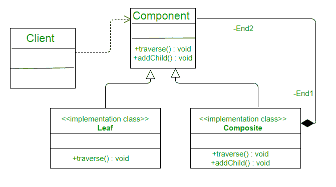

# c++中的复合设计模式

> 原文:[https://www.geeksforgeeks.org/composite-pattern-cpp/](https://www.geeksforgeeks.org/composite-pattern-cpp/)

**先决条件:** [复合设计模式](https://www.geeksforgeeks.org/composite-design-pattern/)
复合模式是行业中使用最广泛的模式之一，解决了一个非常重要且微妙的问题。每当用户希望将单个对象视为这些单个对象的集合时，就会使用它，例如，您可能希望将副本中的一个页面视为与基本上是页面集合的整个副本相同，或者如果您希望创建一个层次结构，您可能希望将整个对象视为对象。
将对象组合成树形结构来表示部分-整体层次结构。复合允许客户端统一处理单个对象和对象的组合。
在 photoshop 中，我们绘制许多单个对象，然后这些对象组成一个完整的唯一对象，您可能希望对整个对象而不是每个单个对象应用一些操作。



在这个图中，您可以看到 composite 和 Leaf 都实现了 Component 图，因此允许对两个对象进行相同的操作，但是重要的部分是 Composite Class，它也包含 Component Objects，用黑色菱形符号表示 Composite 和 Component class 之间的组合关系。
那么如何设计我们的类来适应这样的场景呢。我们将通过实现我们的复制示例来尝试理解它。假设您必须创建一个页面，该页面具有添加、删除、移除等操作，并且还创建一个副本，该副本将具有与单个页面相同的操作。
这样的情况最好用复合模式处理。

## 卡片打印处理机（Card Print Processor 的缩写）

```
// CPP program to illustrate
// Composite design pattern
#include <iostream>
#include <vector>
using namespace std;

class PageObject {
public:
    virtual void Add(PageObject a)
    {
    }
    virtual void Remove()
    {
    }
    virtual void Delete(PageObject a)
    {
    }
};

class Page : public PageObject {
public:
    void Add(PageObject a)
    {
        cout << "something is added to the page" << endl;
    }
    void Remove()
    {
        cout << "something is removed from the page" << endl;
    }
    void Delete(PageObject a)
    {
        cout << "something is deleted from page " << endl;
    }
};

class Copy : public PageObject {
    vector<PageObject> copyPages;

public:
    void AddElement(PageObject a)
    {
        copyPages.push_back(a);
    }

    void Add(PageObject a)
    {
        cout << "something is added to the copy" << endl;
    }
    void Remove()
    {
        cout << "something is removed from the copy" << endl;
    }
    void Delete(PageObject a)
    {
        cout << "something is deleted from the copy";
    }
};

int main()
{
    Page a;
    Page b;
    Copy allcopy;
    allcopy.AddElement(a);
    allcopy.AddElement(b);

    allcopy.Add(a);
    a.Add(b);

    allcopy.Remove();
    b.Remove();

    return 0;
}
```

```
something is added to the copy
something is added to the page
something is removed from the copy
something is removed from the page
```

现在，同样的操作既可以应用于单个对象，也可以应用于这些单个对象的集合，这使得处理由较小的独立对象组成的较大对象变得非常容易。
复合模式最显著的例子是在任何 UI 工具包中。考虑用户界面元素的情况，其中每个用户界面顶层用户界面元素由许多较小的独立底层用户界面元素组成，顶层和底层用户界面元素都响应相同的事件和动作。
参考文献:
1。[复合图案 c #](http://www.c-sharpcorner.com/article/composite-patterns-in-C-Sharp/)T5】2。[组合模式](https://www.codeproject.com/Articles/185797/Composite-Design-Pattern)
本文由**安基特·辛格**供稿。如果你喜欢 GeeksforGeeks 并想投稿，你也可以使用[write.geeksforgeeks.org](https://write.geeksforgeeks.org)写一篇文章或者把你的文章邮寄到 review-team@geeksforgeeks.org。看到你的文章出现在极客博客主页上，帮助其他极客。
如果发现有不正确的地方，或者想分享更多关于上述话题的信息，请写评论。