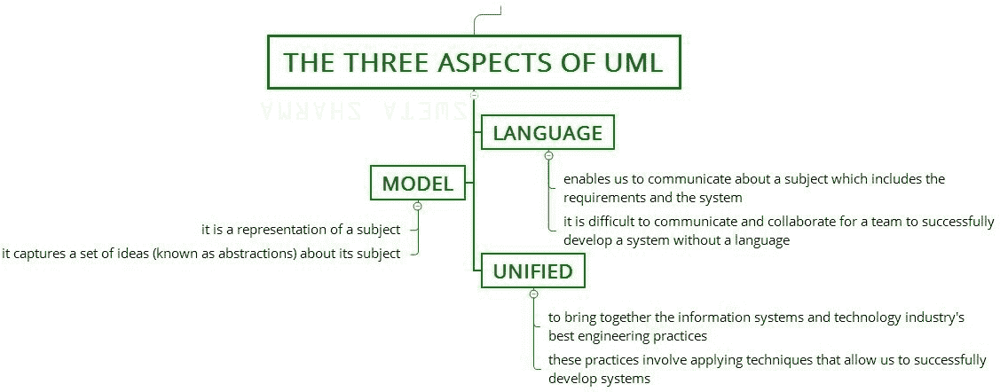
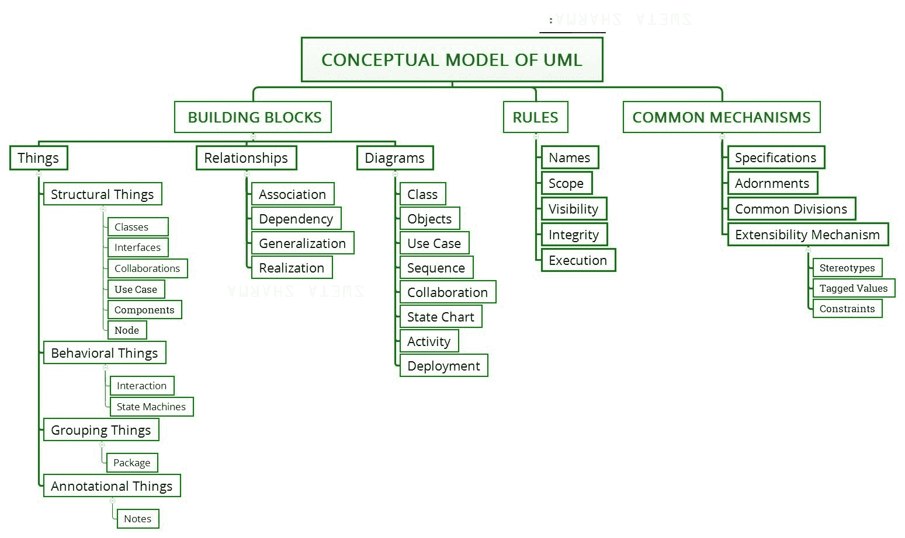

# 统一建模语言(UML)的概念模型

> 原文:[https://www . geesforgeks . org/统一建模语言概念模型-uml/](https://www.geeksforgeeks.org/conceptual-model-of-the-unified-modeling-language-uml/)

[统一建模语言(UML)](https://www.geeksforgeeks.org/unified-modeling-language-uml-introduction/) 是一种用于描述和建模软件蓝图的标准可视化语言。UML 不仅仅是一种图形语言。正式地说，UML 是用于:可视化、指定、构建和记录。
软件密集型系统的产物(尤其是使用面向对象风格构建的系统)。

**UML 的三个方面:**


**图–**UML 的三个方面

**注意–**语言、模型和统一是 UML 的重要方面，如上图所述。

**1。语言:**

*   它使我们能够就包括需求和系统在内的主题进行交流。
*   团队要成功开发一个没有语言的系统是很难沟通和协作的。

**2。型号:**

*   它是一个主题的代表。
*   它捕捉了一组关于其主题的想法*(被称为抽象)*。

**3。统一:**

*   它旨在汇集信息系统和技术行业的最佳工程实践。
*   这些实践包括应用允许我们成功开发系统的技术。

**一个概念模型:**
一个语言的概念模型强调了三大要素:

```
• The Building Blocks
• The Rules
• Some Common Mechanisms

```

一旦你理解了这些元素，你将能够阅读和识别模型，并创建一些模型。


**图–**统一建模语言的概念模型

**构件:**
UML 的词汇包括三种构件:

1.  **Things:**
    Things are the abstractions that are first-class citizens in a model; relationships tie these things together; diagrams group interesting collections of things.
    There are 4 kinds of things in the UML:

    ```
    1. Structural things 
    2. Behavioral things 
    3. Grouping things 
    4. Annotational things 
    ```

    这些东西是 UML 的基本面向对象构件。你用它们来编写格式良好的模型。

2.  **Relationships:**
    There are 4 kinds of relationships in the UML:

    ```
    1. Dependency 
    2. Association 
    3. Generalization 
    4. Realization  
    ```

    这些关系是 UML 的基本关系构建块。

3.  **图解:**
    它是一组元素的图形表示。它被渲染为顶点(事物)和弧(关系)的连通图。

    ```
    1. Class diagram 
    2. Object diagram 
    3. Use case diagram 
    4. Sequence diagram 
    5. Collaboration diagram 
    6. Statechart diagram 
    7. Activity diagram 
    8. Component diagram 
    9. Deployment diagram 
    ```

**规则:**
UML 有许多规则来指定一个好的模型应该是什么样子。一个好的模型是语义上自洽的，并且与其所有相关的模型相协调。
UML 有以下语义规则:

1.  **名称–**你可以称之为事物、关系和图表的东西。
2.  **范围–**赋予名称特定含义的上下文。
3.  **可见性–**这些名称如何被其他人看到和使用。
4.  **完整性–**事物之间如何恰当、一致地相互关联。
5.  **执行–**运行或模拟动态模型意味着什么。

**通用机制:**
UML 通过四种通用机制变得更加简单。它们如下:

```
1. Specifications 
2. Adornments 
3. Common divisions 
4. Extensibility mechanisms 
```