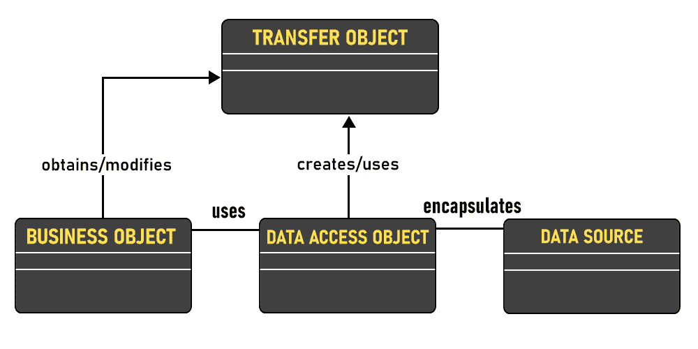

# 数据访问对象模式

> 原文:[https://www.geeksforgeeks.org/data-access-object-pattern/](https://www.geeksforgeeks.org/data-access-object-pattern/)

数据访问对象模式或 DAO 模式用于将低级数据访问应用编程接口或操作与高级业务服务分开。以下是数据访问对象模式的参与者。

**UML 图数据访问对象模式**



**优势**

**1。**使用数据访问对象的优势是应用程序的两个重要部分之间相对简单和严格的分离，这两个部分可以但不应该相互了解，并且可以预期它们会频繁和独立地发展。

**2。**如果我们需要改变底层的持久化机制，我们只需要改变 DAO 层，而不需要改变使用 DAO 层的领域逻辑中的所有地方。

**缺点**

**1。**使用 DAO 的潜在缺点是一个泄漏的抽象、代码重复和抽象反转。

**设计组件**

*   **business object:**business object 代表数据客户端。它是需要访问数据源以获取和存储数据的对象。除了访问数据源的 servlet 或助手 bean 之外，BusinessObject 还可以实现为会话 bean、实体 bean 或其他一些 Java 对象。
*   **DataAccessObject:**DataAccessObject 是这个模式的主要对象。DataAccessObject 抽象了业务对象的底层数据访问实现，以实现对数据源的透明访问。
*   **数据源:**这代表一个数据源实现。数据源可以是数据库，如关系数据库管理系统、面向对象数据库管理系统、XML 存储库、平面文件系统等。数据源也可以是另一个系统服务或某种存储库。
*   **TransferObject:** 这表示用作数据载体的传输对象。数据访问对象可以使用传输对象向客户端返回数据。数据辅助对象也可以从传输对象中的客户端接收数据，以更新数据源中的数据。

**示例:**

## Java 语言(一种计算机语言，尤用于创建网站)

```
// Java program to illustrate Data Access Object Pattern

// Importing required classes
import java.util.ArrayList;
import java.util.List;

// Class 1
// Helper class
class Developer {

    private String name;
    private int DeveloperId;

    // Constructor of Developer class
    Developer(String name, int DeveloperId)
    {

        // This keyword refers to current instance itself
        this.name = name;
        this.DeveloperId = DeveloperId;
    }

    // Method 1
    public String getName() { return name; }

    // Method 2
    public void setName(String name) { this.name = name; }

    // Method 3
    public int getDeveloperId() { return DeveloperId; }

    // Method 4
    public void setDeveloperId(int DeveloperId)
    {
        this.DeveloperId = DeveloperId;
    }
}

// Interface
interface DeveloperDao {
    public List<Developer> getAllDevelopers();
    public Developer getDeveloper(int DeveloperId);
    public void updateDeveloper(Developer Developer);
    public void deleteDeveloper(Developer Developer);
}

// Class 2
// Implementing above defined interface
class DeveloperDaoImpl implements DeveloperDao {

    List<Developer> Developers;

    // Method 1
    public DeveloperDaoImpl()
    {
        Developers = new ArrayList<Developer>();
        Developer Developer1 = new Developer("Kushagra", 0);
        Developer Developer2 = new Developer("Vikram", 1);
        Developers.add(Developer1);
        Developers.add(Developer2);
    }

    // Method 2
    @Override
    public void deleteDeveloper(Developer Developer)
    {
        Developers.remove(Developer.getDeveloperId());
        System.out.println("DeveloperId "
                           + Developer.getDeveloperId()
                           + ", deleted from database");
    }

    // Method 3
    @Override public List<Developer> getAllDevelopers()
    {
        return Developers;
    }

    // Method 4
    @Override public Developer getDeveloper(int DeveloperId)
    {
        return Developers.get(DeveloperId);
    }

    // Method 5
    @Override
    public void updateDeveloper(Developer Developer)
    {
        Developers.get(Developer.getDeveloperId())
            .setName(Developer.getName());
        System.out.println("DeveloperId "
                           + Developer.getDeveloperId()
                           + ", updated in the database");
    }
}

// Class 3
// DaoPatternDemo
class GFG {

    // Main driver method
    public static void main(String[] args)
    {

        DeveloperDao DeveloperDao = new DeveloperDaoImpl();

        for (Developer Developer :
             DeveloperDao.getAllDevelopers()) {
            System.out.println("DeveloperId : "
                               + Developer.getDeveloperId()
                               + ", Name : "
                               + Developer.getName());
        }

        Developer Developer
            = DeveloperDao.getAllDevelopers().get(0);

        Developer.setName("Lokesh");
        DeveloperDao.updateDeveloper(Developer);

        DeveloperDao.getDeveloper(0);
        System.out.println(
            "DeveloperId : " + Developer.getDeveloperId()
            + ", Name : " + Developer.getName());
    }
}
```

**Output**

```
DeveloperId : 0, Name : Kushagra
DeveloperId : 1, Name : Vikram
DeveloperId 0, updated in the database
DeveloperId : 0, Name : Lokesh
```

本文由 [**Saket Kumar**](https://github.com/saketkumar95) 供稿。如果你喜欢 GeeksforGeeks 并想投稿，你也可以使用[write.geeksforgeeks.org](http://www.write.geeksforgeeks.org)写一篇文章或者把你的文章邮寄到 review-team@geeksforgeeks.org。看到你的文章出现在极客博客主页上，帮助其他极客。如果你发现任何不正确的地方，或者你想分享更多关于上面讨论的话题的信息，请写评论。