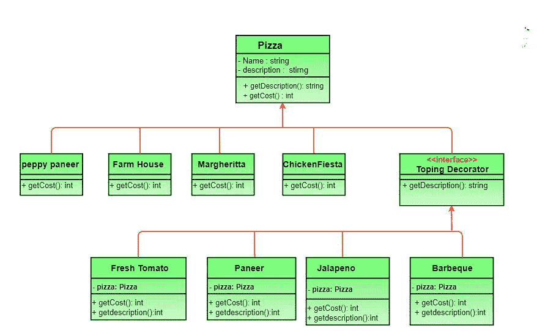

# 装饰图案|第 3 集(设计编码)

> 原文:[https://www . geesforgeks . org/decorator-pattern-set-3-coding-the-design/](https://www.geeksforgeeks.org/decorator-pattern-set-3-coding-the-design/)

我们已经在第一集讨论了[比萨设计问题和解决它的不同幼稚方法](https://www.geeksforgeeks.org/decorator-pattern/)。我们还在第二集中引入了[装饰器模式。](https://www.geeksforgeeks.org/the-decorator-pattern-set-2-introduction-and-design/)

本文讨论了比萨问题装饰模式的设计与实现。强烈建议你自己先试试。

新类图(点击图片看清楚)


*   **Pizza** 充当我们的抽象组件类。
*   有四个具体的组成部分，即**pepppanier**、**农家乐**、**玛格丽塔**、**鸡肉节**。
*   **topping decorator**是我们的抽象装饰师，**fresh 番茄**、**paner**、**墨西哥辣椒**、**烧烤**是混凝土装饰师。

下面是上述设计的 java 实现。

```
// Java program to demonstrate Decorator
// pattern

// Abstract Pizza class (All classes extend
// from this)
abstract class Pizza
{
    // it is an abstract pizza
    String description = "Unkknown Pizza";

    public String getDescription()
    {
        return description;
    }

    public abstract int getCost();
}

// The decorator class :  It extends Pizza to be
// interchangable with it topings decorator can
// also be implemented as an interface
abstract class ToppingsDecorator extends Pizza
{
    public abstract String getDescription();
}

// Concrete pizza classes
class PeppyPaneer extends Pizza
{
    public PeppyPaneer() { description = "PeppyPaneer"; }
    public int getCost() {  return 100; }
}
class FarmHouse extends Pizza
{
    public FarmHouse() {  description = "FarmHouse"; }
    public int getCost() { return 200; }
}
class Margherita extends Pizza
{
    public Margherita()  { description = "Margherita"; }
    public int getCost() { return 100;  }
}
class ChickenFiesta extends Pizza
{
    public ChickenFiesta() { description = "ChickenFiesta";}
    public int getCost() { return 200; }
}
class SimplePizza extends Pizza
{
public SimplePizza() { description = "SimplePizza"; }
public int getCost() {  return 50;  }
}

// Concrete toppings classes
class FreshTomato extends ToppingsDecorator
{
    // we need a reference to obj we are decorating
    Pizza pizza;

    public FreshTomato(Pizza pizza) { this.pizza = pizza; }
    public String getDescription() {
        return pizza.getDescription() + ", Fresh Tomato ";
    }
    public int getCost() { return 40 + pizza.getCost(); }
}
class Barbeque extends ToppingsDecorator
{
    Pizza pizza;
    public Barbeque(Pizza pizza) {  this.pizza = pizza;  }
    public String getDescription() {
        return pizza.getDescription() + ", Barbeque ";
    }
    public int getCost() { return 90 + pizza.getCost(); }
}
class Paneer extends ToppingsDecorator
{
    Pizza pizza;
    public Paneer(Pizza pizza)  {  this.pizza = pizza; }
    public String getDescription() {
        return pizza.getDescription() + ", Paneer ";
    }
    public int getCost()  {  return 70 + pizza.getCost(); }
}

// Other toppings can be coded in a similar way

// Driver class and method
class PizzaStore
{
    public static void main(String args[])
    {
        // create new margherita pizza
        Pizza pizza = new Margherita();
        System.out.println( pizza.getDescription() +
                         " Cost :" + pizza.getCost());

        // create new FarmHouse pizza
        Pizza pizza2 = new FarmHouse();

        // decorate it with freshtomato topping
        pizza2 = new FreshTomato(pizza2);

        //decorate it with paneer topping
        pizza2 = new Paneer(pizza2);

        System.out.println( pizza2.getDescription() +
                         " Cost :" + pizza2.getCost());
        Pizza pizza3 = new Barbeque(null);    //no specific pizza
        System.out.println( pizza3.getDescription() + "  Cost :" + pizza3.getCost());
   }
}
```

输出:

```
Margherita Cost :100
FarmHouse, Fresh Tomato , Paneer Cost :310

```

请注意，我们如何添加/删除新的比萨饼和配料，而不改变之前测试的代码，配料和比萨饼是分离的。

```
// CPP program to demonstrate 
// Decorator pattern
#include <iostream>
#include <string>
using namespace std;

// Component 
class MilkShake
{
public:
    virtual string Serve() = 0;
    virtual float price() = 0;
};

// Concrete Component  
class BaseMilkShake : public MilkShake
{
public:
    string Serve()
    {
        return "MilkShake";
    }

    float price()
    {
        return 30;
    }
};

// Decorator 
class MilkShakeDecorator: public MilkShake
{
protected:
    MilkShake *m_MilkShake;
public:

    MilkShakeDecorator(MilkShake *baseMilkShake): m_MilkShake(baseMilkShake){}

    string Serve()
    {
        return m_MilkShake->Serve();
    }

    float price()
    {
        return m_MilkShake->price();
    }
};

// Concrete Decorator 
class MangoMilkShake: public MilkShakeDecorator
{
public:
    MangoMilkShake(MilkShake *baseMilkShake): MilkShakeDecorator(baseMilkShake){}

    string Serve()
    {
        return m_MilkShake->Serve() + " decorated with Mango ";
    }
    float price()
    {
        return m_MilkShake->price() + 40;
    }
};

class VanillaMilkShake: public MilkShakeDecorator
{
public:
    VanillaMilkShake(MilkShake *baseMilkShake): MilkShakeDecorator(baseMilkShake){}

    string Serve()
    {
        return m_MilkShake->Serve() + " decorated with Vanilla ";
    }
    float price()
    {
        return m_MilkShake->price() + 80;
    }
};

int main()
{
  MilkShake *baseMilkShake = new BaseMilkShake();
  cout << "Basic Milk shake \n";
  cout << baseMilkShake -> Serve() << endl;
  cout << baseMilkShake -> price() << endl;    

  MilkShake *decoratedMilkShake = new MangoMilkShake(baseMilkShake);
  cout << "Mango decorated Milk shake \n";
  cout << decoratedMilkShake -> Serve() << endl;
  cout << decoratedMilkShake -> price() << endl;    

  delete decoratedMilkShake;

  decoratedMilkShake = new VanillaMilkShake(baseMilkShake);
  cout << "Vanilla decorated Milk shake \n";
  cout << decoratedMilkShake -> Serve() << endl;
  cout << decoratedMilkShake -> price() << endl;    

 delete decoratedMilkShake;
 delete baseMilkShake;
  return 0;
} 
```

输出:

```
Basic Milk shake
MilkShake
Price of MilkShake : 30
Mango decorated Milk shake
MilkShake decorated with Mango
Price of Mango MilkShake : 70
Vanilla decorated Milk shake
MilkShake decorated with Vanilla
Price of Vanilla MilkShake : 110

```

**进一步阅读:**[Python 中的装饰器方法](https://www.geeksforgeeks.org/decorator-method-python-design-patterns/)

本文由**苏拉布·库马尔和沙山克·古普塔供稿。**如果你喜欢 GeeksforGeeks 并想投稿，你也可以写一篇文章，把你的文章邮寄到 review-team@geeksforgeeks.org。看到你的文章出现在极客博客主页上，帮助其他极客。

如果您发现任何不正确的地方，或者您想分享更多关于上面讨论的主题的信息，请写评论