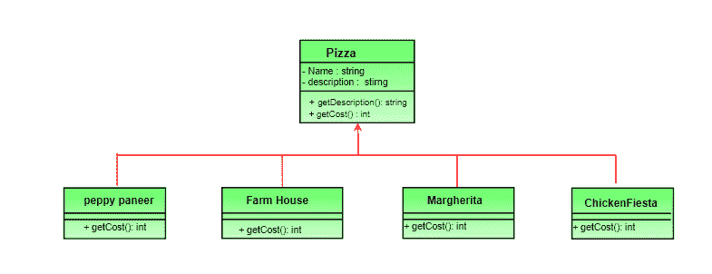
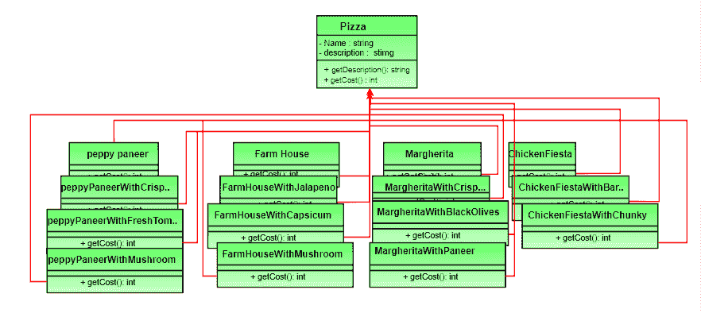
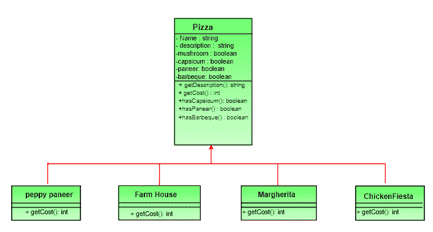

# 装饰图案|设置 1(背景)

> 原文:[https://www.geeksforgeeks.org/decorator-pattern/](https://www.geeksforgeeks.org/decorator-pattern/)

为了理解装饰者模式，让我们考虑一个受《头部优先设计模式》一书启发的场景。假设我们正在为一家比萨店构建一个应用程序，我们需要为他们的比萨课程建模。假设他们提供四种类型的披萨，即活力派、农家乐、玛格丽塔和鸡肉节。最初我们只是使用继承并抽象出一个 **Pizza** 类中的公共功能。

[](https://media.geeksforgeeks.org/wp-content/uploads/decorePattern-1.png)

每种比萨饼的价格不同。我们已经覆盖了子类中的 getCost()来找到合适的成本。现在假设一个新的要求，除了一个披萨，顾客还可以要求几种配料，如新鲜番茄、帕内尔、墨西哥辣椒、辣椒、烤肉等。让我们想一想，我们如何适应上述类别的变化，以便顾客可以选择带配料的比萨饼，我们得到顾客选择的比萨饼和配料的总成本。

让我们看看各种选择。

**选项 1**
为每一个比萨饼的浇头创建一个新的子类。类图看起来像: [](https://media.geeksforgeeks.org/wp-content/uploads/decorePattern.png)

这看起来很复杂。有太多的类，是一个维护噩梦。此外，如果我们想添加新的浇头或比萨饼，我们必须添加这么多类。这显然是非常糟糕的设计。

**选项 2:**
让我们给披萨基类添加实例变量来表示每个披萨是否有浇头。类图看起来像:

超类的 getCost()计算所有配料的成本，而子类中的一个计算特定比萨饼的成本。

```
// Sample getCost() in super class
public int getCost()
{
    int totalToppingsCost = 0;
    if (hasJalapeno() )
        totalToppingsCost += jalapenoCost;
    if (hasCapsicum() )
        totalToppingsCost += capsicumCost;

    // similarly for other toppings
    return totalToppingsCost;
}

```

```
// Sample getCost() in subclass
public int getCost()
{
    // 100 for Margherita and super.getCost()
    // for toppings.
    return super.getCost() + 100;
}
```

这个设计起初看起来不错，但是让我们来看看与之相关的问题。

*   配料的价格变化将导致现有代码的改变。
*   新的浇头将迫使我们添加新的方法，并在超类中改变 getCost()方法。
*   对于一些比萨饼，有些配料可能不合适，但子类继承了它们。
*   如果顾客想要双份辣椒或双份奶酪碎呢？

简而言之，我们的设计违反了最流行的设计原则之一-[](https://en.wikipedia.org/wiki/Open/closed_principle)**的开-闭原则，该原则规定类应该为扩展而开放，为修改而关闭。**

**在下一集，我们将介绍 Decorator Pattern，并将其应用于上述问题。**

****参考文献:**首个设计模式(书)。**

**本文由**苏拉布·库马尔**供稿。如果你喜欢极客博客并想投稿，你也可以写一篇文章并把你的文章邮寄到 contribute@geeksforgeeks.org。看到你的文章出现在极客博客主页上，帮助其他极客。**

**如果您发现任何不正确的地方，或者您想分享更多关于上面讨论的主题的信息，请写评论**