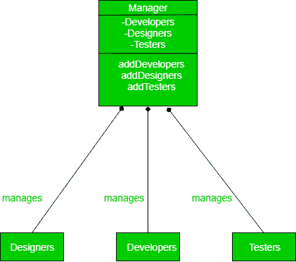
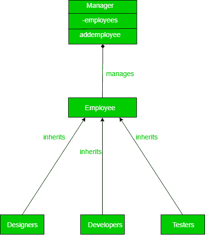

# 依赖倒置原理(固体)

> 原文:[https://www . geesforgeks . org/dependency-inversion-principle-solid/](https://www.geeksforgeeks.org/dependecy-inversion-principle-solid/)

让我们来理解固体原理组的一个关键原理，即依赖倒置原理。

依赖反转原则是大多数设计模式所基于的原则之一。依赖反转讨论不同类或模块之间的耦合。它侧重于高级别不依赖于低级别的方法，而是依赖于低级别的抽象。依赖倒置的主要格言是*任何更高的类应该总是依赖于类的抽象而不是细节*。

这种旨在减少类之间耦合的方法是通过在层之间引入抽象来实现的，因此并不关心真正的实现。

让我们用一个例子来理解依赖反转原理。假设你是一个经理，有一些员工，其中一些是开发人员，一些是图形设计师，其余的是测试人员。

现在让我们看看一个没有任何依赖反转的天真设计会是什么样子，以及该设计中有哪些漏洞。

```
class Manager(object):
    def __init__(self):
        self.developers=[]
        self.designers=[]
        self.testers=[]

    def addDeveloper(self,dev):
        self.developers.append(dev)

    def addDesigners(self,design):
        self.designers.append(design)

    def addTesters(self,testers):
        self.testers.append(testers)

class Developer(object):
    def __init__(self):
        print "developer added"

class Designer(object):
    def __init__(self):
        print "designer added"

class Testers(object):
    def __init__(self):
        print "tester added"

if __name__ == "__main__":
    a=Manager()
    a.addDeveloper(Developer())
    a.addDesigners(Designer())
```

```
Output :
  developer added
  designer added

```

这可以通过下面的 UML 图很容易地可视化。



现在，我们来看看源代码中的设计循环漏洞:
首先，您已经将下层的所有内容都暴露给了上层，因此抽象没有被提及。这意味着经理必须已经知道他可以监督的工人类型。

现在，如果另一种类型的工人归经理管，比如说质量保证，那么整个班级都需要重新调整。这就是依赖反转原理的作用所在。

让我们看看如何使用依赖反转原理更好地解决这个问题。

```

class Employee(object):
    def Work():
        pass

class Manager():
    def __init__(self):
        self.employees=[]
    def addEmployee(self,a):
        self.employees.append(a)

class Developer(Employee):
    def __init__(self):
        print "developer added"
    def Work():
        print "turning coffee into code"

class Designer(Employee):
    def __init__(self):
        print "designer added"
    def Work():
        print "turning lines to wireframes"

class Testers(Employee):
    def __init__(self):
        print "tester added"
    def Work():
        print "testing everything out there"

if __name__ == "__main__":
    a=Manager()
    a.addEmployee(Developer())
    a.addEmployee(Designer())
```

```
Output :
  developer added
  designer added

```

现在，如果添加了任何其他类型的员工，可以简单地将其添加到经理中，而无需让经理明确知道。现在要添加另一类员工，我们可以简单地称之为

```
class QA(Employee):
        def Work():
             print "testing everything out there"
a.add(QA())

```

不同员工和经理之间抽象的创建产生了非常好看的设计代码，易于维护和扩展。请看看下面的 UML 图。



在这段代码中，经理事先并不知道他/她手下的所有类型的员工，这使得代码真正解耦。有许多设计模式，其中这是一个核心思想，其他东西都建立在此基础上。