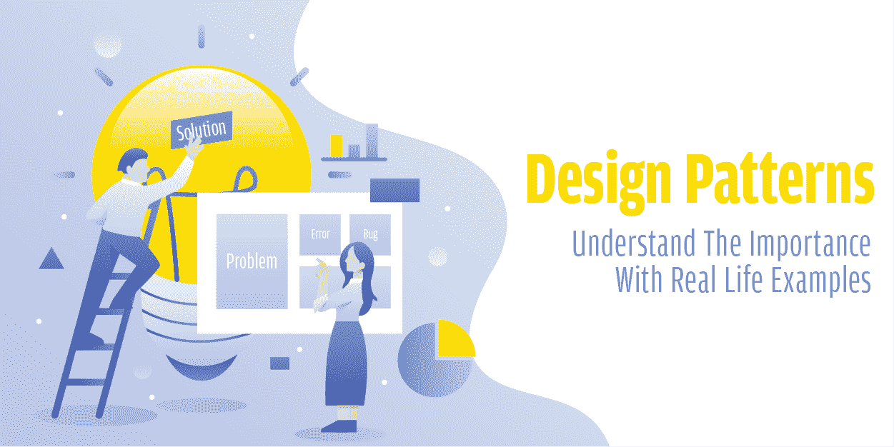

# 设计模式:用真实的例子理解重要性

> 原文:[https://www . geesforgeks . org/design-patterns-了解与现实生活相关的重要性-示例/](https://www.geeksforgeeks.org/design-patterns-understand-the-importance-with-real-life-examples/)

**软件设计模式……***软件设计模式是对软件设计中给定上下文中常见问题的通用、可重用的解决方案。*这是维基百科上写的软件设计模式的定义……如果你是一个有经验的开发人员，花了一些时间为一些软件编写代码，上面的定义对你来说是有意义的，但是同样的一句话就在你的脑海里，如果你是一个初学者，完全没有意识到这一点，这听起来很无聊。让我们先和有经验的开发者讨论一下…(*初学者请稍等或跳过下一段*)。

软件设计模式…有趣的话题是吗？你可能很享受你的开发生涯，致力于一些设计模式，解决项目中反复出现的问题。您可能还知道它如何使代码可重用并提高开发人员的工作效率。设计模式是 ***开发者谈论软件解决方案的常用词汇*** 。当你(作为一个开发人员)说“*我们应该使用单例模式*来实现这一点”时，所有其他的开发人员都清楚地明白这是什么共同的参考点。
和你聊够了(有经验的…我们会再联系你)现在让我们来看看初学者或新手程序员…忘记技术的东西，让我们先进行友好的讨论…

### 真实世界的例子

***你爱美食吗？(大家都喜欢)***……你最喜欢哪家餐厅？你最常去哪里？你喜欢街头美食还是更喜欢一些在线应用 Zomato 和 Swiggy？你可能尝试过不同的菜系，也可能尝试过不同的地方。如果你的清单中有一家你最喜欢的餐馆，在那里你大部分时间都喜欢吃你最喜欢的菜，那么这背后的原因是什么？。当然，那家餐厅的**经验丰富的厨师**可能会使用**特定的技术**来准备这道菜。如果你也想在家里准备同样的食物，做同样的测试呢？你现在需要做什么？你需要遵循经验丰富的厨师使用的相同方法或技巧。他们可能已经**尝试了许多食谱**，他们可能已经**改变了他们的方法**来准备那道菜。最后，有一次，当他们学会了一种特殊的技术来准备这道菜，而且味道很好时，他们停下来了。

好吧，如果你也想在你最喜欢的餐馆里准备同样的菜，那么你需要遵循经验丰富的厨师提供的同样的方法和技术，或者你需要接近你的朋友，他**做得很好**并用一些特定的技术准备菜肴。

*聊够了美食，来看看设计图案*。注意上面强调的话，**尝试了很多菜谱**，**改变了做法**，**经验丰富的厨师**和**厨艺真的很好**。设计模式也是如此。[设计模式](https://en.wikipedia.org/wiki/Design_Patterns)就像厨师(**四人帮(GoF)** )准备一道菜，让它吃起来最好吃的一些最佳做法。

*   设计模式是经验丰富的面向对象软件开发人员(在我们的环境中是经验丰富的厨师或朋友)使用的一些设计实践。它们是软件开发过程中面临的问题的一般解决方案。
*   它们是许多软件开发人员在相当长的时间内通过反复试验(尝试许多方法)获得的解决方案。

> 设计模式本身并不能解决问题，它们帮助我们解决问题。

**我们来进行一些关于设计模式的技术讨论。**

“四人帮”经历了一段时间的问题，他们解决了。他们注意到这些解决方案中的一些可以归类，一些问题总是非常普遍和普遍(像贫困一样普遍)。所以从技术上来说，设计模式只是**模板**，给你的代码一个适当的流程、链接和结构。它是一种交流工具，或者你可以说是由有经验的软件开发人员给出的通用解决方案，用于解决开发人员在软件开发阶段面临的常见问题。

计算研究人员和实践者开发了各种组织概念和方法，用于设计简洁、正确和可重用的高质量面向对象软件，描述了“典型”软件设计问题的解决方案。模式为解决方案提供了通用模板，可以应用于许多不同的情况。您可以无数次地使用这些模板来解决某些特定类型的问题。

> 你知道只有 11%的程序员使用设计图的次数超过 75%吗？

现在你可能会有一个问题，为什么我们需要把我们的问题融入到一些设计模式中……为什么我们不能使用我们的技术。使用它有什么好处？我们肯定会谈论这个…

### 设计模式的目的

*   你在经营一家餐馆。经营一家餐馆并不意味着只准备食物并提供给顾客。你还需要照顾美味的食物，干净的菜肴，服务员，厨师或其他员工在你的餐厅面临的常见问题。作为一个餐馆老板，你也需要给出解决这些普遍问题的方法。
    作为一名软件工程师，你的目的不应该仅仅是写一堆代码，还应该降低复杂性，并注意代码的可重用性。您将被期望编写一个干净、优雅、无错误和可管理的代码，以便其他开发人员能够理解，并且以后如果它需要任何类型的更改，那么它可以在对您的整个项目影响最小的情况下完成，在这方面，设计模式起着至关重要的作用。

> 软件工程的目的是控制复杂性，而不是创造复杂性。
> **-帕梅拉·扎夫**

*   你在没有任何计划的情况下自己盖房子。你对房子想要什么或需要什么有一个大致的概念，然后你开始建造第一面墙，然后是第二面墙，以此类推。你很快就会发现这是行不通的，如果你和多人一起盖房子，问题会更大。没有计划，他们怎么知道该怎么办？软件也是如此。
    在软件开发中，无需前期设计就可以构建应用。尤其是如果你可以重新使用现有的设计。(例如，向网站添加新页面并不需要您重新设计所有内容。您可以只关注其他页面是如何制作的，并重用相同的构建模式)。您可以检查现有的解决方案，寻找您正在处理的类似问题，并使用该技术或使用其中的一些代码来解决您自己的问题。
*   假设你是一名学生或者是一名 CAT 野心家。为了解决一些智能问题或数学问题，你可能会使用一些公式或技巧。你应用这些公式或技术来解决类似的问题。你知道你只是拯救了几条线或原则，你的努力就减少了。你也节省了时间。在软件开发中，设计模式扮演着这一关键角色(数学公式或技术)。
*   在软件开发中，假设你正在写一些代码，你意识到你犯了一个错误。更正它需要在另外 10 个文件中进行更改。这意味着你的设计，如果你做的话，一开始就不好。这个错误让你付出了什么代价？….你浪费了很多时间、一些资源、努力，这也影响了其他开发人员的工作效率。

你可能已经得到了设计模式在软件开发中有多重要的线索。让我们举一个你正在做一个项目的例子。您的项目有一个通知系统。你有 15 类代码。其中 13 个类生成通知。您可以在每个通知类中编写代码来与您的通知类进行通信。

几天后，事情发生了变化，您又有了 10 个类，您也向这些类添加了通知。你的通知机制改变了，你进入所有的 10+13 类并改变代码。现在你的代码对你来说毫无意义。您意识到所有这些类都应该与通知系统分离。你创建一个新的类，并把所有的通知逻辑放在那里。然后你想出了抽象概念，允许任何事情通知你的系统，最小的连锁反应和最大的可重用性。

你有没有注意到你刚刚为你的整个代码发明了观察者或者模式？如果你以前知道这种模式，你就不会面临所有这些问题，也不会浪费很多时间。作为一名软件工程师，你应该构建有意义的软件。现在我们可以从以下几点总结设计模式的重要性…

*   它使代码可重用、无 bug 且干净。
*   加快发展进程。
*   更改或修改变得更加容易。
*   减少开发人员在开发过程中面临的常见问题。
*   提高面向对象的技能。
*   易于理解的代码流。
*   代码更少，易于维护。

> 模式不提供解决方案，它们激发解决方案。