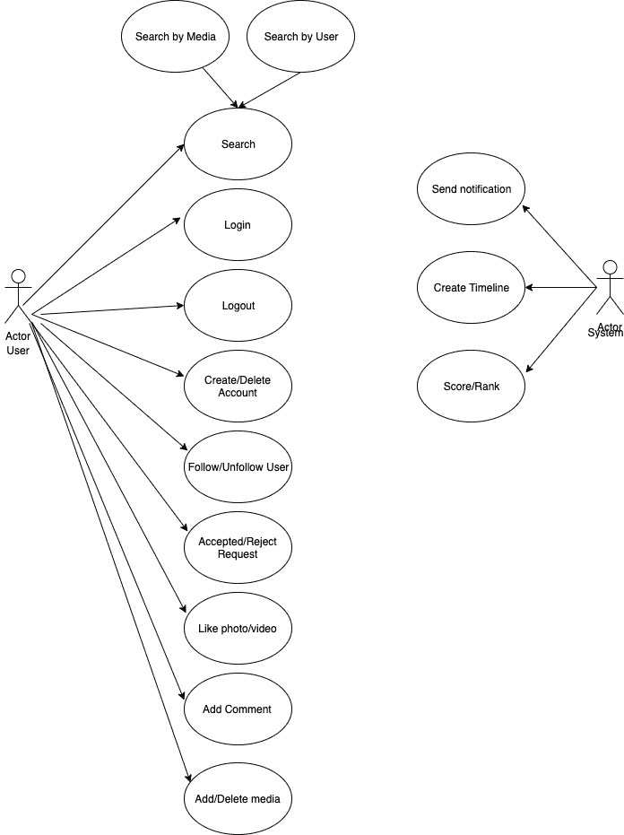

# 设计媒体共享社交网络系统

> 原文:[https://www . geesforgeks . org/design-scalable-system-like-insta gram/](https://www.geeksforgeeks.org/design-scalable-system-like-instagram/)

**媒体社交网络服务系统的目的**
该系统将允许用户与其他用户共享照片和视频。此外，用户可以根据跟随请求跟随其他用户，并且他们可以看到其他用户的照片和视频。在这个系统中，您可以搜索用户，并查看他们的个人资料，如果他们的帐户是公开的。否则，您需要发送一个跟随请求。
在开始设计任何像照片和视频分享社交网络服务系统这样的系统之前，建议详细思考系统边界和需求，并尝试了解未来(比如 5 年或 10 年)的系统容量是多少这一点非常关键，因为在某些时候，如果系统的用户数量呈指数级增长，系统的容量将不足以给出快速响应。建筑设计背后，你要考虑一些柱子。这些是；
–可用性
–可靠性
–弹性
–耐用性
–性价比
这些是我们应该一起考虑的支柱，因为它们是相互耦合的。简而言之，可用性意味着系统应该始终可用。可靠性意味着系统应该按预期工作。弹性意味着如果出现任何问题，系统将如何以及何时自我恢复。在我们删除之前，持久性是系统每个部分都应该存在的支柱。性价比也是一个重要的话题，它将基本上关系到在成本效率下使用服务。可以举例说明，如果系统将建立在 AWS 上，并且足以使用 t2 微 EC2 实例，就没有任何理由使用更大的 EC2 实例并支付额外的费用。

**需求和系统边界**
如果你想设计一个系统，你必须首先定义需求和系统边界。可能你会有一个服务设计文档，你会在这个服务设计文档中定义需求、边界、架构决策和其他。但基本上，照片和视频共享社交网络系统将是一种用户可以与其他用户共享图像和视频的服务。用户可以有一个公共或私人帐户，这意味着如果你有一个公共帐户，你的图像/视频将对其他用户可见(无论你是否有关系)。但是如果你有一个私人帐户，那么你的图片/视频将只对你的朋友可见。所以你的系统会支持这些功能；
–用户必须能够创建账户。
–每个注册用户必须有自己的个人账户页面。
–用户必须能够登录系统并从系统中注销。
–用户必须能够在其时间线中看到其他用户的照片和视频。
–用户登录后必须能够上传照片和视频。
–用户登录后必须能够删除自己的照片和视频。
–用户必须能够搜索用户。
-系统必须能够支持公共和私人账户。
–用户必须能够向其他用户发送跟随请求。
–用户必须能够接受或拒绝后续请求。
–用户必须能够在需要时删除他们的帐户。
–用户必须能够像其他用户一样拍摄照片和视频。
–系统应该高可用
–系统应该高可靠
–系统应该耐用
–系统应该有弹性
–系统应该高性价比
定义系统边界和功能需求时，需要考虑云或承诺选项。你的系统可以；
–% 100%承诺(您自己的数据中心/服务器)
–% 100 云(AWS、Google Cloud、Azure)
–承诺和云的混合(在迁移过程中您可以同时拥有两者)
如今，云服务凭借云机制优势获得了巨大的普及。这些优点；
–成本效益
–高速
–安全
–备份解决方案
–无限存储容量
–多种不同的服务选项。你不需要从头开始创造世界
–可靠性
–耐用性
–弹性
–对几乎所有服务的监控
–与其他服务的轻松软件集成
–来自云提供商的维护等等……
我们来思考一下设计边界；
–服务将同时重写和重读。
–服务将保持一致和可靠，这意味着不应有任何数据丢失。–服务将是持久的，这意味着系统的所有部分都应该存在，直到它们被手动删除。
在定义容量考虑之前，您必须定义服务的目的是什么。即使它对于承诺服务更重要，但对于承诺服务和云服务都很重要，因为您可以根据目的选择正确的服务，根据可用区域定位它们并定义容量。这样的例子有；
–创建比写服务更多的读服务。
–根据操作类型选择服务器类型。
–根据您的容量估计定义缓存策略。
–根据您的需求选择数据库类型(SQL、NoSQL)。
–根据您的容量估计定义备份解决方案。
–根据您的需求等定义数据分片策略……
假设您有 1 亿用户。在你的系统中，我们将假设下载数据比上传数据重，让我们假设读写比为 10:3。
我们将假设照片的平均大小为 200 KB，视频的平均大小为 25 MB，所以系统会有；
5 年内照片容量；
–5 * 100m * 10 * 200 kb = 1pb。(假设每个用户每年上传 10 张照片)。
–12TB 用于复制和备份。
让照片总容量在 5 年内达到 3 PB。
视频 5 年产能；
–5 * 100m * 1 * 25mb = 12pb。(假设每个用户每年上传 1 个视频)。
–36pb 用于复制和备份。
此计算只是如何定义系统容量的一个简单示例，我们不会计算每日下载/上传容量和元数据容量，但您应该考虑此计算(以及每日读/写容量估计)以进行服务/数据库扩展。

**API 设计**
我们可以使用 REST 或者 SOAP 来提供我们的 API。基本上，照片和视频共享服务系统将有三个重要的应用编程接口。
1-后期媒体(api_dev_key，media_type，media_data，title，description，tags[]，media_details)
后期媒体将负责上传照片或图片。api_dev_key 是注册账户的 api 开发者密钥。我们可以用 api_dev_key 消除黑客攻击。这个 API 返回 HTTP 响应。(成功则接受 202)
2-*GetMedia(API _ dev _ key，media_type，search_query，user_location，page，maximum_video_count = 20)*
返回包含照片和视频列表信息的 JSON。每个媒体资源将有一个标题，创建日期，如计数，总浏览量，所有者和其他元信息。
3- *删除媒体(api_dev_key，ID，type)*
检查用户是否有删除媒体的权限。根据您的响应，它将返回 HTTP 响应 200(正常)、202(已接受)(如果操作已排队)或 204(无内容)。
* *设计图片和视频分享服务的 API 比较多，但是这三个 API 比其他的更重要。其他的应用程序接口将会像媒体，搜索，推荐等等…

**数据库模式**
你可以把数据库部分想成两部分。第一部分将涉及如何以安全的方式保存图像/视频，第二部分将涉及如何在数据库中保存图像/视频元数据和用户信息/用户关系数据。视频和图像是静态数据，因此您可以将图像/视频保存在图像存储中。您可以使用像 Chromecast 这样的第三方服务，或者如果您正在使用 AWS，您可以在 S3 存储真实的媒体文件。S3 将根据您的战略提供不同类型的存储。为了说明这一点，s3 将提供 S3 标准、S3 不经常访问、S3 冰川等……如果我们认为对于 Instagram，我们可以开始使用 S3 标准来保存图像/视频，如果它们在今年上传，并且在第一年之后，我们可以将它们移动到 S3 不经常访问，并且在 10 年之后，我们可以将它们移动到 S3 冰川。这使得系统具有成本效益，因为即使 S3 标准是自动气象站中最便宜的服务之一，S3 偶尔接入也比 S3 标准便宜。此外，我们 S3 标准和 S3 不常访问自动将数据保存在不同的可用性区域(如数据中心)，因此您不必担心可靠性。但最好将镜像数据(复制)保留在不同的区域，以增加数据冗余。此外，使用 Cloudfront 作为分布式缓存层来减少读取/访问时间也很好。Cloudfront 是一个分布式 AWS 缓存服务，位于不同的边缘位置。您可以同时使用 cloudfront 读写选项。
对于用户，您可以同时使用关系数据库管理系统或 NoSQL。我们可以使用图形数据库，这样用户之间就会有很强的关系。AWS Neptune 或 Neo4j 可能是用于此目的的合适数据库。在 MySQL 或 PostgreSQL 上设计；
用户:
USERID: INT
昵称:NVARCHAR(50)
密码:带哈希函数的 VARCHAR(255)
邮箱:NVARCHAR(50)
出生日期:DATETIME
注册日期:DATETIME
LASTLOGINDATE:DATETIME
主键:USERID
用户关系
ID:INT
FOLLOWERID:INT
followingd:INT
主键:1
Post
ID:INT
USERID:INT
MEDIA_TYPE _ ID:INT
PATH:NVARCHAR(100)
描述:TEXT
可视性:BOOLEAN
ADDEDDATE:DATETIME
view _ COUNT:INT
主键:ID
外键:带用户表的 USERID
外键:带 MEDIA _ TYPE 表的 MEDIA _ TYPE _ ID
主键:(ID， TYPE)
外键:带媒体表的 MEDIAID
User like
ID:INT
MEDIAID:INT
USERID:INT
主键:ID
外键:带用户表的 USERID
外键:带媒体表的 MEDIAID
注释
ID:INT
MEDIAID:INT
USERID:INT
注释:NVARCHAR(256)
主键:ID【T43 遵循数据库设计过程的规范化规则会很好。
**我们将在 AWS S3 存储照片/视频。我们还可以使用 S3 生命周期规则来提高成本效率。
**我们可以使用 Cassandra，基于列的数据存储，来保存用户的后续。
注意:很多 NoSQL 数据库都支持复制。
注意:我们可以在 Media Table–ADDEDDATE 字段上创建二级索引，因为我们需要获取最新的媒体文件。

**系统设计考虑**
–系统将具有缓存机制，以便在下载媒体文件时快速响应。
–系统最终将保持一致，但我们将采用缓存回收策略来清理缓存。
-系统将有推送通知机制向用户发送信息(如用户喜欢照片/视频)。
–系统将 Cloudfront 作为 CDN。Cloudfront 位于 EDGE 位置，因此响应时间会很快。我们可以使用 Cloudfront 进行下载和上传。
–系统将使用 NGinx 作为负载均衡器，我们将实施智能路由算法，只发送健康服务的请求。
–系统将有预先生成的服务来为用户创建时间表。
–系统将保存多个数据和文件。(复制、备份)
–系统将具有监控机制。如果系统组件基于警报考虑出现故障，系统将发送警报
-系统将支持代码管道机制。我们可以使用 AWS 代码提交、代码构建、代码部署和代码管道。



**高级系统设计**
如果我们在设计一个系统，我们需要的基本概念是；
–客户端
–服务
–网络服务器
–应用服务器
–媒体文件存储
–数据库
–缓存
–复制
–冗余
–负载平衡
–分片
本系统中有两个独立的服务，分别是上传/下载媒体。媒体存储用于保存静态媒体内容。数据库用于保存关于用户和媒体内容的所有元数据。当一个请求到达系统时，它将首先到达 web 服务器。Web 服务器将传入的请求重定向到应用服务器。
复制和备份是提供我们之前提到的支柱的两个重要概念。复制是处理服务或服务器故障的一个非常重要的概念。复制可以应用于数据库服务器、网络服务器、应用服务器、媒体存储等..事实上，我们可以复制系统的所有部分。(像 Route53 这样的一些 AWS 服务，它们本身是高度可用的，所以您不需要考虑 Route53、负载平衡器等的复制..)请注意，复制还有助于系统缩短响应时间。您可以想象，如果我们将传入的请求分成更多的资源，而不是一个资源，系统可以轻松地满足所有传入的请求。此外，每个资源的副本的最佳数量为 3 个或更多。您可以通过将数据保存在不同的可用性区域或 AWS 中的不同区域来提供冗余。
对于缓存策略，我们可以通过使用缓存服务器来使用全局缓存机制。我们可以使用 Redis 或 memcache，但是缓存策略最重要的部分是如何提供缓存回收。如果我们使用全局缓存服务器，我们将保证每个用户在缓存中看到相同的数据，但是如果我们使用全局缓存服务器，会有时间延迟。作为缓存策略，我们可以使用 LRU(最近最少使用)算法。
对于媒体文件缓存，我们之前提到过，我们会用到 CDN。CDN 位于不同的边缘位置，因此响应时间比直接从 AWS S3 获取媒体内容要短。
在这种服务中分割身份证总是很难，因为会有大量的数据，但你可以检查；
a href = " https://insta gram-engineering . com/sharding-ids-at-insta gram-1cf 5a 71e 5a 5c/">
负载平衡器允许根据特定标准将传入的请求重定向到资源。我们可以在系统的每一层使用负载平衡器。如果我们想使用 AWS 负载平衡器服务，AWS 将支持三种不同的负载平衡器类型，它们是:
–网络负载均衡器
–经典负载均衡器(已弃用)
–应用负载均衡器
对于本服务，应用负载均衡器将适用于我们的服务，它本身也将处理 AZ 分发。否则你可以使用 NGinx，但你必须实现算法，如果我们想使用 NGinx，你必须提供维护。
我们可以用负载均衡器；
–在请求和网络服务器之间。
–网络服务器和应用服务器之间。
–应用服务器和数据库之间
–应用服务器和映像存储之间。
–应用服务器和缓存数据库之间。
–我们可以对负载均衡器使用循环方法。循环方法可以防止请求到达失效的服务器，但是循环方法不能处理任何服务器流量过大的情况。我们可以将 Round Robin 方法修改为更智能的方法来处理这个问题。

**基本编码样本**

## Java 语言(一种计算机语言，尤用于创建网站)

```
// Java Program to explain the design

public enum InvitationStatus{
  PENDING,
  ACCEPTED,
  REJECTED,
  CANCELED
}

public enum AccountStatus{
  PUBLIC,
  PRIVATE,
  CLOSED
}

public enum MediaStatus {
  PUBLIC,
  PRIVATE
}

public enum MediaType {
  PHOTO,
  VIDEO
}

public class AddressDetails {
  private String streetAddress;
  private String city;
  private String country;
  ...
}

public class AccountDetails {
  private Date createdTime;
  private AccountStatus status;
  private boolean updateAccountStatus(AccountStatus accountStatus);
  ...
}

public class Invitation {
  private Integer userID;
  private InvitationStatus status;
  private Date sentDate;

  public boolean updateInvitation(InvitationStatus status);
  ...
}

public class PendingInvitation extends Invitation{
  public boolean acceptConnection();
  public boolean rejectConnection();
  ...
}

public class UserRelations {
  private HashSet<Integer> userFollower;
  private HashSet<Integer> userFollowing;
  private HashSet<ConnectionInvitation> connectionInvitations;
  ...
}

public class Comment {
  private Integer id;
  private User addedBy;
  private Date addedDate;
  private String comment;

  public boolean updateComment(String comment);
  ...
}

public class Media {
  private Integer id;
  private User createdBy;
  private MediaType mediaType;
  private String path;
  private MediaStatus mediaStatus;
  private int viewsCount;

  private HashSet<Integer> userLikes;
  private HashSet<Integer> userComments;
  ...
}

public class User {
  private int id;
  private String password;
  private String nickname;
  private String email;
  private AddressDetails addressDetails;
  private AccountDetails accountDetails;
  private UserRelations userRelations;
  private HashSet<ConnectionInvitation> invitationsByMe;
  private HashSet<ConnectionInvitation> invitationsToMe;

  public boolean updatePassword();
  public boolean createMedia(Media media);
  public boolean updateMedia(int mediaId, MediaStatus mediaStatus);
  public boolean sendInvitation(ConnectionInvitation invitation);
  public List<User> searchUser(string term);
  public List<Media> searchMedia(string term);
  ...
}
```

**参考:https://tinyurl.com/yhyv6yxl**
发现有不正确的地方请写评论，或者想分享更多以上讨论话题的信息。