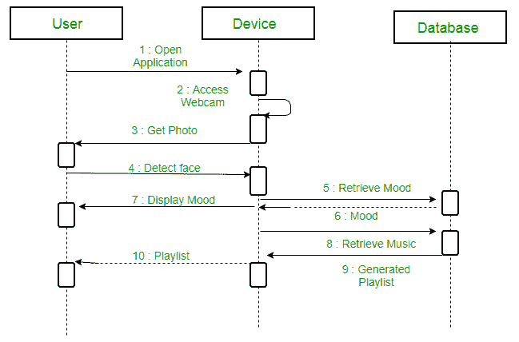
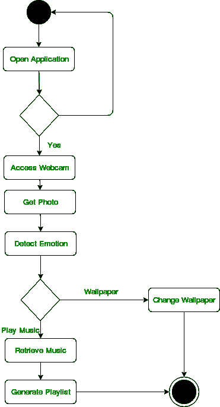

# 序列图和活动图的区别

> 原文:[https://www . geesforgeks . org/序列图和活动图的区别/](https://www.geeksforgeeks.org/difference-between-sequence-diagram-and-activity-diagram/)

**什么是[序列图](https://www.geeksforgeeks.org/unified-modeling-language-uml-sequence-diagrams/)？**

一个[序列图](https://www.geeksforgeeks.org/unified-modeling-language-uml-sequence-diagrams/)简单地描述了对象之间的顺序交互，即这些交互发生的顺序。我们还可以使用术语事件图或事件场景来指代序列图。序列图描述了系统中的对象如何以及以什么顺序运行。商人和软件开发人员广泛使用这些图表来记录和理解新系统和现有系统的需求。

**示例:**基于情感的音乐播放器的序列图:

**什么是[活动图](https://www.geeksforgeeks.org/unified-modeling-language-uml-activity-diagrams/)？**

一个[活动图](https://www.geeksforgeeks.org/unified-modeling-language-uml-activity-diagrams/)基本上是一个流程图(统一建模语言)图，用来描述系统的动态方面。流程图表示从一个活动到另一个活动的活动流程。这些活动可以描述为系统的操作。活动图中的控制流是从一个操作到另一个操作绘制的。该流程可以是顺序的、分支的或并发的。

**示例:**基于情绪的音乐播放器的活动图

**序列和活动图的相似性:**

*   序列图和活动图都是 UML 图。
*   序列图和活动图都用来表示消息的控制流。

**序列图和活动图的区别**

| 程序表 | 活动图 |
| --- | --- |
| 序列图代表了 UML，它用于可视化系统中用于执行特定功能的调用序列。 | 活动图代表了 UML，它被用来为系统的工作流建模。 |
| 序列图显示了从一个对象到另一个对象的消息流。 | 活动图显示了从一个活动到另一个活动的消息流。 |
| 序列图用于动态建模。 | 活动图用于功能建模。 |
| 序列图用于描述单个用例中几个对象
的行为 | 活动图用于描述几个对象和用例的动作的一般顺序
。 |
| 序列图主要用来表示一个过程的时间顺序。 | 活动图用于表示流程的执行。 |