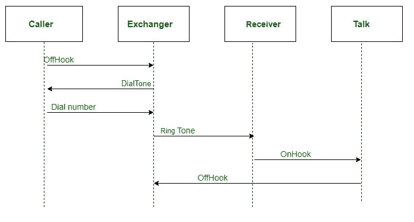
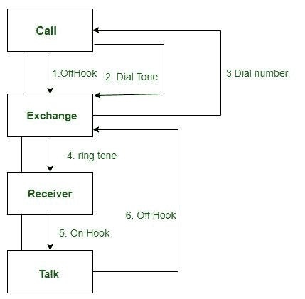

# 序列图和协作图的区别

> 原文:[https://www . geesforgeks . org/序列图和协作图之间的区别/](https://www.geeksforgeeks.org/difference-between-sequence-diagram-and-collaboration-diagram/)

一个[序列图](https://www.geeksforgeeks.org/unified-modeling-language-uml-sequence-diagrams/)是一个交互图，详细说明了正在执行的操作。序列图捕捉协作上下文中对象之间的交互。序列图以时间为中心，通过使用图的垂直轴来表示时间，它们直观地显示了交互的顺序。

**示例:**

**协作图**表示执行特定用例或部分用例行为的对象之间的交互。设计人员使用序列图和协作图来定义和阐明执行用例的特定事件流的对象的角色。

**例:**

**序列和协作图的相似之处**

1.  在统一建模语言中，序列图和协作图都用作交互图。
2.  这两个图都详细描述了系统的行为方面。

**序列与协作图的区别:**

<figure class="table">

| 

序列图

 | 

协作图

 |
| --- | --- |
| 序列图代表了 UML，它用于可视化系统中用于执行特定功能的调用序列。 | 协作图也属于 UML 表示，用于可视化对象的组织及其交互。 |
| 序列图用于表示从一个对象流向另一个对象的消息序列。 | 协作图用于表示系统的结构组织以及发送和接收的消息。 |
| 当时序是主要焦点时，使用序列图。 | 当对象组织是主要焦点时，使用协作图。 |
| 序列图更适合分析活动。 | 协作图更适合于描述数量较少的对象之间更简单的交互。 |

</figure>