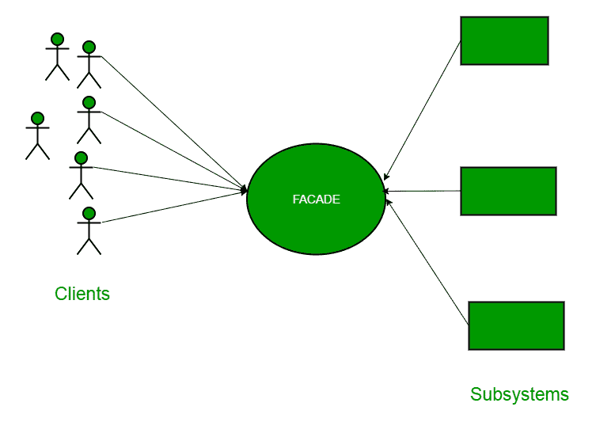

# 立面设计图案|简介

> 原文:[https://www . geesforgeks . org/facade-design-pattern-introduction/](https://www.geeksforgeeks.org/facade-design-pattern-introduction/)

立面是“四人帮”设计模式的一部分，属于结构设计模式。在我们深入研究它的细节之前，让我们讨论一些将由这个特定模式解决的例子。

所以，顾名思义，就是指建筑的正面。走过这条路的人只能看到这座建筑的玻璃面。他们对它、线路、管道和其他复杂的东西一无所知。它隐藏了建筑的所有复杂性，展示了友好的面孔。

**更多示例**

在 Java 中，JDBC 接口可以称为门面，因为我们作为用户或客户端使用“java.sql.Connection”接口创建连接，我们不关心该接口的实现。实现留给驱动程序的供应商。

另一个很好的例子是计算机的启动。当一台计算机启动时，它涉及到 cpu、内存、硬盘等的工作。为了便于用户使用，我们可以添加一个包装任务复杂性的外观，并提供一个简单的界面。
同样适用于**立面设计模式**。它隐藏了系统的复杂性，并为客户端提供了一个接口，客户端可以从该接口访问系统。

[](https://media.geeksforgeeks.org/wp-content/uploads/facadeA.png)

**立面设计模式图**

现在，让我们用一个简单的例子来尝试更好地理解门面模式。让我们考虑一家酒店。这家旅馆有一个旅馆管理员。酒店内有许多餐厅，例如纯素食餐厅、非纯素食餐厅和纯素食/非两者兼有的餐厅。
你作为客户，想要访问不同餐厅的不同菜单。你不知道他们有什么不同的菜单。你只需要去找一个熟悉酒店的酒店老板。无论你想要哪份菜单，你都要告诉酒店老板，他会从各自的餐厅里拿出来，递给你。在这里，酒店管理员充当了**的门面**，因为他隐藏了系统酒店的复杂性。
我们来看看它是如何工作的:

**酒店界面**

```
package structural.facade;
public interface Hotel
{
    public Menus getMenus();
}
```

酒店界面仅返回菜单。
同样，餐厅有三种类型，可以实现酒店界面。让我们看看其中一家餐馆的代码。

**不守寡者。java**

```
package structural.facade;

public class NonVegRestaurant implements Hotel
{
    public Menus getMenus()
    {
        NonVegMenu nv = new NonVegMenu();
        return nv;
    }
}
```

**vegretaurant . Java**

```
package structural.facade;

public class VegRestaurant implements Hotel
{
    public Menus getMenus()
    {
        VegMenu v = new VegMenu();
        return v;
    }
}
```

**【venbasturant . Java】**

```
package structural.facade;

public class VegNonBothRestaurant implements Hotel
{
    public Menus getMenus()
    {
        Both b = new Both();
        return b;
    }
}
```

现在让我们考虑一下门面，

**HotelKeeper.java**

```
package structural.facade;

public class HotelKeeper
{
    public VegMenu getVegMenu()
    {
        VegRestaurant v = new VegRestaurant();
        VegMenu vegMenu = (VegMenu)v.getMenus();
        return vegMenu;
    }

    public NonVegMenu getNonVegMenu()
    {
        NonVegRestaurant v = new NonVegRestaurant();
        NonVegMenu NonvegMenu = (NonVegMenu)v.getMenus();
        return NonvegMenu;
    }

    public Both getVegNonMenu()
    {
        VegNonBothRestaurant v = new VegNonBothRestaurant();
        Both bothMenu = (Both)v.getMenus();
        return bothMenu;
    }    
}
```

由此可见，复杂的实现将由 HotelKeeper 自己完成。客户只需访问酒店博客，并要求提供蔬菜、非蔬菜或蔬菜非两种餐馆菜单。

**客户端程序将如何访问这个立面？**

```
package structural.facade;

public class Client
{
    public static void main (String[] args)
    {
        HotelKeeper keeper = new HotelKeeper();

        VegMenu v = keeper.getVegMenu();
        NonVegMenu nv = keeper.getNonVegMenu();
        Both = keeper.getVegNonMenu();

    }
}
```

通过这种方式，实现被发送到外观。客户端只有一个接口，只能访问这个接口。这隐藏了所有的复杂性。

**这个模式应该什么时候用？**

当您有一个**复杂系统**想要以一种简化的方式向客户端公开，或者您想要在与系统不兼容的现有系统上建立一个外部通信层时，门面模式是合适的。Facade 处理接口，而不是实现。它的目的是将内部复杂性隐藏在一个外表看起来简单的单一界面后面。

**进一步解读:**Python 中的[外立面法](https://www.geeksforgeeks.org/facade-method-python-design-patterns/)

本文由 **[Saket Kumar](https://www.linkedin.com/in/saketkumar95/)** 供稿。如果你喜欢 GeeksforGeeks 并想投稿，你也可以使用[write.geeksforgeeks.org](https://write.geeksforgeeks.org)写一篇文章或者把你的文章邮寄到 review-team@geeksforgeeks.org。看到你的文章出现在极客博客主页上，帮助其他极客。

如果你发现任何不正确的地方，或者你想分享更多关于上面讨论的话题的信息，请写评论。