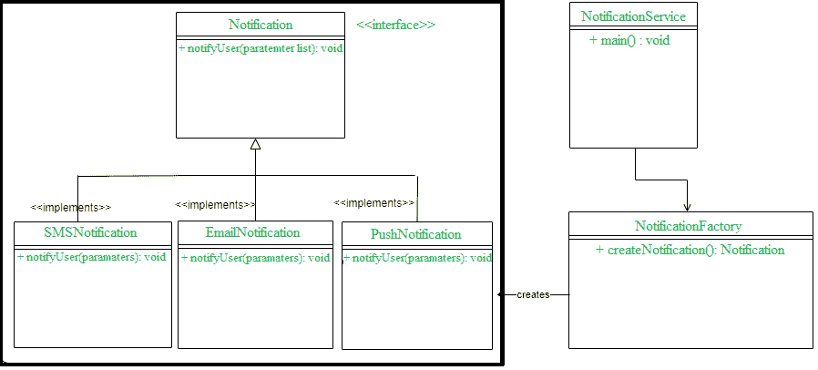
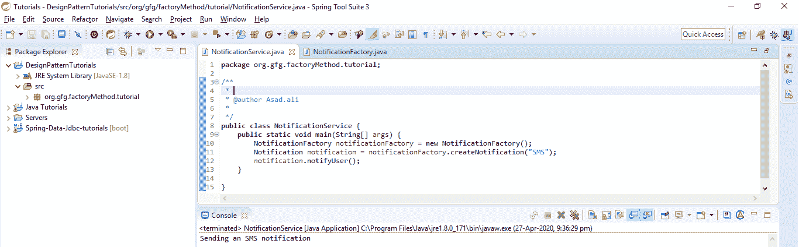

# Java 中的工厂方法设计模式

> 原文:[https://www . geesforgeks . org/factory-method-design-pattern-in-Java/](https://www.geeksforgeeks.org/factory-method-design-pattern-in-java/)

这是一种创造性的设计模式，它谈论一个物体的创造。工厂设计模式规定定义一个接口(一个 java 接口或一个抽象类)，并让子类决定实例化哪个对象。接口中的工厂方法允许一个类将实例化推迟到一个或多个具体的子类。因为这种设计模式谈论对象的实例化，所以它属于创造性设计模式的范畴。如果我们注意到**工厂方法**这个名字，那就意味着有一个方法是工厂，一般来说，工厂涉及到创造性的东西，在这里，一个对象正在被创建。这是创建对象的最佳方式之一，其中对象创建逻辑对客户端是隐藏的。现在让我们看看实现。

**执行:**
1。在接口内部定义工厂方法。
2。让子类实现上述工厂方法，并决定创建哪个对象。
在 Java 中，构造函数不是多态的，但是通过允许子类创建一个对象，我们在实例化中增加了多态行为。简而言之，我们试图通过让子类决定创建什么来实现伪多态性，因此这个工厂方法也被称为

**虚拟构造器**。让我们尝试用一个实时问题和一些编码练习来实现它。

**问题陈述:**
考虑我们想要通过电子邮件、短信和推送通知来实现通知服务。让我们借助工厂方法设计模式来尝试实现这一点。首先，我们将为此设计一个 UML 类图。



在上面的类图中，我们有一个名为 **Notification** 的接口，三个具体的类正在实现 Notification 接口。创建工厂类通知工厂是为了获取通知对象。让我们现在开始编码。

**创建通知界面**

## Java 语言（一种计算机语言，尤用于创建网站）

```
public interface Notification {
    void notifyUser();
}
```

注意-上面的接口也可以创建为抽象类。
**创建所有实现类**

```
SMSNotification.java

```

## Java 语言（一种计算机语言，尤用于创建网站）

```
public class SMSNotification implements Notification {

    @Override
    public void notifyUser()
    {
        // TODO Auto-generated method stub
        System.out.println("Sending an SMS notification");
    }
}
```

```
EmailNotification.java

```

## Java 语言（一种计算机语言，尤用于创建网站）

```
public class EmailNotification implements Notification {

    @Override
    public void notifyUser()
    {
        // TODO Auto-generated method stub
        System.out.println("Sending an e-mail notification");
    }
}
```

```
PushNotification.java

```

## Java 语言（一种计算机语言，尤用于创建网站）

```
public class PushNotification implements Notification {

    @Override
    public void notifyUser()
    {
        // TODO Auto-generated method stub
        System.out.println("Sending a push notification");
    }
}
```

**创建一个工厂类 NotificationFactory.java 来实例化具体类。**

## Java 语言（一种计算机语言，尤用于创建网站）

```
public class NotificationFactory {
    public Notification createNotification(String channel)
    {
        if (channel == null || channel.isEmpty())
            return null;
        if ("SMS".equals(channel)) {
            return new SMSNotification();
        }
        else if ("EMAIL".equals(channel)) {
            return new EmailNotification();
        }
        else if ("PUSH".equals(channel)) {
            return new PushNotification();
        }
        return null;
    }
}
```

现在让我们使用工厂类通过传递一些信息来创建并获得一个具体类的对象。

## Java 语言（一种计算机语言，尤用于创建网站）

```
public class NotificationService {
    public static void main(String[] args)
    {
        NotificationFactory notificationFactory = new NotificationFactory();
        Notification notification = notificationFactory.createNotification("SMS");
        notification.notifyUser();
    }
}
```

```
Output : Sending an SMS notification

```



**实时示例**
这种设计模式已经在 JDK 广泛使用，比如
1。java.util.Calendar、NumberFormat 和 ResourceBundle 的 getInstance()方法使用工厂方法设计模式。
2。Java 中的所有包装类，如整型、布尔型等，都使用这种模式，使用 valueOf()方法计算值。
3。Java . nio . charset . charset . FOrname()、Java . SQL . drivermanager # GetConnection()、java.net.URL.openConnection()、java.lang.Class.newInstance()、java.lang.Class.forName()是使用工厂方法设计模式的一些例子。
**结论**
到目前为止，我们已经学习了什么是 Factory 方法设计模式，以及如何实现。我相信现在我们对这种设计机制的优势有了一个公平的理解。