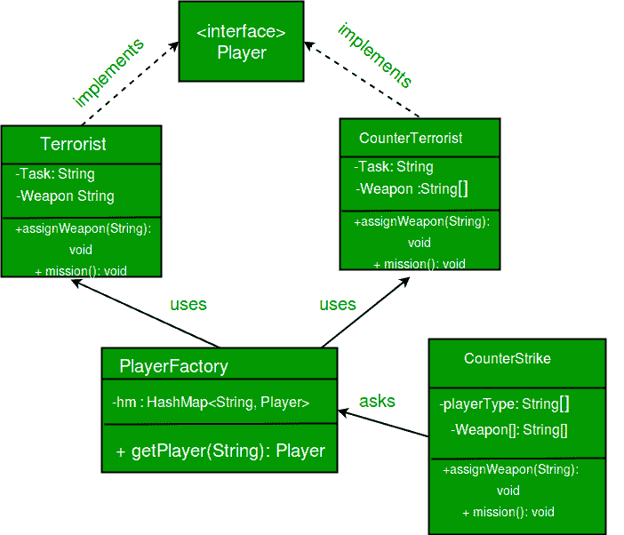

# 飞重设计模式

> 原文:[https://www.geeksforgeeks.org/flyweight-design-pattern/](https://www.geeksforgeeks.org/flyweight-design-pattern/)

Flyweight 模式是[结构设计模式](https://www.geeksforgeeks.org/design-patterns-set-1-introduction/)之一，因为该模式提供了减少对象数量的方法，从而改善应用程序所需的对象结构。当我们需要创建大量类似的对象时(比如 10 <sup>5</sup> )，会用到 Flyweight 模式。飞重物体的一个重要特征是它们是。这意味着它们一旦被构建就不能被修改。

**为什么我们关心程序中对象的数量？**

*   对象数量的减少减少了内存的使用，并且它设法让我们远离与内存相关的错误，如[Java . lang . out of memory error .](https://docs.oracle.com/javase/7/docs/api/java/lang/OutOfMemoryError.html)
*   虽然用 Java 创建一个对象真的很快，但我们仍然可以通过共享对象来减少程序的执行时间。

在 Flyweight 模式中，我们使用一个 [HashMap](https://www.geeksforgeeks.org/hashmap-treemap-java/) ，它存储对已经创建的对象的引用，每个对象都与一个键相关联。现在，当一个客户端想要创建一个对象时，他只需要传递一个与之关联的键，如果该对象已经被创建，我们只需获取对该对象的引用，否则它会创建一个新的对象，然后将其引用返回给客户端。

**内在和外在状态**

为了理解内在和外在状态，让我们考虑一个例子。

假设在文本编辑器中，当我们输入一个字符时，创建了一个字符类的对象，字符类的属性是{名称、字体、大小}。我们不需要在每次客户端输入一个字符时都创建一个对象，因为字母“B”与另一个“B”没有什么不同。如果客户端再次键入“B”，我们只需返回之前已经创建的对象。现在所有这些都是内在状态(名称、字体、大小)，因为它们可以在不同的对象之间共享，因为它们彼此相似。

现在我们给字符类添加了更多的属性，它们是行和列。它们指定字符在文档中的位置。现在，即使对于相同的字符，这些属性也不会相似，因为没有两个字符在文档中具有相同的位置，这些状态被称为外部状态，并且它们不能在对象之间共享。

**实现:**我们在[反击](https://en.wikipedia.org/wiki/Counter-Strike)的游戏中实现恐怖分子和反恐怖分子的创建。所以我们有两个班一个是 **T** 恐怖分子( **T** )另一个是**C**counter**T**恐怖分子( **CT** )。每当一个玩家要一件武器时，我们就把他要的武器分配给他。在任务中，恐怖分子的任务是放置炸弹，而反恐怖分子必须扩散炸弹。

**为什么在这个例子中使用 Flyweight 设计模式？**这里我们使用了 Fly Weight 的设计模式，因为这里我们需要减少玩家的对象数量。现在我们有 n 个玩家玩 CS 1.6，如果我们不遵循飞行重量设计模式，那么我们将不得不创建 n 个对象，每个玩家一个。但是现在我们只需要创建两个对象，一个用于恐怖分子，另一个用于反恐怖分子，我们会在需要的时候重复使用。

**内在状态:**这里的“任务”是两种类型玩家的内在状态，因为这对于 T/CT 总是一样的。我们可以有一些其他国家，像他们的颜色或任何其他属性，类似于所有的恐怖分子/反恐怖分子在他们各自的恐怖分子/反恐怖分子类别。

**外在状态:**武器是一种外在状态，因为每个玩家都可以携带自己选择的任何武器。客户端本身需要将武器作为参数传递。

类图: [](https://media.geeksforgeeks.org/wp-content/uploads/flyweight.jpg)

```
// A Java program to demonstrate working of
// FlyWeight Pattern with example of Counter
// Strike Game
import java.util.Random;
import java.util.HashMap;

// A common interface for all players
interface Player
{
    public void assignWeapon(String weapon);
    public void mission();
}

// Terrorist must have weapon and mission
class Terrorist implements Player
{
    // Intrinsic Attribute
    private final String TASK;

    // Extrinsic Attribute
    private String weapon;

    public Terrorist()
    {
        TASK = "PLANT A BOMB";
    }
    public void assignWeapon(String weapon)
    {
        // Assign a weapon
        this.weapon = weapon;
    }
    public void mission()
    {
        //Work on the Mission
        System.out.println("Terrorist with weapon "
                           + weapon + "|" + " Task is " + TASK);
    }
}

// CounterTerrorist must have weapon and mission
class CounterTerrorist implements Player
{
    // Intrinsic Attribute
    private final String TASK;

    // Extrinsic Attribute
    private String weapon;

    public CounterTerrorist()
    {
        TASK = "DIFFUSE BOMB";
    }
    public void assignWeapon(String weapon)
    {
        this.weapon = weapon;
    }
    public void mission()
    {
        System.out.println("Counter Terrorist with weapon "
                           + weapon + "|" + " Task is " + TASK);
    }
}

// Class used to get a player using HashMap (Returns
// an existing player if a player of given type exists.
// Else creates a new player and returns it.
class PlayerFactory
{
    /* HashMap stores the reference to the object
       of Terrorist(TS) or CounterTerrorist(CT).  */
    private static HashMap <String, Player> hm =
                         new HashMap<String, Player>();

    // Method to get a player
    public static Player getPlayer(String type)
    {
        Player p = null;

        /* If an object for TS or CT has already been
           created simply return its reference */
        if (hm.containsKey(type))
                p = hm.get(type);
        else
        {
            /* create an object of TS/CT  */
            switch(type)
            {
            case "Terrorist":
                System.out.println("Terrorist Created");
                p = new Terrorist();
                break;
            case "CounterTerrorist":
                System.out.println("Counter Terrorist Created");
                p = new CounterTerrorist();
                break;
            default :
                System.out.println("Unreachable code!");
            }

            // Once created insert it into the HashMap
            hm.put(type, p);
        }
        return p;
    }
}

// Driver class
public class CounterStrike
{
    // All player types and weapon (used by getRandPlayerType()
    // and getRandWeapon()
    private static String[] playerType =
                    {"Terrorist", "CounterTerrorist"};
    private static String[] weapons =
      {"AK-47", "Maverick", "Gut Knife", "Desert Eagle"};

    // Driver code
    public static void main(String args[])
    {
        /* Assume that we have a total of 10 players
           in the game. */
        for (int i = 0; i < 10; i++)
        {
            /* getPlayer() is called simply using the class
               name since the method is a static one */
            Player p = PlayerFactory.getPlayer(getRandPlayerType());

            /* Assign a weapon chosen randomly uniformly
               from the weapon array  */
            p.assignWeapon(getRandWeapon());

            // Send this player on a mission
            p.mission();
        }
    }

    // Utility methods to get a random player type and
    // weapon
    public static String getRandPlayerType()
    {
        Random r = new Random();

        // Will return an integer between [0,2)
        int randInt = r.nextInt(playerType.length);

        // return the player stored at index 'randInt'
        return playerType[randInt];
    }
    public static String getRandWeapon()
    {
        Random r = new Random();

        // Will return an integer between [0,5)
        int randInt = r.nextInt(weapons.length);

        // Return the weapon stored at index 'randInt'
        return weapons[randInt];
    }
}
```

**输出:**

```
Counter Terrorist Created
Counter Terrorist with weapon Gut Knife| Task is DIFFUSE BOMB
Counter Terrorist with weapon Desert Eagle| Task is DIFFUSE BOMB
Terrorist Created
Terrorist with weapon AK-47| Task is PLANT A BOMB
Terrorist with weapon Gut Knife| Task is PLANT A BOMB
Terrorist with weapon Gut Knife| Task is PLANT A BOMB
Terrorist with weapon Desert Eagle| Task is PLANT A BOMB
Terrorist with weapon AK-47| Task is PLANT A BOMB
Counter Terrorist with weapon Desert Eagle| Task is DIFFUSE BOMB
Counter Terrorist with weapon Gut Knife| Task is DIFFUSE BOMB
Counter Terrorist with weapon Desert Eagle| Task is DIFFUSE BOMB
```

**进一步阅读–**[Python 中的 Flyweight 方法](https://www.geeksforgeeks.org/flyweight-method-python-design-patterns/)

**参考文献:**

*   可重用面向对象软件的要素(由“四人帮”编写)
*   [https://en.wikipedia.org/wiki/Flyweight_pattern](https://en.wikipedia.org/wiki/Flyweight_pattern)

本文由 **Chirag Agarwal** 供稿。如果你喜欢极客博客并想投稿，你也可以写一篇文章并把你的文章邮寄到 review-team@geeksforgeeks.org。看到你的文章出现在极客博客主页上，帮助其他极客。

如果您发现任何不正确的地方，或者您想分享关于上面讨论的主题的更多信息，请写评论