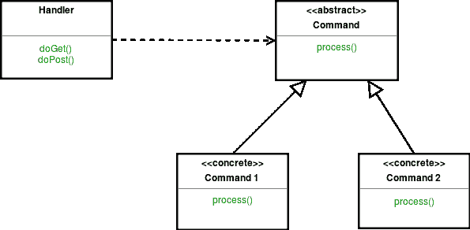

# 前控制器设计模式

> 原文:[https://www . geesforgeks . org/front-controller-design-pattern/](https://www.geeksforgeeks.org/front-controller-design-pattern/)

前端控制器设计模式意味着应用程序中资源的所有请求都将由单个处理程序处理，然后分派给该类型请求的适当处理程序。前控制器可以使用其他助手来实现调度机制。

**UML 图前控制器设计模式**

[](https://media.geeksforgeeks.org/wp-content/uploads/uml-front-controller-design-pattern.png)

**设计组件**

*   **控制器:**控制器是处理系统中所有请求的初始接触点。控制器可以委托助手完成用户的认证和授权，或者启动联系人检索。
*   **视图:**视图向客户端表示和显示信息。视图从模型中检索信息。助手通过封装和修改底层数据模型来支持视图，以便在显示中使用。
*   **Dispatcher:** 一个 Dispatcher 负责视图管理和导航，管理要呈现给用户的下一个视图的选择，并提供对该资源进行矢量控制的机制。
*   **帮助者:**帮助者负责帮助视图或控制器完成其处理。因此，助手有许多职责，包括收集视图所需的数据和存储这个中间模型，在这种情况下，助手有时被称为值 bean。

**我们来看一个前置控制器设计模式的例子。**

```
class TeacherView 
{
    public void display()
    {
        System.out.println("Teacher View");
    }
}

class StudentView 
{
    public void display()
    {
        System.out.println("Student View");
    }
}

class Dispatching 
{
    private StudentView studentView;
    private TeacherView teacherView;

    public Dispatching()
    {
        studentView = new StudentView();
        teacherView = new TeacherView();
    }

    public void dispatch(String request)
    {
        if(request.equalsIgnoreCase("Student"))
        {
            studentView.display();
        }
        else
        {
            teacherView.display();
        }    
    }
}

class FrontController 
{
    private Dispatching Dispatching;

    public FrontController()
    {
        Dispatching = new Dispatching();
    }

    private boolean isAuthenticUser()
    {
        System.out.println("Authentication successful.");
        return true;
    }

    private void trackRequest(String request)
    {
        System.out.println("Requested View: " + request);
    }

    public void dispatchRequest(String request)
    {
        trackRequest(request);

        if(isAuthenticUser())
        {
            Dispatching.dispatch(request);
        }    
    }
}

class FrontControllerPattern
{
    public static void main(String[] args) 
    {
        FrontController frontController = new FrontController();
        frontController.dispatchRequest("Teacher");
        frontController.dispatchRequest("Student");
    }
}
```

输出:

```
Requested View: Teacher
Authentication successful.
Teacher View
Requested View: Student
Authentication successful.
Student View

```

**优势:**

*   **集中控制:**前端控制器处理所有对 Web 应用的请求。这种避免使用多个控制器的集中式控制的实现对于实施应用范围的策略(如用户跟踪和安全性)是理想的。
*   **线程安全:**当接收到新请求时，会出现一个新的命令对象，而这些命令对象并不意味着是线程安全的。因此，它在命令类中是安全的。虽然在收集线程问题时不能保证安全性，但是使用该命令的代码仍然是线程安全的。

**缺点:**

*   使用前端控制器无法扩展应用程序。
*   如果您唯一地处理单个请求，性能会更好。

本文由 **[Saket Kumar](https://github.com/saketkumar95)** 供稿。如果你喜欢 GeeksforGeeks 并想投稿，你也可以使用[contribute.geeksforgeeks.org](http://www.contribute.geeksforgeeks.org)写一篇文章或者把你的文章邮寄到 contribute@geeksforgeeks.org。看到你的文章出现在极客博客主页上，帮助其他极客。

如果你发现任何不正确的地方，或者你想分享更多关于上面讨论的话题的信息，请写评论。