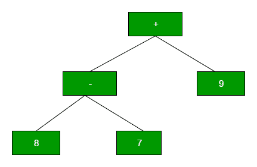
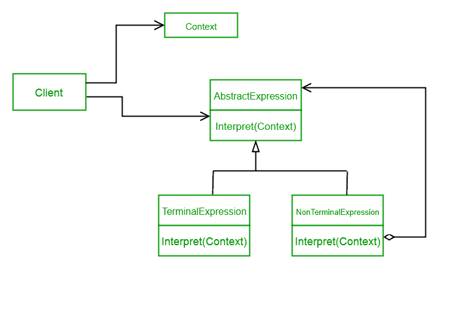

# 解释器设计模式

> 原文:[https://www.geeksforgeeks.org/interpreter-design-pattern/](https://www.geeksforgeeks.org/interpreter-design-pattern/)

解释器设计模式是**行为**设计模式之一。解释器模式用于定义一种语言的语法表示，并提供解释器来处理这种语法。

*   这种模式包括实现一个表达式接口来解释特定的上下文。该模式用于 SQL 解析、符号处理引擎等。
*   这种模式在表达式层次上执行。这里的每个表达式都是一个终端或非终端。
*   解释器设计模式的树形结构有点类似于复合设计模式定义的树形结构，终端表达式是叶对象，非终端表达式是复合。
*   该树包含要计算的表达式，通常由解析器生成。解析器本身不是解释器模式的一部分。

例如:
这里是**"+–9 8 7 "**:
[](https://media.geeksforgeeks.org/wp-content/uploads/interpreter-pattern-1.png)的表达层次

**实现解释器模式**

**UML 图解释器设计模式**

[](https://media.geeksforgeeks.org/wp-content/uploads/UMLDiagram-1.png)

**设计组件**

*   **抽象表达式**(表达式):声明 AST 中所有节点(终端和非终端)覆盖的解释()操作。
*   **终端表达式** (NumberExpression):实现终端表达式的解释()操作。
*   **非终结表达式**(加法表达式、减法表达式和乘法表达式):对所有非终结表达式执行解释()操作。
*   **上下文**(字符串):包含解释器全局的信息。必须解释和解析的是这个带有后缀符号的字符串表达式。
*   **客户端** (ExpressionParser):构建(或提供)由终端表达式和非终端表达式组装的 AST。客户端调用解释()操作。

**我们来看一个解释器设计模式的例子。**

```
// Expression interface used to
// check the interpreter.
interface Expression
{
    boolean interpreter(String con);
}

// TerminalExpression class implementing
// the above interface. This interpreter 
// just check if the data is same as the 
// interpreter data.
class TerminalExpression implements Expression 
{
    String data;

    public TerminalExpression(String data)
    {
        this.data = data; 
    }

    public boolean interpreter(String con) 
    {
        if(con.contains(data))
        {
            return true;
        }
        else
        {
            return false;  
        }
    }
}
// OrExpression class implementing
// the above interface. This interpreter 
// just returns the or condition of the 
// data is same as the interpreter data.
class OrExpression implements Expression 
{
    Expression expr1;
    Expression expr2;

    public OrExpression(Expression expr1, Expression expr2) 
    {
        this.expr1 = expr1;
        this.expr2 = expr2;
    }
    public boolean interpreter(String con) 
    {        
        return expr1.interpreter(con) || expr2.interpreter(con);
    }
}

// AndExpression class implementing
// the above interface. This interpreter 
// just returns the And condition of the 
// data is same as the interpreter data.
class AndExpression implements Expression 
{
    Expression expr1;
    Expression expr2;

    public AndExpression(Expression expr1, Expression expr2) 
    { 
        this.expr1 = expr1;
        this.expr2 = expr2;
    }
    public boolean interpreter(String con) 
    {        
        return expr1.interpreter(con) && expr2.interpreter(con);
    }
}

// Driver class
class InterpreterPattern
{

    public static void main(String[] args) 
    {
        Expression person1 = new TerminalExpression("Kushagra");
        Expression person2 = new TerminalExpression("Lokesh");
        Expression isSingle = new OrExpression(person1, person2);

        Expression vikram = new TerminalExpression("Vikram");
        Expression committed = new TerminalExpression("Committed");
        Expression isCommitted = new AndExpression(vikram, committed);    

        System.out.println(isSingle.interpreter("Kushagra"));
        System.out.println(isSingle.interpreter("Lokesh"));
        System.out.println(isSingle.interpreter("Achint"));

        System.out.println(isCommitted.interpreter("Committed, Vikram"));
        System.out.println(isCommitted.interpreter("Single, Vikram"));

    }
}
```

输出:

```
true
true
false
true
false

```

在上面的代码中，我们正在创建一个接口**表达式**和**具体的**类来实现表达式接口。定义了一个类**终端表达式**作为主解释器，其他类**或表达式**、**和表达式**用于创建组合表达式。

**优势**

*   很容易改变和扩展语法。因为模式使用类来表示语法规则，所以您可以使用继承来更改或扩展语法。现有表达式可以增量修改，新表达式可以定义为旧表达式的变体。
*   实现语法也很容易。在抽象语法树中定义节点的类有类似的实现。这些类很容易编写，并且它们的生成通常可以通过编译器或解析器生成器来自动化。

**缺点**

*   复杂的语法很难维护。解释器模式为语法中的每个规则定义至少一个类。因此，包含许多规则的语法可能很难管理和维护。

本文由 **[Saket Kumar](https://github.com/saketkumar95)** 供稿。如果你喜欢 GeeksforGeeks 并想投稿，你也可以使用[contribute.geeksforgeeks.org](http://www.contribute.geeksforgeeks.org)写一篇文章或者把你的文章邮寄到 contribute@geeksforgeeks.org。看到你的文章出现在极客博客主页上，帮助其他极客。

如果你发现任何不正确的地方，或者你想分享更多关于上面讨论的话题的信息，请写评论。