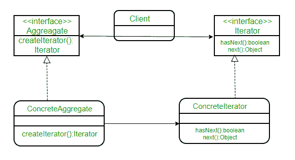

# 迭代器模式

> 原文:[https://www.geeksforgeeks.org/iterator-pattern/](https://www.geeksforgeeks.org/iterator-pattern/)

迭代器模式是一种相对简单且经常使用的设计模式。每种语言都有很多可用的数据结构/集合。每个集合都必须提供一个迭代器，让它遍历它的对象。然而，在这样做的时候，它应该确保不公开它的实现。
假设我们正在构建一个应用程序，要求我们维护一个通知列表。最终，代码的某些部分将需要迭代所有通知。如果我们将您的通知集合实现为一个数组，您可以通过以下方式迭代它们:

```
// If a simple array is used to store notifications
for (int i = 0; i < notificationList.length; i++)
     Notification notification = notificationList[i]);

```

```
// If ArrayList is Java is used, then we would iterate
// over them as:
for (int i = 0; i < notificationList.size(); i++)
    Notification notification = (Notification)notificationList.get(i);

```

如果是其他的收藏品，比如布景、树等等。迭代的方式会略有改变。现在，如果我们构建一个迭代器，提供一种独立于集合类型的通用迭代方式，会怎么样。

```
// Create an iterator
Iterator iterator = notificationList.createIterator();

// It wouldn’t matter if list is Array or ArrayList or
// anything else.
while (iterator.hasNext())
{
    Notification notification = iterator.next());
}

```

迭代器模式让我们做到了这一点。形式上定义如下: ***迭代器模式提供了一种在不暴露底层表示的情况下访问聚合对象元素的方法。***

***类图:***


这里，我们有一个通用的客户端接口 Aggregate，因为它将客户端从您的对象集合的实现中分离出来。ConcreteAggregate 实现 createIterator()，返回其集合的迭代器。每个具体集合的责任是实例化一个具体迭代器，该迭代器可以遍历其对象集合。迭代器接口提供了一组遍历或修改集合的方法，除了 next()/hasNext()之外，还可以提供搜索、移除等功能。
我们通过一个例子来理解这一点。假设我们正在应用程序中创建一个通知栏，显示通知集合中保存的所有通知。NotificationCollection 提供了一个迭代器来迭代其元素，而无需向客户端(NotificationBar)公开它是如何实现集合(在本例中是数组)的。

类图应该是:


下面是相同的 Java 实现:

```
// A Java program to demonstrate implementation
// of iterator pattern with the example of
// notifications

// A simple Notification class
class Notification
{
    // To store notification message
    String notification;

    public Notification(String notification)
    {
        this.notification = notification;
    }
    public String getNotification()
    {
        return notification;
    }
}

// Collection interface
interface Collection
{
    public Iterator createIterator();
}

// Collection of notifications
class NotificationCollection implements Collection
{
    static final int MAX_ITEMS = 6;
    int numberOfItems = 0;
    Notification[] notificationList;

    public NotificationCollection()
    {
        notificationList = new Notification[MAX_ITEMS];

        // Let us add some dummy notifications
        addItem("Notification 1");
        addItem("Notification 2");
        addItem("Notification 3");
    }

    public void addItem(String str)
    {
        Notification notification = new Notification(str);
        if (numberOfItems >= MAX_ITEMS)
            System.err.println("Full");
        else
        {
            notificationList[numberOfItems] = notification;
            numberOfItems = numberOfItems + 1;
        }
    }

    public Iterator createIterator()
    {
        return new NotificationIterator(notificationList);
    }
}

// We could also use Java.Util.Iterator
interface Iterator
{
    // indicates whether there are more elements to
    // iterate over
    boolean hasNext();

    // returns the next element
    Object next();
}

// Notification iterator
class NotificationIterator implements Iterator
{
    Notification[] notificationList;

    // maintains curr pos of iterator over the array
    int pos = 0;

    // Constructor takes the array of notifiactionList are
    // going to iterate over.
    public  NotificationIterator (Notification[] notificationList)
    {
        this.notificationList = notificationList;
    }

    public Object next()
    {
        // return next element in the array and increment pos
        Notification notification =  notificationList[pos];
        pos += 1;
        return notification;
    }

    public boolean hasNext()
    {
        if (pos >= notificationList.length ||
            notificationList[pos] == null)
            return false;
        else
            return true;
    }
}

// Contains collection of notifications as an object of
// NotificationCollection
class NotificationBar
{
    NotificationCollection notifications;

    public NotificationBar(NotificationCollection notifications)
    {
        this.notifications = notifications;
    }

    public void printNotifications()
    {
        Iterator iterator = notifications.createIterator();
        System.out.println("-------NOTIFICATION BAR------------");
        while (iterator.hasNext())
        {
            Notification n = (Notification)iterator.next();
            System.out.println(n.getNotification());
        }
    }
}

// Driver class
class Main
{
    public static void main(String args[])
    {
        NotificationCollection nc = new NotificationCollection();
        NotificationBar nb = new NotificationBar(nc);
        nb.printNotifications();
    }
}
```

输出:

```
-------NOTIFICATION BAR------------
Notification 1
Notification 2
Notification 3
```

请注意，如果我们使用数组列表而不是数组，由于迭代器接口的使用实现了解耦，客户端(通知栏)代码不会有任何变化。

**进一步阅读–**[Python 中的迭代器方法](https://www.geeksforgeeks.org/iterator-method-python-design-patterns/)

**参考文献:**
[头部优先设计模式](http://www.amazon.com/Head-First-Design-Patterns/dp/0596007124)

本文由**苏拉布·库马尔供稿。**如果你喜欢 GeeksforGeeks 并想投稿，你也可以写一篇文章，把你的文章邮寄到 review-team@geeksforgeeks.org。看到你的文章出现在极客博客主页上，帮助其他极客。

如果您发现任何不正确的地方，或者您想分享关于上面讨论的主题的更多信息，请写评论