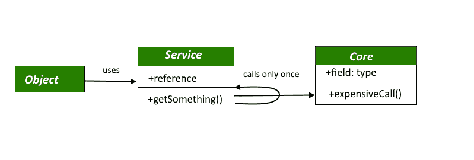

# 懒加载设计模式

> 原文:[https://www.geeksforgeeks.org/lazy-loading-design-pattern/](https://www.geeksforgeeks.org/lazy-loading-design-pattern/)

延迟加载是一个概念，我们延迟对象的加载，直到我们需要它的时候。

*   延迟加载只是在实际需要的时候给初始化类的过程起的一个奇特的名字。
*   简而言之，惰性加载是一种软件设计模式，其中对象的初始化只在实际需要时发生，而不是在此之前发生，以保持使用的简单性并提高性能。
*   当对象创建的成本非常高并且对象的使用非常少时，惰性加载是必不可少的。所以这是一个值得实现延迟加载的场景。惰性加载的基本思想是在需要时加载对象/数据。

例如，假设您正在创建一个应用程序，其中有一个公司对象，该对象包含一个联系人列表对象中的公司员工列表。一家公司可能有成千上万的员工。从数据库中加载公司对象以及联系人列表对象中的所有员工列表可能非常耗时。在某些情况下，你甚至不需要员工名单，但你必须等到公司及其员工名单加载到内存中。
一种节省时间和内存的方法是避免在需要之前加载员工对象，这是使用**惰性加载设计模式**完成的。
[](https://media.geeksforgeeks.org/wp-content/uploads/lazy-loading.png) 
**惰性加载模式有四种常见的实现方式:**

1.  虚拟代理
2.  惰性初始化
3.  《人鬼情未了》
4.  价值持有人

**虚拟代理**

虚拟代理模式是一种节省内存的技术，它建议将对象创建推迟到需要的时候。它用于创建一个在内存使用或相关处理方面很昂贵的对象。

```
// Java program to illustrate
// virtual proxy in
// Lazy Loading Design Pattern
import java.util.List;
import java.util.ArrayList;

interface ContactList
{
public List<Employee> getEmployeeList();
}

class Company {
    String companyName;
    String companyAddress;
    String companyContactNo;
    ContactList contactList;

    public Company(String companyName, String companyAddress,
            String companyContactNo, ContactList contactList)
    {
        this.companyName = companyName;
        this.companyAddress = companyAddress;
        this.companyContactNo = companyContactNo;
        this.contactList = contactList;
    }

    public String getCompanyName()
    {
        return companyName;
    }
    public String getCompanyAddress()
    {
        return companyAddress;
    }
    public String getCompanyContactNo()
    {
        return companyContactNo;
    }
    public ContactList getContactList()
    {
        return contactList;
    }

}

class ContactListImpl implements ContactList {
    public List<Employee> getEmployeeList()
    {
        return getEmpList();
    }
    private static List<Employee> getEmpList()
    {
        List<Employee> empList = new ArrayList<Employee>(5);

        empList.add(new Employee("Lokesh", 2565.55, "SE"));
        empList.add(new Employee("Kushagra", 22574, "Manager"));
        empList.add(new Employee("Susmit", 3256.77, "G4"));
        empList.add(new Employee("Vikram", 4875.54, "SSE"));
        empList.add(new Employee("Achint", 2847.01, "SE"));

        return empList;
    }
}

class ContactListProxyImpl implements ContactList {
    private ContactList contactList;
    public List<Employee> getEmployeeList()
    {
        if (contactList == null) {
            System.out.println("Fetching list of employees");
            contactList = new ContactListImpl();
        }
        return contactList.getEmployeeList();
    }
}

class Employee {
    private String employeeName;

    private double employeeSalary;
    private String employeeDesignation;

    public Employee(String employeeName,
             double employeeSalary, String employeeDesignation)
    {
        this.employeeName = employeeName;
        this.employeeSalary = employeeSalary;
        this.employeeDesignation = employeeDesignation;
    }
    public String getEmployeeName()
    {
        return employeeName;
    }
    public double getEmployeeSalary()
    {
        return employeeSalary;
    }
    public String getEmployeeDesignation()
    {
        return employeeDesignation;
    }
    public String toString()
    {
        return "Employee Name: " + employeeName + ", 
               EmployeeDesignation : " + employeeDesignation + ",
               Employee Salary : " + employeeSalary;
    }
}

class LazyLoading {
    public static void main(String[] args)
    {
        ContactList contactList = new ContactListProxyImpl();
        Company company = new Company
        ("Geeksforgeeks", "India", "+91-011-28458965", contactList);

        System.out.println("Company Name: " + company.getCompanyName());
        System.out.println("Company Address: " + company.getCompanyAddress());
        System.out.println("Company Contact No.: " + company.getCompanyContactNo());
        System.out.println("Requesting for contact list");

        contactList = company.getContactList();
        List<Employee> empList = contactList.getEmployeeList();
        for (Employee emp : empList) {
            System.out.println(emp);
        }
    }
}
```

输出:

```
Company Name: ABC Company
Company Address: India
Company Contact No.: +91-011-28458965
Requesting for contact list
Fetching list of employees
Employee Name: Lokesh, EmployeeDesignation: SE, Employee Salary: 2565.55
Employee Name: Kushagra, EmployeeDesignation: Manager, Employee Salary: 22574.0
Employee Name: Susmit, EmployeeDesignation: G4, Employee Salary: 3256.77
Employee Name: Vikram, EmployeeDesignation: SSE, Employee Salary: 4875.54
Employee Name: Achint, EmployeeDesignation: SE, Employee Salary: 2847.01

```

现在，在上面的代码中，有一个公司对象是用代理联系人列表对象创建的。此时，Company 对象持有代理引用，而不是真正的 ContactList 对象的引用，因此没有员工列表加载到内存中。

**惰性初始化**

惰性初始化技术包括在使用类字段时检查其值。如果该值等于 null，则该字段在返回之前会加载适当的值。
下面是例子:

```
// Java program to illustrate
// Lazy Initialization in
// Lazy Loading Design Pattern
import java.util.HashMap;
import java.util.Map;
import java.util.Map.Entry;

enum CarType {
    none,
    Audi,
    BMW,
}

class Car {
    private static Map<CarType, Car> types = new HashMap<>();

    private Car(CarType type) {}

    public static Car getCarByTypeName(CarType type)
    {
        Car Car;

        if (!types.containsKey(type)) {
            // Lazy initialisation
            Car = new Car(type);
            types.put(type, Car);
        } else {
            // It's available currently
            Car = types.get(type);
        }

        return Car;
    }

    public static Car getCarByTypeNameHighConcurrentVersion(CarType type)
    {
        if (!types.containsKey(type)) {
            synchronized(types)
            {
                // Check again, after having acquired the lock to make sure
                // the instance was not created meanwhile by another thread
                if (!types.containsKey(type)) {
                    // Lazy initialisation
                    types.put(type, new Car(type));
                }
            }
        }

        return types.get(type);
    }

    public static void showAll()
    {
        if (types.size() > 0) {

            System.out.println("Number of instances made = " + types.size());

            for (Entry<CarType, Car> entry : types.entrySet()) {
                String Car = entry.getKey().toString();
                Car = Character.toUpperCase(Car.charAt(0)) + Car.substring(1);
                System.out.println(Car);
            }

            System.out.println();
        }
    }
}

class Program {
    public static void main(String[] args)
    {
        Car.getCarByTypeName(CarType.BMW);
        Car.showAll();
        Car.getCarByTypeName(CarType.Audi);
        Car.showAll();
        Car.getCarByTypeName(CarType.BMW);
        Car.showAll();
    }
}
```

输出:

```
Number of instances made = 1
BMW

Number of instances made = 2
BMW
Audi

Number of instances made = 2
BMW
Audi

```

**价值持有人**

基本上，值持有人是一个处理惰性加载行为的通用对象，它出现在对象数据字段的位置。当用户需要访问它时，他们只需通过调用 GetValue 方法向值持有者请求它的值。那时(也只有那时)，从数据库或服务加载值。(这并不总是需要的)。

```
// Java function to illustrate
// Lazy Initialization in
// Lazy Loading Design Pattern
public class ValueHolder<T> {
    private T value;
    private readonly Func<object, T> valueRetrieval;

    // Constructor
    public ValueHolder(Func<object, T> valueRetrieval)
    {
        valueRetrieval = this.valueRetrieval;
    }

    // We'll use the signature "GetValue" for convention
    public T GetValue(object parameter)
    {
        if (value == null)
            value = valueRetrieval(parameter);
        return value;
    }
}
```

注意:这种方法的主要缺点是用户必须知道值持有者是预期的。

**幽灵**

鬼是以部分状态加载的对象。它对应于真实的对象，但不处于其完整状态。它可能是空的，也可能只包含一些字段(如标识)。当用户试图访问一些尚未加载的字段时，ghost 对象会完全初始化自己(这并不总是需要的)。

例如，让我们考虑一个开发人员添加了一个在线表单，这样任何用户都可以通过该在线表单请求内容。在创建时，我们只知道内容将被访问，但是用户不知道什么动作或内容。

```
$userData = array(
    "UID" = > uniqid(),
    "requestTime" = > microtime(true),
    "dataType" = > "",
    "request" = > "");

if (isset($_POST['data']) && $userData) {
    //...
}
```

在上面的 PHP 示例中，用户可以以文本文件或任何来源的形式访问在线表单中的内容。

*   **UID** 是每个特定用户的唯一 ID。
*   **requestTime** 是用户从在线表单请求内容的时间。
*   **数据类型**是数据的类型。主要是文本，但取决于形式。
*   **请求**是通知用户请求是否完成的布尔函数。

**优势**

*   这种方法加快了应用程序的启动时间，因为不需要创建和加载所有的应用程序对象。

**缺点**

*   代码变得复杂，因为我们需要检查是否需要加载。所以这可能会导致性能下降。

本文由 **Saket Kumar** 供稿。如果你喜欢 GeeksforGeeks 并想投稿，你也可以使用[contribute.geeksforgeeks.org](http://www.contribute.geeksforgeeks.org)写一篇文章或者把你的文章邮寄到 contribute@geeksforgeeks.org。看到你的文章出现在极客博客主页上，帮助其他极客。

如果你发现任何不正确的地方，或者你想分享更多关于上面讨论的话题的信息，请写评论。