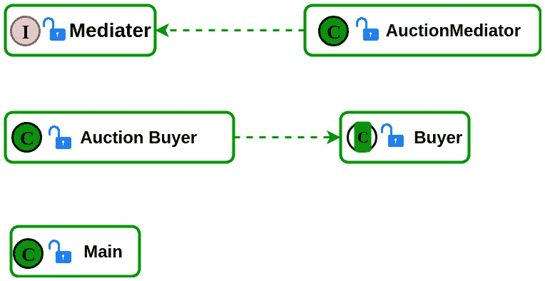

# 调解器设计模式

> 原文:[https://www.geeksforgeeks.org/mediator-design-pattern-2/](https://www.geeksforgeeks.org/mediator-design-pattern-2/)

中介设计模式定义了一个封装一组对象如何交互的对象。
调解器是一种行为模式(像观察者或[访问者模式](https://www.geeksforgeeks.org/visitor-design-pattern/)，因为它可以改变程序的运行行为。
我们习惯于看到由大量类组成的程序。然而，随着更多的类被添加到程序中，这些类之间的通信问题可能会变得更加复杂。
正因为如此，维修就成了我们需要这样或那样解决的大问题。
像许多其他[设计模式](https://www.geeksforgeeks.org/software-design-patterns/)一样，中介模式来解决问题。它将对象之间的通信封装在一个中介对象中。
对象之间不直接交流，而是通过中介进行交流。

**Java 中的中介模式实现**

这个节目展示了一场拍卖。拍卖调解人负责添加买家，在每个买家为物品出价一定金额后，调解人知道谁赢得了拍卖。
类图:



## Java 语言(一种计算机语言，尤用于创建网站)

```
// Java code to illustrate Mediator Pattern
// All public class codes should be put in
// different files.

public interface Mediator {

    // The mediator interface
    public void addBuyer(Buyer buyer);
    public void findHighestBidder();
}

public class AuctionMediator implements Mediator {

    // this class implements the interface and holds
    // all the buyers in a Array list.
    // We can add buyers and find the highest bidder
    private ArrayList buyers;

    public AuctionMediator()
    {
        buyers = new ArrayList<>();
    }

    @Override
    public void addBuyer(Buyer buyer)
    {
        buyers.add(buyer);
        System.out.println(buyer.name + " was added to" +
                "the buyers list.");
    }

    @Override
    public void findHighestBidder()
    {
        int maxBid = 0;
        Buyer winner = null;
        for (Buyer b : buyers) {
            if (b.price > maxBid) {
                maxBid = b.price;
                winner = b;
            }
        }
        System.out.println("The auction winner is " + winner.name +
        ". He paid " + winner.price + "$ for the item.");
    }
}

public abstract class Buyer {

    // this class holds the buyer
    protected Mediator mediator;
    protected String name;
    protected int price;

    public Buyer(Mediator med, String name)
    {
        this.mediator = med;
        this.name = name;
    }

    public abstract void bid(int price);

    public abstract void cancelTheBid();
}

public class AuctionBuyer extends Buyer {

    // implementation of the bidding process
    // There is an option to bid and an option to
    // cancel the bidding
    public AuctionBuyer(Mediator mediator,
                                String name)
    {
        super(mediator, name);
    }

    @Override
    public void bid(int price)
    {
        this.price = price;
    }

    @Override
    public void cancelTheBid()
    {
        this.price = -1;
    }
}

public class Main {

    /* This program illustrate an auction. The AuctionMediator
    is responsible for adding the buyers, and after each
    buyer bid a certain amount for the item, the mediator
    know who won the auction. */
    public static void main(String[] args)
    {

        AuctionMediator med = new AuctionMediator();
        Buyer b1 = new AuctionBuyer(med, "Tal Baum");
        Buyer b2 = new AuctionBuyer(med, "Elad Shamailov");
        Buyer b3 = new AuctionBuyer(med, "John Smith");

        // Create and add buyers
        med.addBuyer(b1);
        med.addBuyer(b2);
        med.addBuyer(b3);

        System.out.println("Welcome to the auction. Tonight " +
                        "we are selling a vacation to Vegas." +
                        " please Bid your offers.");
        System.out.println("--------------------------------" +
                                        "---------------");
        System.out.println("Waiting for the buyer's offers...");

        // Making bids
        b1.bid(1800);
        b2.bid(2000);
        b3.bid(780);
        System.out.println("---------------------------------" +
                                            "--------------");
        med.findHighestBidder();

        b2.cancelTheBid();
        System.out.print(b2.name + " Has canceled his bid!, " +
                                            "in that case ");
        med.findHighestBidder();
    }
}
```

**输出:**

```
Tal Baum was added to the buyers list.
Elad Shamailov was added to the buyers list.
John Smith was added to the buyers list.
Welcome to the auction. Tonight we are
 selling a vacation to Vegas. please Bid your offers.
-----------------------------------------------
Waiting for the buyer's offers...
-----------------------------------------------
The auction winner is Elad Shamailov.
He paid 2000$ for the item.
Elad Shamailov Has canceled his bid!, In that 
case The auction winner is Tal Baum.
He paid 1800$ for the item.
```

**优势**:

*   简单
*   您可以用不同的对象替换结构中的一个对象，而不会影响类和接口。

**缺点**:

*   调解人经常需要与所有不同的类非常亲密，这使它变得非常复杂。
*   会让维护变得很困难。

作者:[http://designpattern.co.il/](http://designpattern.co.il/)T2】