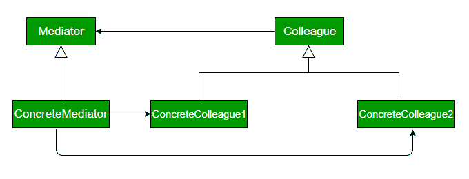

# 调解员设计模式

> 原文:[https://www.geeksforgeeks.org/mediator-design-pattern/](https://www.geeksforgeeks.org/mediator-design-pattern/)

中介设计模式是一种重要且广泛使用的行为设计模式。中介器通过在两者之间引入一个层来实现对象的解耦，这样对象之间的交互就可以通过该层进行。如果对象之间直接交互，系统组件之间紧密耦合，使得可维护性成本更高，也不难扩展。中介模式侧重于为通信提供对象之间的中介，并帮助实现对象之间的失去耦合。

空中交通管制员是中介模式的一个很好的例子，机场控制室作为不同航班之间通信的中介。中介作为对象之间的路由器，它可以有自己的逻辑来提供通信方式。

**UML 图中介器设计模式**



**设计组件**

*   **中介器:**定义同事对象之间通信的接口。
*   **具体中介器:**实现中介器接口，协调同事对象之间的通信。
*   **同事:**定义与其他同事沟通的接口
*   **具体同事:**实现同事接口，通过其中介器与其他同事进行沟通

**我们来看一个 Mediator 设计模式的例子。**

```
class ATCMediator implements IATCMediator 
{
    private Flight flight;
    private Runway runway;
    public boolean land;

    public void registerRunway(Runway runway) 
    {
        this.runway = runway;
    }

    public void registerFlight(Flight flight) 
    {
        this.flight = flight;
    }

    public boolean isLandingOk() 
    {
        return land;
    }

    @Override
    public void setLandingStatus(boolean status) 
    {
        land = status;
    }
}

interface Command 
{
    void land();
}

interface IATCMediator
{

    public void registerRunway(Runway runway);

    public void registerFlight(Flight flight);

    public boolean isLandingOk();

    public void setLandingStatus(boolean status);
}

class Flight implements Command 
{
    private IATCMediator atcMediator;

    public Flight(IATCMediator atcMediator) 
    {
        this.atcMediator = atcMediator;
    }

    public void land() 
    {
        if (atcMediator.isLandingOk()) 
        {
            System.out.println("Successfully Landed.");
            atcMediator.setLandingStatus(true);
        }
        else
            System.out.println("Waiting for landing.");
    }

    public void getReady() 
    {
        System.out.println("Ready for landing.");
    }

}

class Runway implements Command 
{
    private IATCMediator atcMediator;

    public Runway(IATCMediator atcMediator) 
    {
        this.atcMediator = atcMediator;
        atcMediator.setLandingStatus(true);
    }

    @Override
    public void land() 
    {
        System.out.println("Landing permission granted.");
        atcMediator.setLandingStatus(true);
    }

}

class MediatorDesignPattern 
{
    public static void main(String args[]) 
    {

        IATCMediator atcMediator = new ATCMediator();
        Flight sparrow101 = new Flight(atcMediator);
        Runway mainRunway = new Runway(atcMediator);
        atcMediator.registerFlight(sparrow101);
        atcMediator.registerRunway(mainRunway);
        sparrow101.getReady();
        mainRunway.land();
        sparrow101.land();

    }
}
```

输出:

```
Ready for landing.
Landing permission granted.
Successfully Landed.

```

**优势**

*   它限制了子类化。中介器定位本来会分布在几个对象中的行为。改变这种行为只需要子类化 Mediator，同事类可以原样重用。

**劣势**

*   它集中了控制权。中介模式用交互的复杂性来换取中介的复杂性。因为中介器封装了协议，所以它会变得比任何一个同事都复杂。这可能使调解人本身成为难以维护的整体

本文由 **[Saket Kumar](https://github.com/saketkumar95)** 供稿。如果你喜欢 GeeksforGeeks 并想投稿，你也可以使用[contribute.geeksforgeeks.org](http://www.contribute.geeksforgeeks.org)写一篇文章或者把你的文章邮寄到 contribute@geeksforgeeks.org。看到你的文章出现在极客博客主页上，帮助其他极客。

如果你发现任何不正确的地方，或者你想分享更多关于上面讨论的话题的信息，请写评论。