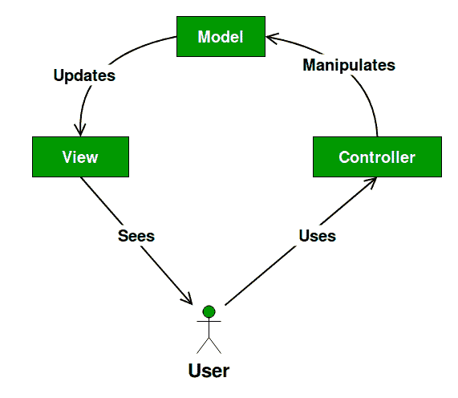

# MVC 设计模式

> 原文:[https://www.geeksforgeeks.org/mvc-design-pattern/](https://www.geeksforgeeks.org/mvc-design-pattern/)

**模型视图控制器** (MVC)设计模式指定应用程序由数据模型、表示信息和控制信息组成。该模式要求将每个对象分成不同的对象。

MVC 更多的是一种架构模式，而不是完整的应用程序。MVC 主要涉及应用程序的用户界面/交互层。您仍然需要业务逻辑层，可能还需要一些服务层和数据访问层。

**UML 图 MVC 设计模式**

[](https://media.geeksforgeeks.org/wp-content/uploads/MVC-Design-Pattern.png)

**设计组件**

*   **模型**只包含纯应用数据，它不包含描述如何向用户呈现数据的逻辑。
*   **视图**向用户呈现模型的数据。视图知道如何访问模型的数据，但它不知道这些数据意味着什么，也不知道用户可以做什么来操作它。
*   **控制器**存在于视图和模型之间。它监听视图(或另一个外部源)触发的事件，并对这些事件执行适当的反应。在大多数情况下，反应是调用模型上的方法。由于视图和模型通过通知机制连接，因此该操作的结果会自动反映在视图中。

**我们来看一个 MVC 设计模式的例子。**

```
class Student 
{
    private String rollNo;
    private String name;

    public String getRollNo() 
    {
        return rollNo;
    }

    public void setRollNo(String rollNo) 
    {
        this.rollNo = rollNo;
    }

    public String getName() 
    {
        return name;
    }

    public void setName(String name) 
    {
        this.name = name;
    }
}

class StudentView 
{
    public void printStudentDetails(String studentName, String studentRollNo)
    {
        System.out.println("Student: ");
        System.out.println("Name: " + studentName);
        System.out.println("Roll No: " + studentRollNo);
    }
}

class StudentController 
{
    private Student model;
    private StudentView view;

    public StudentController(Student model, StudentView view)
    {
        this.model = model;
        this.view = view;
    }

    public void setStudentName(String name)
    {
        model.setName(name);        
    }

    public String getStudentName()
    {
        return model.getName();        
    }

    public void setStudentRollNo(String rollNo)
    {
        model.setRollNo(rollNo);        
    }

    public String getStudentRollNo()
    {
        return model.getRollNo();        
    }

    public void updateView()
    {                
        view.printStudentDetails(model.getName(), model.getRollNo());
    }    
}

class MVCPattern 
{
    public static void main(String[] args) 
    {
        Student model  = retriveStudentFromDatabase();

        StudentView view = new StudentView();

        StudentController controller = new StudentController(model, view);

        controller.updateView();

        controller.setStudentName("Vikram Sharma");

        controller.updateView();
    }

    private static Student retriveStudentFromDatabase()
    {
        Student student = new Student();
        student.setName("Lokesh Sharma");
        student.setRollNo("15UCS157");
        return student;
    }

}
```

输出:

```
Student: 
Name: Lokesh Sharma
Roll No: 15UCS157
Student: 
Name: Vikram Sharma
Roll No: 15UCS157

```

**优势**

*   多个开发人员可以同时处理模型、控制器和视图。
*   MVC 支持将控制器上的相关动作逻辑分组在一起。特定模型的视图也分组在一起。
*   模型可以有多个视图。

**缺点**

*   框架导航可能很复杂，因为它引入了新的抽象层，并要求用户适应 MVC 的分解标准。
*   关于多种技术的知识成为常态。使用 MVC 的开发人员需要熟练掌握多种技术。

本文由 **[Saket Kumar](https://github.com/saketkumar95)** 供稿。如果你喜欢 GeeksforGeeks 并想投稿，你也可以使用[contribute.geeksforgeeks.org](http://www.contribute.geeksforgeeks.org)写一篇文章或者把你的文章邮寄到 contribute@geeksforgeeks.org。看到你的文章出现在极客博客主页上，帮助其他极客。

如果你发现任何不正确的地方，或者你想分享更多关于上面讨论的话题的信息，请写评论。