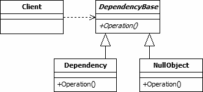

# 空对象设计模式

> 原文:[https://www.geeksforgeeks.org/null-object-design-pattern/](https://www.geeksforgeeks.org/null-object-design-pattern/)

空对象模式是一种设计模式，它简化了未定义的依赖关系的使用。这是通过使用实现已知接口的具体类的实例来实现的，而不是空引用。
我们创建了一个抽象类，指定要完成的各种操作，具体类扩展了这个类，一个空对象类提供了这个类的无操作实现，将无缝地用于我们需要检查空值的地方。

**空对象设计模式的 UML 图**

[](https://media.geeksforgeeks.org/wp-content/uploads/NullObject.png)

**设计组件**

*   **客户端:**这个类有一个依赖项，可能需要，也可能不需要。如果依赖项中不需要任何功能，它将执行空对象的方法。
*   **DependencyBase :** 这个抽象类是客户端可能使用的各种可用依赖项的基类。这也是 null 对象类的基类。当基类不提供共享功能时，可以用接口替换它。
*   **依赖关系:**这个类是一个可以被客户端使用的函数依赖关系。
*   **空对象:**这是可以被客户端用作依赖项的空对象类。它不包含任何功能，但是实现了 DependencyBase 抽象类定义的所有成员。

**我们来看一个 Null 对象设计模式的例子。**

```
// Java program to illustrate Null
// Object Design Pattern 

abstract class Emp
{
    protected String name;
    public abstract boolean isNull();
    public abstract String getName();
}

class Coder extends Emp
{
    public Coder(String name) 
    {
        this.name = name;
    }
    @Override
    public String getName() 
    {
        return name;
    }
    @Override
    public boolean isNull() 
    {
        return false;
    }
}

class NoClient extends Emp
{
    @Override
    public String getName() 
    {
        return "Not Available";
    }

    @Override
    public boolean isNull() 
    {
        return true;
    }
}

class EmpData 
{

    public static final String[] names = {"Lokesh", "Kushagra", "Vikram"};
    public static Emp getClient(String name)
    {
        for (int i = 0; i < names.length; i++) 
        {
            if (names[i].equalsIgnoreCase(name))
            {
                return new Coder(name);
            }
        }
        return new NoClient();
    }
}

public class Main 
{
    public static void main(String[] args) 
    {
        Emp emp1 = EmpData.getClient("Lokesh");
        Emp emp2 = EmpData.getClient("Kushagra");
        Emp emp3 = EmpData.getClient("Vikram");
        Emp emp4 = EmpData.getClient("Rishabh");

        System.out.println(emp1.getName());
        System.out.println(emp2.getName());
        System.out.println(emp3.getName());
        System.out.println(emp4.getName());
    }
}
```

输出:

```
Lokesh
Kushagra
Vikram
Not Available

```

**优势:**

*   它定义了由实对象和空对象组成的类层次结构。当对象不需要做任何事情时，可以使用空对象来代替真实对象。每当客户端代码期望一个真实对象时，它也可以接受一个空对象。
*   也使客户端代码变得简单。客户端可以统一对待真正的协作者和空协作者。客户通常不知道他们面对的是真正的合作者还是空合作者。这简化了客户端代码，因为它避免了必须编写专门处理空协作者的测试代码。

**缺点:**

*   如果各种客户端不同意空对象应该如何做，就像抽象对象接口没有被很好地定义一样，那么可能很难实现。
*   可能需要为每个新的抽象对象类创建一个新的空对象类。

本文由 **[Saket Kumar](https://github.com/saketkumar95)** 供稿。如果你喜欢 GeeksforGeeks 并想投稿，你也可以使用[contribute.geeksforgeeks.org](http://www.contribute.geeksforgeeks.org)写一篇文章或者把你的文章邮寄到 contribute@geeksforgeeks.org。看到你的文章出现在极客博客主页上，帮助其他极客。

如果你发现任何不正确的地方，或者你想分享更多关于上面讨论的话题的信息，请写评论。