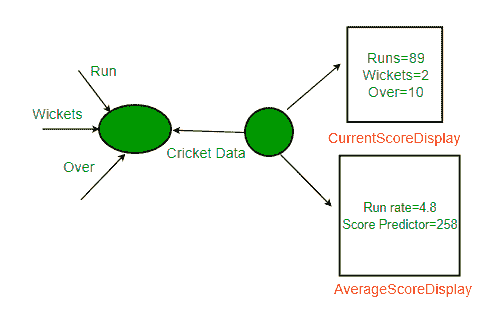
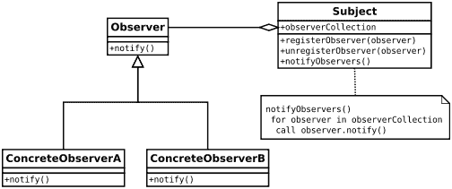

# 观察者模式|第一集(简介)

> 原文:[https://www . geesforgeks . org/observer-pattern-set-1-introduction/](https://www.geeksforgeeks.org/observer-pattern-set-1-introduction/)

让我们首先考虑以下场景来理解观察者模式。

****场景**:**

**假设我们正在构建一个板球应用程序，通知观众关于信息，如当前得分，运行率等。假设我们制作了两个显示元素 CurrentScoreDisplay 和 AverageScoreDisplay。板球数据有所有的数据(跑，碗等。)并且每当数据改变时，显示元素被通知新的数据，并且它们相应地显示最新的数据。 [](https://media.geeksforgeeks.org/wp-content/uploads/ObserverPatternSet-1.png)**

**下面是这个设计的 java 实现。**

```
// Java implementation of above design for Cricket App. The
// problems with this design are discussed below.

// A class that gets information from stadium and notifies
// display elements, CurrentScoreDisplay & AverageScoreDisplay
class CricketData
{
    int runs, wickets;
    float overs;
    CurrentScoreDisplay currentScoreDisplay;
    AverageScoreDisplay averageScoreDisplay;

    // Constructor
    public CricketData(CurrentScoreDisplay currentScoreDisplay,
                       AverageScoreDisplay averageScoreDisplay)
    {
        this.currentScoreDisplay = currentScoreDisplay;
        this.averageScoreDisplay = averageScoreDisplay;
    }

    // Get latest runs from stadium
    private int getLatestRuns()
    {
        // return 90 for simplicity
        return 90;
    }

    // Get latest wickets from stadium
    private int getLatestWickets()
    {
        // return 2 for simplicity
        return 2;
    }

    // Get latest overs from stadium
    private float getLatestOvers()
    {
        // return 10.2 for simplicity
        return (float)10.2;
    }

    // This method is used update displays when data changes
    public void dataChanged()
    {
        // get latest data
        runs = getLatestRuns();
        wickets = getLatestWickets();
        overs = getLatestOvers();

        currentScoreDisplay.update(runs,wickets,overs);
        averageScoreDisplay.update(runs,wickets,overs);
    }
}

// A class to display average score. Data of this class is
// updated by CricketData
class AverageScoreDisplay
{
    private float runRate;
    private int predictedScore;

    public void update(int runs, int wickets, float overs)
    {
        this.runRate = (float)runs/overs;
        this.predictedScore = (int) (this.runRate * 50);
        display();
    }

    public void display()
    {
        System.out.println("\nAverage Score Display:\n" +
                           "Run Rate: " + runRate +
                           "\nPredictedScore: " + predictedScore);
    }
}

// A class to display score. Data of this class is
// updated by CricketData
class CurrentScoreDisplay
{
    private int runs, wickets;
    private float overs;

    public void update(int runs,int wickets,float overs)
    {
        this.runs = runs;
        this.wickets = wickets;
        this.overs = overs;
        display();
    }

    public void display()
    {
        System.out.println("\nCurrent Score Display: \n" +
                           "Runs: " + runs +"\nWickets:"
                           + wickets + "\nOvers: " + overs );
    }
}

// Driver class
class Main
{
    public static void main(String args[])
    {
        // Create objects for testing
        AverageScoreDisplay averageScoreDisplay =
                                       new AverageScoreDisplay();
        CurrentScoreDisplay currentScoreDisplay =
                                       new CurrentScoreDisplay();

        // Pass the displays to Cricket data
        CricketData cricketData = new CricketData(currentScoreDisplay,
                                                  averageScoreDisplay);

        // In real app you would have some logic to call this
        // function when data changes
        cricketData.dataChanged();
    }
}
```

****输出:****

```
Current Score Display: 
Runs: 90
Wickets:2
Overs: 10.2

Average Score Display:
Run Rate: 8.823529
PredictedScore: 441
```

****上述设计存在的问题** **:****

*   **CricketData 保存对具体显示元素对象的引用，即使它只需要调用这些对象的更新方法。它获取的额外信息比它需要的要多得多。**
*   **该语句“currentcoredisplay . update(runs，wickets，overs”违反了最重要的设计原则之一“编程到接口，而不是实现。”因为我们使用具体的对象来共享数据，而不是抽象的接口。**
*   **环状数据和显示元素紧密耦合。**
*   **如果将来出现另一个需求，并且我们需要添加另一个显示元素，我们需要对代码中不变的部分进行更改(CricketData)。这绝对不是一个好的设计实践，应用程序可能无法处理变更，也不容易维护。**

****如何避免这些问题？**
使用观察者模式**

****观察者模式****

**要理解观察者模式，首先你需要理解主体和观察者对象。**

**主体和观察者之间的关系很容易理解为杂志订阅的类比。**

*   **一个杂志出版商(主题)从事商业并出版杂志(数据)。**
*   **如果你(数据用户/观察者)对你订阅(注册)的杂志感兴趣，并且如果有新的版本出版，它会被发送给你。**
*   **如果您取消订阅(取消注册)，您将无法获得新版本。**
*   **Publisher 不知道你是谁，也不知道你如何使用杂志，它只是把它传递给你，因为你是订阅者(松散耦合)。**

****定义:****

**观察者模式定义了对象之间的一对多依赖关系，这样一个对象改变状态，它的所有依赖关系都会被自动通知和更新。**

****说明:****

*   **主体(一)和观察者(多)之间是一对多的依赖关系。**
*   **存在依赖性，因为观察者本身不能访问数据。他们依赖主题向他们提供数据。**

****类图:****

**图片来源:[维基百科](https://en.wikipedia.org/wiki/Observer_pattern)**

*   **这里 Observer 和 Subject 是接口(可以是任何抽象的超类型，不一定是 java 接口)。**
*   **所有需要数据的观察者都需要实现观察者接口。**
*   **observer 接口中的 notify()方法定义了当主题向它提供数据时要采取的操作。**
*   **主题维护一个 observerCollection，它只是当前注册(订阅)的观察者的列表。**
*   **registerObserver(观察者)和 unregisterObserver(观察者)分别是添加和移除观察者的方法。**
*   **当数据改变并且需要向观察器提供新数据时，调用 notifyObservers()。**

****优势:**
在交互的对象之间提供松散耦合的设计。松散耦合的对象随着需求的变化而灵活。这里的松散耦合意味着交互对象之间的信息应该更少。**

**观察者模式提供了这种松散的耦合:**

*   **主体只知道观察者实现观察者界面。仅此而已。**
*   **无需修改“主题”来添加或删除观察者。**
*   **我们可以相互独立地重用主体类和观察者类。**

****缺点:****

*   **由于观察器的显式注册和注销，[失效的侦听器问题](https://en.wikipedia.org/wiki/Lapsed_listener_problem)导致内存泄漏。**

****这个图案什么时候用？**
当多个对象依赖于一个对象的状态时，您应该考虑在应用程序中使用这种模式，因为它为同一个对象提供了整洁且经过良好测试的设计。**

****现实生活用途:****

*   **它在图形用户界面工具包和事件侦听器中大量使用。在 java 中，按钮(主题)和 onClickListener(观察者)是用观察者模式建模的。**
*   **社交媒体、RSS 源、电子邮件订阅，您可以选择关注或订阅，并收到最新通知。**
*   **如果有更新，play store 上应用程序的所有用户都会收到通知。**

**[观察者模式|集合 2(实现)](https://www.geeksforgeeks.org/observer-pattern-set-2-implementation/)**

****进一步阅读–**[Python 中的观察者方法](https://www.geeksforgeeks.org/observer-method-python-design-patterns/)**

**本文由**苏拉布·库马尔**供稿。如果你喜欢极客博客并想投稿，你也可以写一篇文章并把你的文章邮寄到 review-team@geeksforgeeks.org。看到你的文章出现在极客博客主页上，帮助其他极客。**

**如果您发现任何不正确的地方，或者您想分享关于上面讨论的主题的更多信息，请写评论**