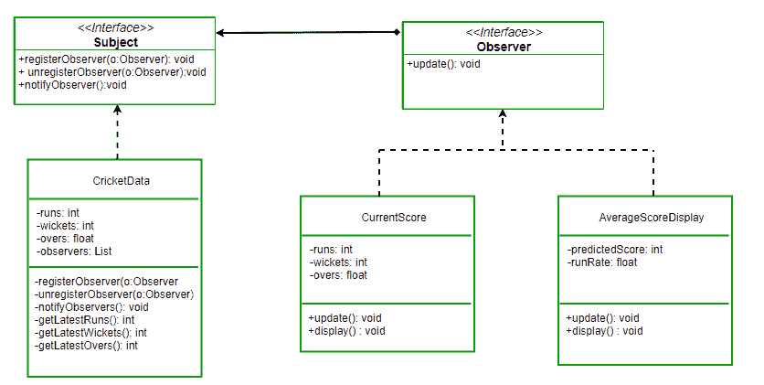

# 观察者模式|集合 2(实现)

> 原文:[https://www . geesforgeks . org/observer-pattern-set-2-implementation/](https://www.geeksforgeeks.org/observer-pattern-set-2-implementation/)

我们强烈建议在继续这篇文章之前参考下面的第 1 集。

**[观察者模式-简介](https://www.geeksforgeeks.org/observer-pattern-set-1-introduction/)**

在集合 1 中，我们讨论了下面的问题，一个没有观察者模式的问题的解决方案和有解决方案的问题。

*假设我们正在构建一个板球应用程序，通知观众当前得分、跑速等信息。假设我们制作了两个显示元素 CurrentScoreDisplay 和 AverageScoreDisplay。板球数据有所有的数据(跑，碗等。)并且每当数据改变时，显示元素被通知新的数据，并且它们相应地显示最新的数据* 

**将观察者模式应用于上述问题:**
让我们看看如何使用观察者模式来改进应用程序的设计。如果我们观察数据流，我们可以很容易地看到，环形数据和显示元素遵循主体-观察者关系。

**新类图:**
***[](https://media.geeksforgeeks.org/wp-content/uploads/ObserverPatternSet-2.png)***

***Java 实现:***

```
// Java program to demonstrate working of
// onserver pattern
import java.util.ArrayList;
import java.util.Iterator;

// Implemented by Cricket data to communicate
// with observers
interface Subject
{
    public void registerObserver(Observer o);
    public void unregisterObserver(Observer o);
    public void notifyObservers();
}

class CricketData implements Subject
{
    int runs;
    int wickets;
    float overs;
    ArrayList<Observer> observerList;

    public CricketData() {
        observerList = new ArrayList<Observer>();
    }

    @Override
    public void registerObserver(Observer o) {
        observerList.add(o);
    }

    @Override
    public void unregisterObserver(Observer o) {
        observerList.remove(observerList.indexOf(o));
    }

    @Override
    public void notifyObservers()
    {
        for (Iterator<Observer> it =
              observerList.iterator(); it.hasNext();)
        {
            Observer o = it.next();
            o.update(runs,wickets,overs);
        }
    }

    // get latest runs from stadium
    private int getLatestRuns()
    {
        // return 90 for simplicity
        return 90;
    }

    // get latest wickets from stadium
    private int getLatestWickets()
    {
        // return 2 for simplicity
        return 2;
    }

    // get latest overs from stadium
    private float getLatestOvers()
    {
        // return 90 for simplicity
        return (float)10.2;
    }

    // This method is used update displays
    // when data changes
    public void dataChanged()
    {
        //get latest data
        runs = getLatestRuns();
        wickets = getLatestWickets();
        overs = getLatestOvers();

        notifyObservers();
    }
}

// This interface is implemented by all those
// classes that are to be updated whenever there
// is an update from CricketData
interface Observer
{
    public void update(int runs, int wickets,
                      float overs);
}

class AverageScoreDisplay implements Observer
{
    private float runRate;
    private int predictedScore;

    public void update(int runs, int wickets,
                       float overs)
    {
        this.runRate =(float)runs/overs;
        this.predictedScore = (int)(this.runRate * 50);
        display();
    }

    public void display()
    {
        System.out.println("\nAverage Score Display: \n"
                           + "Run Rate: " + runRate +
                           "\nPredictedScore: " +
                           predictedScore);
    }
}

class CurrentScoreDisplay implements Observer
{
    private int runs, wickets;
    private float overs;

    public void update(int runs, int wickets,
                       float overs)
    {
        this.runs = runs;
        this.wickets = wickets;
        this.overs = overs;
        display();
    }

    public void display()
    {
        System.out.println("\nCurrent Score Display:\n"
                           + "Runs: " + runs +
                           "\nWickets:" + wickets +
                           "\nOvers: " + overs );
    }
}

// Driver Class
class Main
{
    public static void main(String args[])
    {
        // create objects for testing
        AverageScoreDisplay averageScoreDisplay =
                          new AverageScoreDisplay();
        CurrentScoreDisplay currentScoreDisplay =
                          new CurrentScoreDisplay();

        // pass the displays to Cricket data
        CricketData cricketData = new CricketData();

        // register display elements
        cricketData.registerObserver(averageScoreDisplay);
        cricketData.registerObserver(currentScoreDisplay);

        // in real app you would have some logic to
        // call this function when data changes
        cricketData.dataChanged();

        //remove an observer
        cricketData.unregisterObserver(averageScoreDisplay);

        // now only currentScoreDisplay gets the
        // notification
        cricketData.dataChanged();
    }
}
```

**输出:**

```
Average Score Display: 
Run Rate: 8.823529
PredictedScore: 441

Current Score Display:
Runs: 90
Wickets:2
Overs: 10.2

Current Score Display:
Runs: 90
Wickets:2
Overs: 10.2

```

**注意:**现在我们可以在不改变主题的情况下添加/删除任意多的观察者。

**参考文献:**

1.  [https://en.wikipedia.org/wiki/Observer_pattern](https://en.wikipedia.org/wiki/Observer_pattern)
2.  头部优先设计模式书(强烈推荐)

本文由**苏拉布·库马尔**供稿。如果你喜欢极客博客并想投稿，你也可以写一篇文章并把你的文章邮寄到 contribute@geeksforgeeks.org。看到你的文章出现在极客博客主页上，帮助其他极客。

如果您发现任何不正确的地方，或者您想分享更多关于上面讨论的主题的信息，请写评论