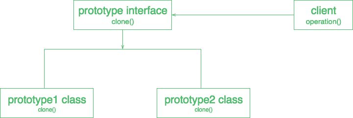

# 原型设计模式

> 原文:[https://www.geeksforgeeks.org/prototype-design-pattern/](https://www.geeksforgeeks.org/prototype-design-pattern/)

原型允许我们向客户端隐藏创建新实例的复杂性。这个概念是复制一个现有的对象，而不是从头开始创建一个新的实例，这可能包括昂贵的操作。现有对象充当原型，并包含对象的状态。只有在需要时，新复制的对象才能更改相同的属性。这种方法节省了昂贵的资源和时间，尤其是当对象创建是一个繁重的过程时。
原型模式是一种创造性的设计模式。当创建对象既费时又费钱时，就需要原型模式，所以我们用现有的对象本身来创建对象。从现有对象创建对象的最佳方法之一是**克隆()方法**。克隆是实现原型模式的最简单方法。但是，根据您的业务模型决定如何复制现有对象是您的责任。

**原型设计参与者**

1) **原型**:这是一个实际物体的原型。
2) **原型注册**:这是一个注册服务，可以使用简单的字符串参数访问所有原型。
3) **客户端**:客户端将负责使用注册表服务访问原型实例。

**何时使用原型设计模式**

当一个系统应该独立于它的产品是如何被创建、组成和表示的时候，以及
当要实例化的类在运行时被指定的时候。
例如，
1)通过动态加载或避免构建与产品的类层次结构平行的工厂类层次结构，或
2)当一个类的实例只能有几种不同的状态组合之一时。安装相应数量的原型并克隆它们可能比每次用适当的状态手动实例化类更方便。

**原型设计模式的 UML 图**



## Java 语言(一种计算机语言，尤用于创建网站)

```
// A Java program to demonstrate working of
// Prototype Design Pattern with example
// of a ColorStore class to store existing objects.

import java.util.HashMap;
import java.util.Map;

abstract class Color implements Cloneable
{

    protected String colorName;

    abstract void addColor();

    public Object clone()
    {
        Object clone = null;
        try
        {
            clone = super.clone();
        }
        catch (CloneNotSupportedException e)
        {
            e.printStackTrace();
        }
        return clone;
    }
}

class blueColor extends Color
{
    public blueColor()
    {
        this.colorName = "blue";
    }

    @Override
    void addColor()
    {
        System.out.println("Blue color added");
    }

}

class blackColor extends Color{

    public blackColor()
    {
        this.colorName = "black";
    }

    @Override
    void addColor()
    {
        System.out.println("Black color added");
    }
}

class ColorStore {

    private static Map<String, Color> colorMap = new HashMap<String, Color>();

    static
    {
        colorMap.put("blue", new blueColor());
        colorMap.put("black", new blackColor());
    }

    public static Color getColor(String colorName)
    {
        return (Color) colorMap.get(colorName).clone();
    }
}

// Driver class
class Prototype
{
    public static void main (String[] args)
    {
        ColorStore.getColor("blue").addColor();
        ColorStore.getColor("black").addColor();
        ColorStore.getColor("black").addColor();
        ColorStore.getColor("blue").addColor();
    }
}
```

**输出:**

```
Blue color added
Black color added
Black color added
Blue color added
```

**UML 图示例:**


**原型设计模式的优势**

*   **在运行时添加和移除产品–**原型允许您通过向客户端注册原型实例，将新的具体产品类合并到系统中。这比其他创建模式更灵活一点，因为客户端可以在运行时安装和移除原型。

*   **通过改变值来指定新对象–**高动态系统允许您通过对象组合来定义新行为，方法是为对象的变量指定值，而不是定义新类。

*   **通过改变结构来指定新对象–**许多应用程序从零件和子零件构建对象。为了方便起见，这样的应用程序通常让您实例化复杂的、用户定义的结构，以便一次又一次地使用特定的子电路。

*   **简化子类化–**工厂方法通常会产生一个与产品类层次平行的创建者类层次。原型模式允许您克隆一个原型，而不是要求工厂方法来创建一个新的对象。因此，您根本不需要创建者类层次结构。

**原型设计模式的缺点**

*   对于一个使用很少对象和/或根本不强调原型链扩展的项目来说，这是一种过度扼杀。

*   它还对客户端隐藏了具体的产品类
*   Prototype 的每个子类都必须实现 clone()操作，当考虑中的类已经存在时，这可能很困难。当克隆()的内部包含不支持复制或具有循环引用的对象时，实现克隆()也会很困难。

**进一步阅读:**[Python 中的原型法](https://www.geeksforgeeks.org/prototype-method-python-design-patterns/)
本文由 [**Saket Kumar**](https://github.com/saketkumar95) 供稿。如果你喜欢 GeeksforGeeks 并想投稿，你也可以使用[write.geeksforgeeks.org](https://write.geeksforgeeks.org)写一篇文章或者把你的文章邮寄到 review-team@geeksforgeeks.org。看到你的文章出现在极客博客主页上，帮助其他极客。
如果发现有不正确的地方，或者想分享更多关于上述话题的信息，请写评论。