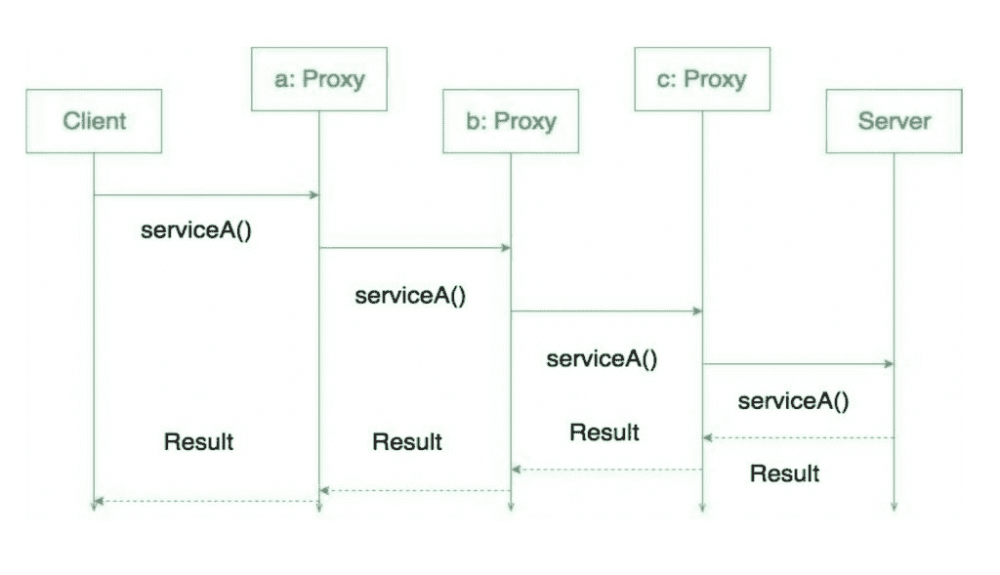

# 代理设计模式

> 原文:[https://www.geeksforgeeks.org/proxy-design-pattern/](https://www.geeksforgeeks.org/proxy-design-pattern/)

代理的意思是“代替”，“代表”或“代替”或“代表”是代理的字面意思，直接解释了**代理设计模式**。
代理也被称为代理、句柄和包装器。它们在结构上与[适配器](https://www.geeksforgeeks.org/adapter-pattern/)和[装饰器](https://www.geeksforgeeks.org/the-decorator-pattern-set-2-introduction-and-design/)密切相关，但不是目的。

一个真实的例子是，支票或信用卡可以代表我们银行账户中的东西。它可以代替现金使用，并在需要时提供获取现金的方法。这正是代理模式所做的-“**控制和管理对他们所保护的对象的访问**”。

**行为**

正如在装饰器模式中一样，代理可以被链接在一起。客户端和每个代理都认为它正在将消息委托给真实的服务器:

[](https://media.geeksforgeeks.org/wp-content/uploads/19702635_1413820232028220_8628994446322905016_o.jpg)

**这个图案什么时候用？**

当我们需要从客户端创建一个包装来覆盖主对象的复杂性时，使用代理模式。

**代理类型**

**远程代理:**
他们负责表示位于远程的对象。与真实对象对话可能涉及数据的编组和解组以及与远程对象对话。所有这些逻辑都封装在这些代理中，客户端应用程序不需要担心它们。

**虚拟代理:**

如果真实对象需要一些时间来产生结果，这些代理将提供一些默认的即时结果。这些代理启动对真实对象的操作，并向应用程序提供默认结果。一旦完成了真正的对象，这些代理将实际数据推送到客户端，在那里它先前已经提供了虚拟数据。

**保护代理:**

如果一个应用程序不能访问某个资源，那么这样的代理将与应用程序中可以访问该资源的对象进行对话，然后返回结果。

**智能代理:**

智能代理通过在访问对象时插入特定的操作来提供额外的安全层。一个例子是在访问真实对象之前检查它是否被锁定，以确保没有其他对象可以更改它。

**一些例子**

一个非常简单的现实生活场景是我们的大学互联网，它限制了很少的网站访问。代理首先检查你正在连接的主机，如果它不是受限站点列表的一部分，那么它连接到真正的互联网。此示例基于保护代理。

让我们看看它是如何工作的:

**互联网界面**

```
package com.saket.demo.proxy;

public interface Internet
{
    public void connectTo(String serverhost) throws Exception;
}
```

**net . Java**的实现

```
package com.saket.demo.proxy;

public class RealInternet implements Internet
{
    @Override
    public void connectTo(String serverhost)
    {
        System.out.println("Connecting to "+ serverhost);
    }
}
```

**ProxyInternet.java**

```
package com.saket.demo.proxy;

import java.util.ArrayList;
import java.util.List;

public class ProxyInternet implements Internet
{
    private Internet internet = new RealInternet();
    private static List<String> bannedSites;

    static
    {
        bannedSites = new ArrayList<String>();
        bannedSites.add("abc.com");
        bannedSites.add("def.com");
        bannedSites.add("ijk.com");
        bannedSites.add("lnm.com");
    }

    @Override
    public void connectTo(String serverhost) throws Exception
    {
        if(bannedSites.contains(serverhost.toLowerCase()))
        {
            throw new Exception("Access Denied");
        }

        internet.connectTo(serverhost);
    }

}
```

**Client.java**

```
package com.saket.demo.proxy;

public class Client
{
    public static void main (String[] args)
    {
        Internet internet = new ProxyInternet();
        try
        {
            internet.connectTo("geeksforgeeks.org");
            internet.connectTo("abc.com");
        }
        catch (Exception e)
        {
            System.out.println(e.getMessage());
        }
    }
}
```

由于其中一个站点是被禁站点中提到的，所以
运行程序会给出输出:

```
Connecting to geeksforgeeks.org
Access Denied

```

**优势:**

*   代理模式的优势之一是安全性。
*   这种模式避免了对象的重复，这些对象可能很大，并且占用大量内存。这又会提高应用程序的性能。
*   远程代理还通过在客户机上安装本地代码代理(存根)，然后在远程代码的帮助下访问服务器来确保安全性。

**缺点/后果:**

这种模式引入了另一个抽象层，如果一些客户端直接访问 RealSubject 代码，而其中一些客户端可能访问 Proxy 类，这有时可能会成为一个问题。这可能会导致不同的行为。

**有趣的点:**

*   相关模式之间几乎没有差异。像适配器模式给它的主体一个不同的接口，而代理模式提供与原始对象相同的接口，但是装饰器提供一个增强的接口。装饰器模式在运行时增加了额外的行为。
*   Java API 中使用的代理:Java . RMI . *；

**进一步阅读:**[Python 中的代理方法](https://www.geeksforgeeks.org/proxy-method-python-design-patterns/)

本文由 **[Saket Kumar](https://www.facebook.com/saketkumar95)** 供稿。如果你喜欢 GeeksforGeeks 并想投稿，你也可以使用[write.geeksforgeeks.org](https://write.geeksforgeeks.org)写一篇文章或者把你的文章邮寄到 review-team@geeksforgeeks.org。看到你的文章出现在极客博客主页上，帮助其他极客。

如果你发现任何不正确的地方，或者你想分享更多关于上面讨论的话题的信息，请写评论。