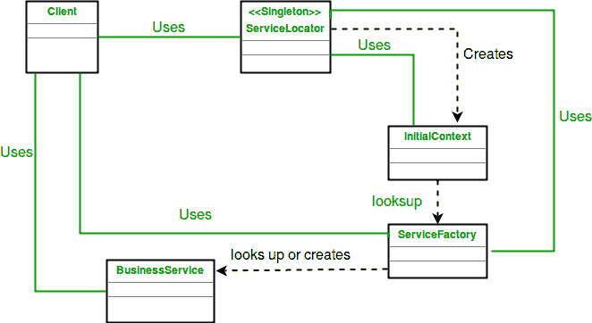
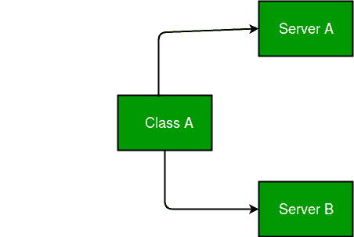
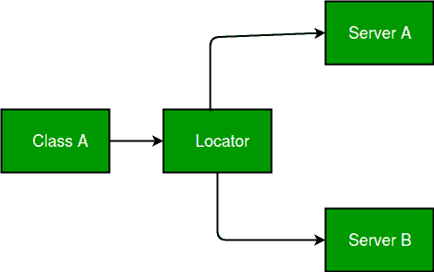

# 服务定位器模式

> 原文:[https://www.geeksforgeeks.org/service-locator-pattern/](https://www.geeksforgeeks.org/service-locator-pattern/)

服务定位器模式是一种在软件开发中使用的设计模式，用于封装获取具有强大抽象层的服务所涉及的过程。这种模式使用一个被称为“服务定位器”的中央注册表，它根据请求返回执行特定任务所需的信息。
服务定位器负责在服务消费者或服务客户端请求服务时返回服务实例。

**UML 图服务定位器模式**

[](https://media.geeksforgeeks.org/wp-content/uploads/dPattern.jpg)

**设计组件**

*   **服务定位器:**服务定位器抽象了 API 查找服务、供应商依赖、查找复杂性和业务对象创建，并为客户端提供了一个简单的接口。这降低了客户端的复杂性。此外，同一客户端或其他客户端可以重用服务定位器。
*   **initial context:**initial context 对象是查找和创建过程的起点。服务提供者提供上下文对象，这取决于服务定位器的查找和创建服务所提供的业务对象的类型。
*   **service factory:**service factory 对象表示为 BusinessService 对象提供生命周期管理的对象。企业 beans 的服务工厂对象是一个 EJBHome 对象。
*   **business service:**business service 是一个角色，由客户端正在寻求访问的服务来完成。业务服务对象由服务工厂创建、查找或删除。EJB 应用程序上下文中的 BusinessService 对象是一个企业 bean。

假设类依赖于在编译时指定了具体类型的服务。
[](https://media.geeksforgeeks.org/wp-content/uploads/ServiceLocator.jpg)

在上图中，类 A 对服务 A 和服务 B 有编译时依赖关系。但这种情况也有弊端。

*   如果我们想替换或更新依赖项，我们必须更改类的源代码并重新编译解决方案。
*   依赖项的具体实现必须在编译时可用。

**通过使用服务定位器模式:**

[](https://media.geeksforgeeks.org/wp-content/uploads/serviceLocatorPattern.jpg)

简单地说，服务定位器模式没有描述如何实例化服务。它描述了一种注册服务并定位它们的方法。

**我们来看一个服务定位器模式的例子。**

```
// Java program to
// illustrate Service Design Service
// Locator Pattern

import java.util.ArrayList;
import java.util.List;

// Service interface
// for getting name and
// Executing it.

interface Service {
    public String getName();
    public void execute();
}

// Service one implementing Locator
class ServiceOne implements Service {
    public void execute()
    {
        System.out.println("Executing ServiceOne");
    }

    @Override
    public String getName()
    {
        return "ServiceOne";
    }
}

// Service two implementing Locator
class ServiceTwo implements Service {
    public void execute()
    {
        System.out.println("Executing ServiceTwo");
    }

    @Override
    public String getName()
    {
        return "ServiceTwo";
    }
}

// Checking the context
// for ServiceOne and ServiceTwo
class InitialContext {
    public Object lookup(String name)
    {
        if (name.equalsIgnoreCase("ServiceOne")) {
            System.out.println("Creating a new ServiceOne object");
            return new ServiceOne();
        }
        else if (name.equalsIgnoreCase("ServiceTwo")) {
            System.out.println("Creating a new ServiceTwo object");
            return new ServiceTwo();
        }
        return null;
    }
}

class Cache {
    private List<Service> services;

    public Cache()
    {
        services = new ArrayList<Service>();
    }

    public Service getService(String serviceName)
    {
        for (Service service : services) {
            if (service.getName().equalsIgnoreCase(serviceName)) {
                System.out.println("Returning cached "
                                   + serviceName + " object");
                return service;
            }
        }
        return null;
    }

    public void addService(Service newService)
    {
        boolean exists = false;
        for (Service service : services) {
            if (service.getName().equalsIgnoreCase(newService.getName())) {
                exists = true;
            }
        }
        if (!exists) {
            services.add(newService);
        }
    }
}

// Locator class
class ServiceLocator {
    private static Cache cache;

    static
    {
        cache = new Cache();
    }

    public static Service getService(String name)
    {
        Service service = cache.getService(name);

        if (service != null) {
            return service;
        }

        InitialContext context = new InitialContext();
        Service ServiceOne = (Service)context.lookup(name);
        cache.addService(ServiceOne);
        return ServiceOne;
    }
}

// Driver class
class ServiceLocatorPatternDemo {
    public static void main(String[] args)
    {
        Service service = ServiceLocator.getService("ServiceOne");
        service.execute();

        service = ServiceLocator.getService("ServiceTwo");
        service.execute();

        service = ServiceLocator.getService("ServiceOne");
        service.execute();

        service = ServiceLocator.getService("ServiceTwo");
        service.execute();
    }
}
```

输出:

```
Creating a new ServiceOne object
Executing ServiceOne
Creating a new ServiceTwo object
Executing ServiceTwo
Returning cached ServiceOne object
Executing ServiceOne
Returning cached ServiceTwo object
Executing ServiceTwo

```

**优势:**

*   应用程序可以在运行时通过从服务定位器中有选择地添加和删除项目来优化自己。
*   库或应用程序的大部分可以完全分开。它们之间唯一的联系就是注册表。

**缺点:**

*   注册表使得代码更难维护(与使用依赖注入相反)，因为不清楚什么时候会引入一个突破性的更改。
*   注册表隐藏了导致运行时错误的类依赖关系，而不是缺少依赖关系时的编译时错误。

**策略**

以下策略用于实现服务定位器模式:

*   **EJB 服务定位器策略:**该策略将 EJBHome 对象用于企业 bean 组件，该 EJBHome 缓存在 Service Locator 中，以备将来客户端再次需要 Home 对象时使用。
*   **JMS 队列服务定位器策略:**该策略适用于点对点消息传递需求。以下是 JMS 队列服务定位器策略下的策略。
    *   JMS 队列服务定位器策略
    *   JMS 主题服务定位器策略
*   **类型检查服务定位器策略:**该策略有权衡。它降低了服务属性定位器策略中的查找灵活性，但是增加了向 ServiceLocator.getHome()方法传递常量的类型检查。