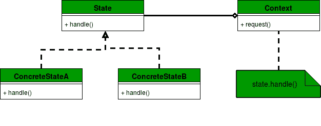

# 状态设计模式

> 原文:[https://www.geeksforgeeks.org/state-design-pattern/](https://www.geeksforgeeks.org/state-design-pattern/)

状态模式是[行为设计模式](https://www.geeksforgeeks.org/design-patterns-set-1-introduction/)之一。当对象基于其内部状态改变其行为时，使用状态设计模式。

如果我们必须根据对象的状态改变它的行为，我们可以在对象中有一个状态变量，并使用 if-else 条件块根据状态执行不同的操作。状态模式用于通过上下文和状态实现来提供一种系统的、失去耦合的方式来实现这一点。

**状态设计模式 UML 图**



*   **上下文:**定义客户端交互的接口。它维护对具体状态对象的引用，这些对象可用于定义对象的当前状态。
*   **状态:**定义用于声明每个具体状态应该做什么的接口。
*   **具体状态:**为状态中定义的方法提供实现。

**状态设计模式示例**
在下面的示例中，我们实现了一个移动状态场景。关于警报，移动设备可以处于不同的状态。例如，振动和无声。根据此警报状态，当要进行警报时，移动设备的行为会发生变化。

```
// Java program to demonstrate working of
// State Design Pattern

interface MobileAlertState 
{
    public void alert(AlertStateContext ctx);
}

class AlertStateContext 
{
    private MobileAlertState currentState;

    public AlertStateContext() 
    {
        currentState = new Vibration();
    }

    public void setState(MobileAlertState state) 
    {
        currentState = state;
    }

    public void alert() 
    {
        currentState.alert(this);
    }
}

class Vibration implements MobileAlertState 
{
    @Override
    public void alert(AlertStateContext ctx) 
    {
         System.out.println("vibration...");
    }

}

class Silent implements MobileAlertState
{
    @Override
    public void alert(AlertStateContext ctx) 
    {
        System.out.println("silent...");
    }

}

class StatePattern 
{
    public static void main(String[] args) 
    {
        AlertStateContext stateContext = new AlertStateContext();
        stateContext.alert();
        stateContext.alert();
        stateContext.setState(new Silent());
        stateContext.alert();
        stateContext.alert();
        stateContext.alert();        
    }
}
```

输出:

```
vibration...
vibration...
silent...
silent...
silent...

```

**国家设计模式优势**

*   使用状态模式，实现多态行为的好处是显而易见的，而且添加状态来支持附加行为也更容易。
*   在状态设计模式中，对象的行为是其状态的函数的结果，并且行为在运行时根据状态而改变。这消除了对 if/else 或 switch/case 条件逻辑的依赖。例如，在电视远程场景中，我们也可以通过简单地编写一个类和方法来实现该行为，该类和方法将请求一个参数并使用 if/else 块执行一个操作(打开/关闭电视)。
*   状态设计模式还提高了内聚性，因为特定于状态的行为被聚合到混凝土状态类中，这些类被放在代码中的一个位置。

**国家设计模式的弊端**

*   当我们需要在运行时通过输入一些状态基类的不同子类来改变对象的状态时，可以使用状态设计模式。这种情况是有利的，同时也是不利的，因为我们有一个明确的、独立的、带有某种逻辑的国家类别，而从另一方面来看，类别的数量在增加。

**进一步阅读–**[Python 中的状态方法](https://www.geeksforgeeks.org/state-method-python-design-patterns/)

本文由 **[Saket Kumar](https://github.com/saketkumar95)** 供稿。如果你喜欢 GeeksforGeeks 并想投稿，你也可以使用[write.geeksforgeeks.org](https://write.geeksforgeeks.org)写一篇文章或者把你的文章邮寄到 review-team@geeksforgeeks.org。看到你的文章出现在极客博客主页上，帮助其他极客。

如果你发现任何不正确的地方，或者你想分享更多关于上面讨论的话题的信息，请写评论。