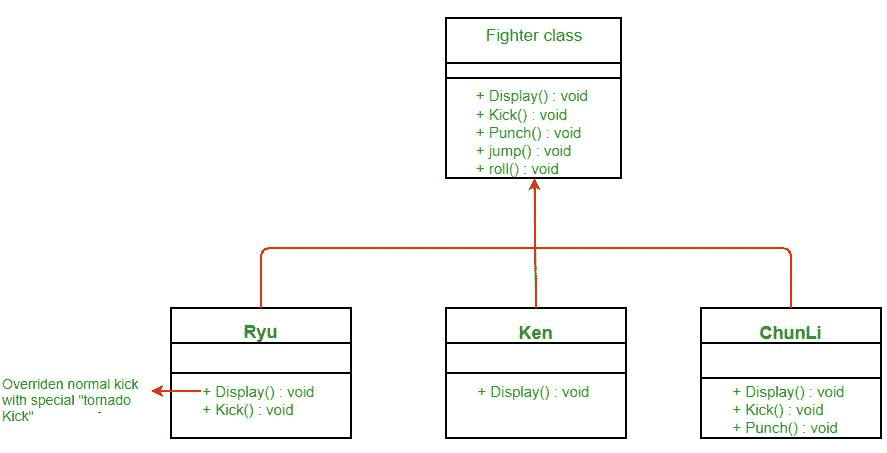
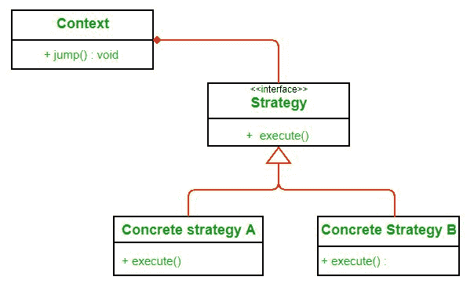

# 策略模式|第一集(简介)

> 原文:[https://www.geeksforgeeks.org/strategy-pattern-set-1/](https://www.geeksforgeeks.org/strategy-pattern-set-1/)

一如既往，我们将通过定义一个问题并使用策略模式来解决它来学习这个模式。假设我们正在构建一个游戏“街头霸王”。为简单起见，假设一个角色可能有四个动作，即踢、打、滚和跳。每个角色都有拳打脚踢的动作，但是翻滚和跳跃是可选的。你会如何模拟你的课程？假设最初你使用继承并抽象出一个**战斗机**类中的共同特征，让其他角色子类化**战斗机**类。

**战斗机**类将我们已经默认实施的正常动作。任何具有特殊移动的角色都可以覆盖其子类中的动作。类图如下:

**以上设计有哪些问题？**

如果一个角色不执行跳跃动作怎么办？它仍然继承了超类的跳转行为。虽然在这种情况下你可以覆盖跳转什么也不做，但是你可能必须为许多现有的类这样做，并且为将来的类也处理这个问题。这也会使维护变得困难。所以这里不能用继承。

**接口怎么样？**

看看下面的设计:

干净多了。我们从**战斗机**类中取出了一些动作(有些角色可能不会执行)，并为它们做了接口。这样，只有应该跳跃的角色才会执行**跳跃行为。**

**以上设计有哪些问题？**

上述设计的主要问题是代码重用。由于没有跳转和滚动行为的默认实现，我们可能会有代码重复。您可能必须在许多子类中一遍又一遍地重写相同的跳转行为。

**如何避免这种情况？**

如果我们制作**跳跃行为**和**滚动行为**类而不是接口呢？那么我们将不得不使用多重继承，由于与之相关的许多问题，这在许多语言中都不被支持。

*这里战略格局来搭救我们。我们将学习什么是战略模式，然后应用它来解决我们的问题。*

**定义:**

维基百科将策略模式定义为:

*“在计算机编程中，**策略模式**(也称为**策略模式**)是一种软件设计模式，能够在运行时选择算法的行为。战略模式*

*   *定义一系列算法，*
*   *封装各算法，*
*   *使算法在该系列中可以互换。”*

***班*图:T4】**

在这里，我们依赖组合而不是继承来重用。**上下文**由**策略**组成。不是实现一个行为**上下文**将其委托给**策略**。上下文是需要改变行为的类。我们可以动态改变行为。**策略**作为接口实现，这样我们就可以在不影响我们的上下文的情况下改变行为。

当我们使用策略模式来解决我们的问题时，我们会对策略模式有更清晰的理解。

**优势:**

1.  一系列算法可以被定义为一个类层次结构，并且可以互换使用来改变应用程序的行为而不改变其体系结构。
2.  通过单独封装算法，可以容易地引入符合相同接口的新算法。
3.  应用程序可以在运行时切换策略。
4.  策略使客户端能够选择所需的算法，而无需使用“switch”语句或一系列“if-else”语句。
5.  用于实现算法的数据结构完全封装在策略类中。因此，可以在不影响上下文类的情况下更改算法的实现。

**缺点:**

1.  应用程序必须知道所有的策略，以便为正确的情况选择正确的策略。
2.  上下文和策略类通常通过抽象策略基类指定的接口进行通信。策略基类必须为所有必需的行为公开接口，而某些具体的策略类可能不会实现这些行为。
3.  在大多数情况下，应用程序使用所需的策略对象来配置上下文。因此，应用程序需要创建和维护两个对象来代替一个对象。

**进一步阅读–**[Python 中的策略方法](https://www.geeksforgeeks.org/strategy-method-python-design-patterns/)

***参考文献:***

*   [头部优先设计模式](http://www.amazon.com/Head-First-Design-Patterns/dp/0596007124)
*   [http://wiki . expert . ncsu . edu/index . PHP/CSC/ECE _ 517 _ fall _ 2007/wiki 1b _ 8 _ sa](http://wiki.expertiza.ncsu.edu/index.php/CSC/ECE_517_Fall_2007/wiki1b_8_sa)
*   [https://en.wikipedia.org/wiki/Strategy_pattern](https://en.wikipedia.org/wiki/Strategy_pattern)

本文由**苏拉布·库马尔供稿。**如果你喜欢 GeeksforGeeks 并想投稿，你也可以写一篇文章，把你的文章邮寄到 review-team@geeksforgeeks.org。看到你的文章出现在极客博客主页上，帮助其他极客。

如果您发现任何不正确的地方，或者您想分享更多关于上面讨论的主题的信息，请写评论