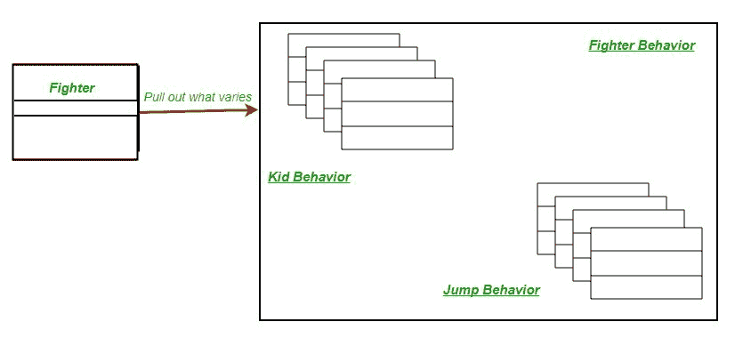
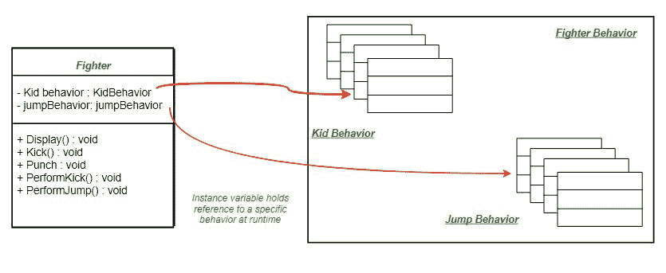
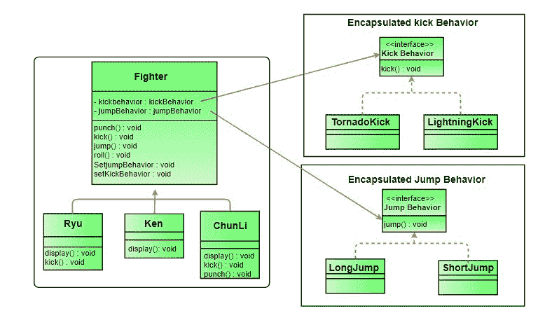

# 战略模式|第二集(实施)

> 原文:[https://www.geeksforgeeks.org/strategy-pattern-set-2/](https://www.geeksforgeeks.org/strategy-pattern-set-2/)

我们已经讨论了一个战斗机的例子，并在第 1 集介绍了战略模式。

[策略模式|第一集(简介)](https://www.geeksforgeeks.org/strategy-pattern-set-1/)

在这篇文章中，我们将战略模式应用于战斗机问题，并讨论其实施。

第一步是确定未来不同类别中可能不同的行为，并将其与其他行为分开。举个例子，让他们做踢腿跳的动作。为了分离这些行为，我们将从**战斗机**类中拉出这两种方法，并创建一组新的类来表示每个行为。



战斗机类现在将委托其踢跳行为，而不是使用战斗机类或其子类中定义的踢跳方法。



返工后，最终的类图将是(点击图片以获得更好的视图):


将我们的设计与封装踢腿和跳跃行为的策略模式的定义进行比较，这是两类算法。这些算法在实现中是可以互换的。

下面是相同的 Java 实现。

```
// Java program to demonstrate implementation of
// Strategy Pattern

// Abstract as you must have a specific fighter
abstract class Fighter
{
    KickBehavior kickBehavior;
    JumpBehavior jumpBehavior;

    public Fighter(KickBehavior kickBehavior,
                   JumpBehavior jumpBehavior)
    {
        this.jumpBehavior = jumpBehavior;
        this.kickBehavior = kickBehavior;
    }
    public void punch()
    {
        System.out.println("Default Punch");
    }
    public void kick()
    {
        // delegate to kick behavior
        kickBehavior.kick();
    }
    public void jump()
    {

        // delegate to jump behavior
        jumpBehavior.jump();
    }
    public void roll()
    {
        System.out.println("Default Roll");
    }
    public void setKickBehavior(KickBehavior kickBehavior)
    {
        this.kickBehavior = kickBehavior;
    }
    public void setJumpBehavior(JumpBehavior jumpBehavior)
    {
        this.jumpBehavior = jumpBehavior;
    }
    public abstract void display();
}

// Encapsulated kick behaviors
interface KickBehavior
{
    public void kick();
}
class LightningKick implements KickBehavior
{
    public void kick()
    {
        System.out.println("Lightning Kick");
    }
}
class TornadoKick implements KickBehavior
{
    public void kick()
    {
        System.out.println("Tornado Kick");
    }
}

// Encapsulated jump behaviors
interface JumpBehavior
{
    public void jump();
}
class ShortJump implements JumpBehavior
{
    public void jump()
    {
        System.out.println("Short Jump");
    }
}
class LongJump implements JumpBehavior
{
    public void jump()
    {
        System.out.println("Long Jump");
    }
}

// Characters
class Ryu extends Fighter
{
    public Ryu(KickBehavior kickBehavior,
               JumpBehavior jumpBehavior)
    {
        super(kickBehavior,jumpBehavior);
    }
    public void display()
    {
        System.out.println("Ryu");
    }
}
class Ken extends Fighter
{
    public Ken(KickBehavior kickBehavior,
               JumpBehavior jumpBehavior)
    {
        super(kickBehavior,jumpBehavior);
    }
    public void display()
    {
        System.out.println("Ken");
    }
}
class ChunLi extends Fighter
{
    public ChunLi(KickBehavior kickBehavior,
                  JumpBehavior jumpBehavior)
    {
        super(kickBehavior,jumpBehavior);
    }
    public void display()
    {
        System.out.println("ChunLi");
    }
}

// Driver class
class StreetFighter
{
    public static void main(String args[])
    {
        // let us make some behaviors first
        JumpBehavior shortJump = new ShortJump();
        JumpBehavior LongJump = new LongJump();
        KickBehavior tornadoKick = new TornadoKick();

        // Make a fighter with desired behaviors
        Fighter ken = new Ken(tornadoKick,shortJump);
        ken.display();

        // Test behaviors
        ken.punch();
        ken.kick();
        ken.jump();

        // Change behavior dynamically (algorithms are
        // interchangeable)
        ken.setJumpBehavior(LongJump);
        ken.jump();
    }
}
```

输出:

```
Ken
Default Punch
Tornado Kick
Short Jump
Long Jump

```

***参考文献:***
[头部优先设计图案](http://www.amazon.com/Head-First-Design-Patterns/dp/0596007124)

本文由**苏拉布·库马尔**供稿。如果你喜欢极客博客并想投稿，你也可以写一篇文章并把你的文章邮寄到 contribute@geeksforgeeks.org。看到你的文章出现在极客博客主页上，帮助其他极客。

如果您发现任何不正确的地方，或者您想分享关于上面讨论的主题的更多信息，请写评论