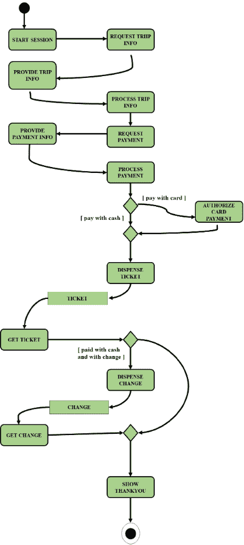
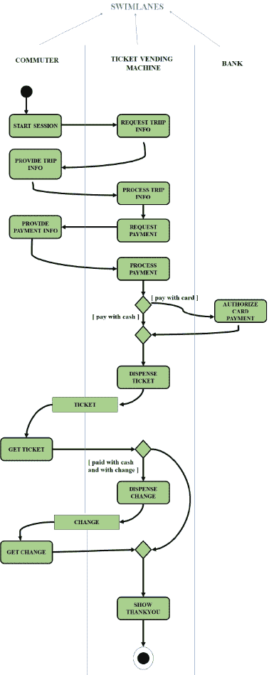

# 活动图中的泳道

> 原文:[https://www . geesforgeks . org/泳道活动图/](https://www.geeksforgeeks.org/swim-lanes-in-activity-diagram/)

[面向对象设计](https://www.geeksforgeeks.org/oops-object-oriented-design/)中的[活动图](https://www.geeksforgeeks.org/unified-modeling-language-uml-activity-diagrams/)就像流程车，显示组成复杂流程的步骤序列，如算法或工作流。活动图在设计阶段的初始阶段最有用。

**示例:**
自动售票机活动图示例如下:

上面的活动图没有显示哪个组织执行特定的活动

**泳道:**
泳道用于显示活动图中哪个组织执行哪些活动。车道是划定的边界，特定组织的活动与该组织的活动划在同一车道上。泳道必须以合理的方式订购。建议在活动图中少于五个泳道。泳道很好，因为它们将活动图对逻辑的描述与交互图对责任的描述结合在一起。

带泳道的“自动售票机”的上述活动图如下所示:

