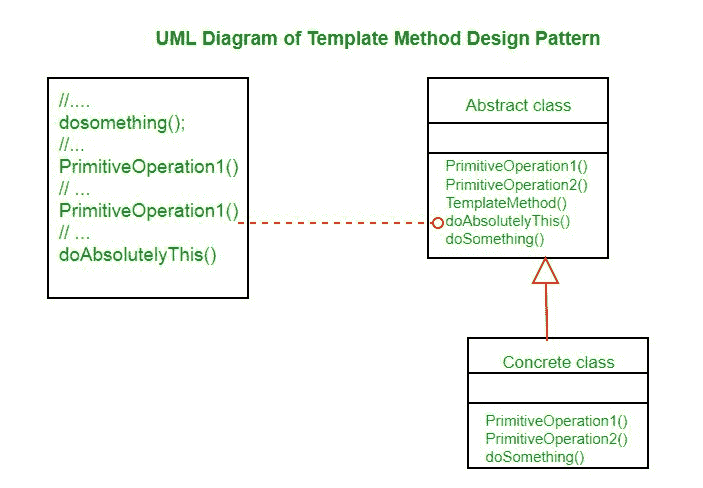

# 模板法设计模式

> 原文:[https://www . geesforgeks . org/template-method-design-pattern/](https://www.geeksforgeeks.org/template-method-design-pattern/)

模板方法设计模式是将一个算法定义为操作的骨架，并将细节留给子类实现。父类保留了算法的整体结构和顺序。
模板是指像 HTML 模板一样的预设格式，有固定的预设格式。同样，在模板方法模式中，我们有一个预设的结构方法，称为模板方法，它由步骤组成。这些步骤可以是一个抽象的方法，由它的子类实现。
这种行为设计模式是最容易理解和实现的模式之一。这种设计模式在框架开发中被广泛使用。这也有助于避免代码重复。



*资料来源:* [维基百科](https://en.wikipedia.org/wiki/Template_method_pattern)

*   **抽象类**包含 templateMethod()，它应该是最终的，这样就不会被覆盖。这个模板方法利用了其他可用的操作来运行算法，但是对于这些方法的实际实现是解耦的。这个模板方法使用的所有操作都是抽象的，所以它们的实现被推迟到子类。
*   **混凝土类**实现了在父类中被定义为抽象的 templateMethod 所需的所有操作。可以有许多不同的具体类。

**我们来看一个模板方法模式的例子。**

## Java 语言(一种计算机语言，尤用于创建网站)

```
abstract class OrderProcessTemplate
{
    public boolean isGift;

    public abstract void doSelect();

    public abstract void doPayment();

    public final void giftWrap()
    {
        try
        {
            System.out.println("Gift wrap successful");
        }
        catch (Exception e)
        {
            System.out.println("Gift wrap unsuccessful");
        }
    }

    public abstract void doDelivery();

    public final void processOrder(boolean isGift)
    {
        doSelect();
        doPayment();
        if (isGift) {
            giftWrap();
        }
        doDelivery();
    }
}

class NetOrder extends OrderProcessTemplate
{
    @Override
    public void doSelect()
    {
        System.out.println("Item added to online shopping cart");
        System.out.println("Get gift wrap preference");
        System.out.println("Get delivery address.");
    }

    @Override
    public void doPayment()
    {
        System.out.println
                   ("Online Payment through Netbanking, card or Paytm");
    }

    @Override
    public void doDelivery()
    {
        System.out.println
                    ("Ship the item through post to delivery address");
    }

}

class StoreOrder extends OrderProcessTemplate
{

    @Override
    public void doSelect()
    {
        System.out.println("Customer chooses the item from shelf.");
    }

    @Override
    public void doPayment()
    {
        System.out.println("Pays at counter through cash/POS");
    }

    @Override
    public void doDelivery()
    {
        System.out.println("Item delivered to in delivery counter.");
    }

}

class TemplateMethodPatternClient
{
    public static void main(String[] args)
    {
        OrderProcessTemplate netOrder = new NetOrder();
        netOrder.processOrder(true);
        System.out.println();
        OrderProcessTemplate storeOrder = new StoreOrder();
        storeOrder.processOrder(true);
    }
}
```

输出:

```
Item added to online shopping cart
Get gift wrap preference
Get delivery address.
Online Payment through Netbanking, card or Paytm
Gift wrap successful
Ship the item through post to delivery address

Customer chooses the item from shelf.
Pays at counter through cash/POS
Gift wrap successful
Item delivered to in delivery counter.
```

上面的例子处理订单处理流程。OrderProcessTemplate 类是一个包含算法框架的抽象类。如注释所示，processOrder()是包含流程步骤的方法。我们有两个子类 NetOrder 和 StoreOrder，它们具有相同的订单处理步骤。
因此，用于处理订单的整体算法在基类中定义，并由子类使用。但是各个操作的执行方式因子类而异。

**何时使用模板法**

模板方法用在框架中，每个框架实现一个领域架构的不变部分，为定制选项留下“占位符”。
使用模板法的原因如下:

*   让子类实现不同的行为(通过方法重写)
*   避免代码中的重复，一般的工作流结构在抽象类的算法中实现一次，必要的变化在子类中实现。
*   控制允许子类化的点。与简单的多态重写相反，在多态重写中，基本方法将被完全重写，允许对工作流进行彻底的更改，只允许更改工作流的特定细节。

**进一步阅读–**[Python 中的模板方法](https://www.geeksforgeeks.org/template-method-python-design-patterns/)
**参考:**
[维基百科](https://en.wikipedia.org/wiki/Template_method_pattern)
本文由 [**Saket Kumar**](https://github.com/saketkumar95) 供稿。如果你喜欢 GeeksforGeeks 并想投稿，你也可以使用[write.geeksforgeeks.org](https://write.geeksforgeeks.org)写一篇文章或者把你的文章邮寄到 review-team@geeksforgeeks.org。看到你的文章出现在极客博客主页上，帮助其他极客。
如果发现有不正确的地方，或者想分享更多关于上述话题的信息，请写评论。