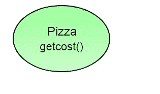
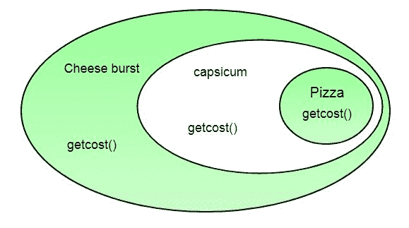
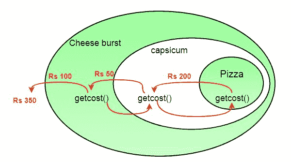
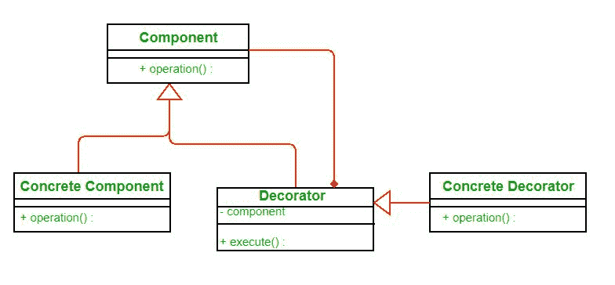

# 装饰者模式|第 2 集(介绍和设计)

> 原文:[https://www . geesforgeks . org/the-decorator-pattern-set-2-introduction-and-design/](https://www.geeksforgeeks.org/the-decorator-pattern-set-2-introduction-and-design/)

正如我们看到的，我们之前使用继承的设计并没有那么好。在本文中，装饰器模式是针对前面的设计问题而讨论的。

所以我们现在要做的是拿一个披萨，在运行时用配料“装饰”它:

1.  拿一个披萨物体。

  

2.  用辣椒物体“装饰”它。

3.  用奶酪爆裂物“装饰”它。
4.  调用 getCost()并使用委托而不是继承来计算浇头成本。
    

最后我们得到的是一个带有奶酪碎和辣椒浇头的比萨饼。将“装饰器”对象可视化为包装器。以下是装饰者的一些特性:

*   装饰者和他们装饰的物体有着相同的超级类型。
*   您可以使用多个装饰器来包装一个对象。
*   由于装饰者与对象具有相同的类型，我们可以传递装饰对象而不是原始对象。
*   我们可以在运行时装饰对象。

**定义:**

*装饰器模式动态地将额外的职责附加到对象上。装饰者为子类化提供了一个灵活的选择来扩展功能。*

**类图:T2【形象 src: [维基百科](https://upload.wikimedia.org/wikipedia/commons/thumb/e/e9/Decorator_UML_class_diagram.svg/600px-Decorator_UML_class_diagram.svg.png)**

*   每个组件都可以单独使用，也可以由装饰者包装。
*   每个装饰器都有一个实例变量，该变量保存对它装饰的组件的引用(HAS-A 关系)。
*   混凝土构件是我们要动态装饰的对象。

**优势:**

*   装饰器模式可以用来在运行时扩展(装饰)某个对象的功能。
*   装饰器模式是子类化的替代。子类化在编译时增加了行为，这个改变影响了原始类的所有实例；装饰可以在运行时为单个对象提供新的行为。
*   Decorator 提供了一种现收现付的方法来增加责任。您可以定义一个简单的类，并使用 Decorator 对象增量地添加功能，而不是试图在一个复杂的、可定制的类中支持所有可预见的特性。

**缺点:**

*   装饰器会使组件的实例化过程变得复杂，因为您不仅要实例化组件，还要用许多装饰器包装它。
*   让装饰者跟踪其他装饰者可能会很复杂，因为回顾装饰者链的多个层会使装饰者模式超出其真正的意图。

**参考文献:**

*   首个设计模式(书籍)
*   [https://Neil mor gan . WordPress . com/2010/02/07/decorator-pattern-正反两面/](https://neillmorgan.wordpress.com/2010/02/07/decorator-pattern-pros-and-cons/)
*   [https://en.wikipedia.org/wiki/Decorator_pattern](https://en.wikipedia.org/wiki/Decorator_pattern)
*   [http://stackoverflow . com/questions/4842978/decorator-pattern-vs-sub class](http://stackoverflow.com/questions/4842978/decorator-pattern-versus-sub-classing)

在下一篇文章中，我们将讨论装饰器模式的实现。

本文由**苏拉布·库马尔**供稿。如果你喜欢极客博客并想投稿，你也可以写一篇文章并把你的文章邮寄到 contribute@geeksforgeeks.org。看到你的文章出现在极客博客主页上，帮助其他极客。

如果您发现任何不正确的地方，或者您想分享更多关于上面讨论的主题的信息，请写评论