# 统一建模语言(UML) |活动图

> 原文:[https://www . geesforgeks . org/unified-modeling-language-UML-activity-diagrams/](https://www.geeksforgeeks.org/unified-modeling-language-uml-activity-diagrams/)

我们使用**活动图**来说明系统中的控制流程，并参考用例执行中涉及的步骤。我们使用活动图对顺序和并发活动建模。因此，我们基本上使用活动图直观地描述工作流。活动图关注的是流动的条件和流动发生的顺序。我们使用活动图来描述或描述导致特定事件的原因。

UML 模型基本上有三种类型的图，即结构图、交互图和行为图。活动图是**行为图**，即它描述了系统的行为。

活动图描绘了从起点到终点的控制流，显示了活动执行时存在的各种决策路径。我们可以使用活动图来描述活动的顺序处理和并发处理。它们用于业务和流程建模，主要用于描述系统的动态方面。

活动图非常类似于流程图。让我们了解一下活动图和流程图有什么不同:

### 活动图和流程图的区别–

流程图通常比活动图更早发明。非程序员使用流程图来建模工作流。例如:制造商使用流程图来解释和说明特定产品是如何制造的。我们可以把流程图称为活动图的原始版本。涉及决策的业务流程用流程图表示。

因此，程序员使用活动图(流程图的高级版本)来描述工作流。活动图是开发人员用来从高层次理解程序流程的**。这也使他们能够找出导致特定事件的约束和条件。如果正在进行复杂的决策，流程图就会汇聚成活动图。**

简洁是智慧的灵魂。我们需要清晰地传达大量信息，并确保信息简短。因此，活动图有助于双方(即商人和开发人员)互动和理解系统。

出现了一个问题:

**我们需要同时使用图表和文本文档吗？**
不同的个体有不同的偏好，他们在其中理解一些东西。例如:为了理解一个概念，有些人可能更喜欢有图像的书面教程，而另一些人则更喜欢视频讲座。
所以我们通常使用图表和文本文档来使我们的系统描述尽可能清晰。我们还需要对我们有时迎合的观众的需求保持敏感。

**用例图和活动图的区别**

活动图用于建模描述条件、约束、顺序和并发活动的工作流。另一方面，用例的目的只是描述功能，即系统做什么，而不是如何做。简单来说，活动图显示“如何”，而用例显示特定系统的“什么”。
两者的抽象层次也各不相同。活动图可以用来说明业务流程(高层实现)到独立算法(底层实现)。然而，用例的抽象程度很低。它们仅用于显示执行的**高水平**。

**图–**基于情绪的音乐播放器的活动图

上图描绘了基于情绪的音乐播放器的活动图，该音乐播放器也可以用于改变壁纸。

图表中使用的各种组件和标准符号解释如下。

### 活动图符号–

1.  **Initial State –** The starting state before an activity takes place is depicted using the initial state.

    
    **图–**初始状态或起始状态的符号

    一个流程只能有一个初始状态，除非我们描述嵌套活动。我们用一个黑色的实心圆来描述系统的初始状态。对于对象，这是它们被实例化时的状态。UML 活动图中的初始状态标记了入口点和初始活动状态。

    例如–这里的初始状态是应用程序打开之前的系统状态。

    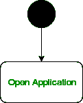
    **图–**正在使用的初始状态符号

2.  **Action or Activity State –** An activity represents execution of an action on objects or by objects. We represent an activity using a rectangle with rounded corners. Basically any action or event that takes place is represented using an activity.

    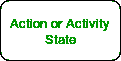
    **图–**活动状态的符号

    例如–考虑前面打开应用程序的示例打开应用程序是活动图中的活动状态。

    
    **图–**正在使用的活动状态符号

3.  **Action Flow or Control flows –** Action flows or Control flows are also referred to as paths and edges. They are used to show the transition from one activity state to another.

    
    **图–**控制流符号

    一个活动状态可以有多个传入和传出的操作流。我们用一条带有箭头的线来描绘控制流。如果在进行转换时有一个约束需要遵守，箭头上会提到它。

    考虑这个例子——在这里，两种状态都使用动作流符号(即箭头)转换到一个最终状态。

    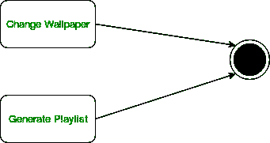
    **图–**使用动作流进行过渡

4.  **Decision node and Branching –** When we need to make a decision before deciding the flow of control, we use the decision node.

    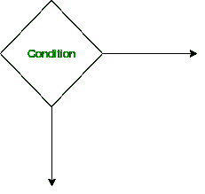
    **图–**表示决策节点

    决策节点的输出箭头可以用条件或保护表达式来标记。它总是包含两个或多个输出箭头。

    
    **图–**使用决策节点的活动图

5.  **Guards –** A Guard refers to a statement written next to a decision node on an arrow sometimes within square brackets.

    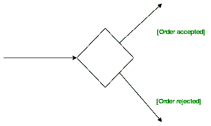
    **图–**决策节点旁边使用的守卫

    该语句必须为真，控件才能沿特定方向移动。卫士帮助我们了解决定流程的约束和条件。

6.  **Fork –** Fork nodes are used to support concurrent activities.

    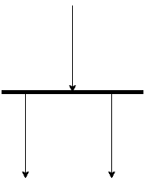
    **图─**fork 符号

    当我们使用一个分叉节点时，两个活动同时执行，也就是说，在将活动分成两部分之前不做任何决定。这两部分都需要在 fork 语句的情况下执行。
    我们使用一个圆形的实心矩形条来表示 Fork 符号，从父活动状态传入的箭头和指向新创建的活动的传出箭头。
    例如:在下面的例子中，煮咖啡的活动可以分成两个并发的活动，因此我们使用了 fork 符号。

    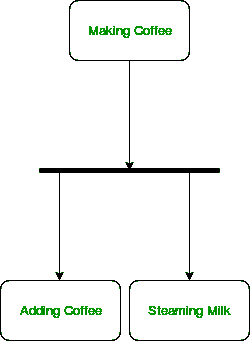
    **图–**一个使用叉子的图表

7.  **Join –** Join nodes are used to support concurrent activities converging into one. For join notations we have two or more incoming edges and one outgoing edge.

    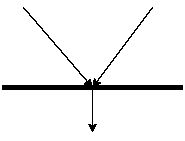
    **图–**连接符号

    例如，当两个活动，即蒸牛奶和加咖啡完成时，我们将它们聚合成最后一个活动。

    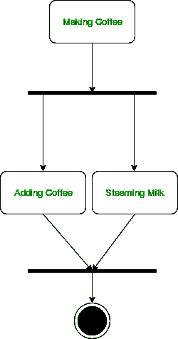
    **图–**使用连接符号的图表

8.  **Merge or Merge Event –** Scenarios arise when activities which are not being executed concurrently have to be merged. We use the merge notation for such scenarios. We can merge two or more activities into one if the control proceeds onto the next activity irrespective of the path chosen.

    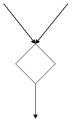
    **图–**合并批注

    例如——在下图中:我们不能让双方同时执行，但它们最终会合并成一个。一个数不能同时是奇数和偶数。

    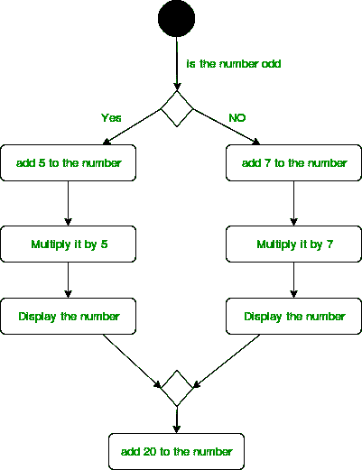
    **图–**使用合并符号的活动图

9.  **Swimlanes –** We use swimlanes for grouping related activities in one column. Swimlanes group related activities into one column or one row. Swimlanes can be vertical and horizontal. Swimlanes are used to add modularity to the activity diagram. It is not mandatory to use swimlanes. They usually give more clarity to the activity diagram. It’s similar to creating a function in a program. It’s not mandatory to do so, but, it is a recommended practice.

    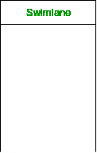
    **图–**泳道符号
    我们用一个矩形柱来表示泳道，如上图所示。

    例如，这里根据数字是奇数还是偶数执行不同的活动集。这些活动被归入一个泳道。

    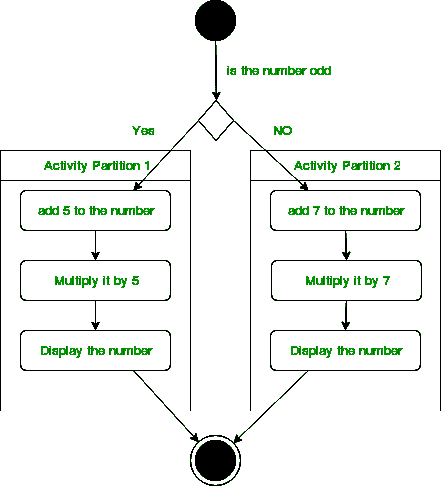
    **图–**利用泳道的活动图

10.  **Time Event –**

    
    **图–**时间事件批注

    我们可以有一个场景，其中一个事件需要一些时间来完成。我们用沙漏来表示时间事件。
    例如–让我们假设图像的处理需要花费大量时间。那么可以表示为如下所示。

    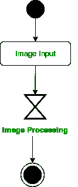
    **图–**使用时间事件的活动图

11.  **Final State or End State –** The state which the system reaches when a particular process or activity ends is known as a Final State or End State. We use a filled circle within a circle notation to represent the final state in a state machine diagram. A system or a process can have multiple final states.

    
    **图–**表示最终状态

### 如何绘制活动图–

1.  确定初始状态和最终状态。
2.  确定从初始状态达到最终状态所需的中间活动。
3.  识别导致系统改变控制流的条件或约束。
4.  用适当的符号画出图表。

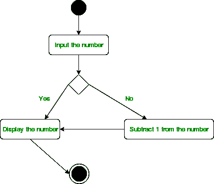
**图–**活动图

上图打印的是奇数，否则它会从数字中减去 1 并显示出来。

### 活动图的用途–

*   系统或过程的动态建模。
*   说明 UML 用例中涉及的各个步骤。
*   建模软件元素，如方法、操作和功能。
*   我们可以使用活动图来轻松地描述并发活动。
*   展示算法背后的约束、条件和逻辑。

**参考资料–**
[活动图–IBM](https://www.ibm.com/developerworks/rational/library/2802.html)
[活动图–sparksystems](http://www.sparxsystems.com.au/resources/uml2_tutorial/uml2_activitydiagram.html)

本文由 [**安基特·贾恩**](https://www.facebook.com/profile.php?id=100000412091676) 供稿。如果你喜欢 GeeksforGeeks 并想投稿，你也可以使用[contribute.geeksforgeeks.org](http://www.contribute.geeksforgeeks.org)写一篇文章或者把你的文章邮寄到 contribute@geeksforgeeks.org。看到你的文章出现在极客博客主页上，帮助其他极客。

如果你发现任何不正确的地方，或者你想分享更多关于上面讨论的话题的信息，请写评论。