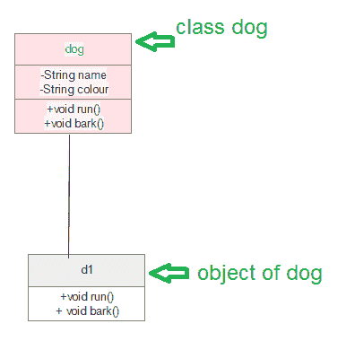
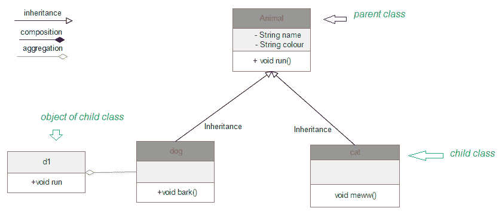
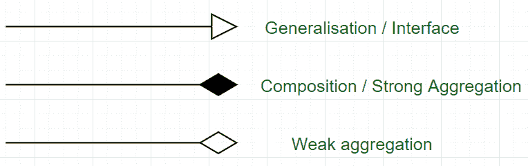

# 统一建模语言(UML) |类图

> 原文:[https://www . geesforgeks . org/unified-modeling-language-UML-class-diagrams/](https://www.geeksforgeeks.org/unified-modeling-language-uml-class-diagrams/)

**什么是**[**【UML】**](https://www.geeksforgeeks.org/unified-modeling-language-uml-introduction/)**？**
是用于可视化系统的通用建模语言。它是一种图形化语言，是软件行业的标准，用于指定、可视化、构建和记录软件系统的工件，以及用于业务建模。
**UML 的优势:**

*   简化复杂的软件设计，也可以像一个被广泛使用的概念一样实现 OOPs。
*   它减少了几个图表中成千上万字的解释，这可能会减少理解的时间消耗。
*   它让沟通更清晰，更真实。
*   它有助于在视图中获取整个系统。
*   一旦软件程序员对问题有了清晰的认识，他们就很容易实现实际需求。

**UML 的类型:**UML 图分为两部分:结构 UML 图和行为 UML 图，下面列出:

1.  结构化 UML 图
    *   类图
    *   包装图
    *   目标图
    *   组件图
    *   复合结构图
    *   配置图
2.  行为 UML 图
    *   活动图
    *   程序表
    *   用例图
    *   状态图
    *   通信图
    *   交互概述图
    *   时间图

**UML 类图:**类图是每一个面向对象方法的主要构件。类图可以用来显示类、关系、接口、关联和协作。UML 在类图中是标准化的。由于类是基于 OOPs 的应用程序的构建块，因此类图具有适当的结构来表示类、继承、关系以及 OOPs 在其上下文中的所有内容。它描述了各种对象以及它们之间的静态关系。
使用类图的主要目的是:

*   这是唯一能够恰当描述 OOPs 概念各个方面的 UML。
*   正确的应用程序设计和分析可以更快、更有效。
*   它是部署和组件图的基础。

有几种软件可以在线和离线绘制这些图表，如 Edraw max、lucid chart 等。绘制类图时，有几个要点需要重点关注。这些可以说是它的语法:

*   每个类由一个矩形表示，该矩形由三个部分组成:名称、属性和操作。
*   有三种类型的修饰符用于决定属性和操作的可见性。
    *   +用于公众可见性(面向所有人)
    *   #用于受保护的可见性(朋友和派生)
    *   –用于私人可见性(仅适用于我)

下面是动物类(父类)的例子，它有两个子类，狗和猫都有对象 d1，c1 继承父类的属性。



**在哪里使用类图？**

类图也被认为是组件和部署图的基础。类图不仅用于可视化系统的静态视图，还用于构建任何系统的正向和反向工程的可执行代码。

类图清晰地展示了与面向对象语言如 Java、C++等的映射。从实践经验来看，类图一般用于构造目的。

简而言之，可以说，类图用于

1.  描述系统的静态视图。
2.  显示静态视图元素之间的协作。
3.  描述系统执行的功能。
4.  使用面向对象语言构建软件应用程序。

## Java 语言(一种计算机语言，尤用于创建网站)

```
import java.io.*;

class GFG {
    public static void main(String[] args)
    {
        dog d1 = new dog();
        d1.bark();
        d1.run();
        cat c1 = new cat();
        c1.meww();
    }
}

class Animal {
    public void run()
    {
        String name;
        String colour;

        System.out.println("animal is running");
    }
}

class dog extends Animal {
    public void bark()
    {
        System.out.println("wooh!wooh! dog is barking");
    }
    public void run()
    {
        System.out.println("dog is running");
    }
}

class cat extends Animal {
    public void meww()
    {
        System.out.println("meww! meww!");
    }
}
```



**设计类图的过程:**在 Edraw max(或任何其他可以绘制类图的平台)中，按照以下步骤操作:

*   在类图部分打开一个空白文档。
*   从库中选择类图，然后单击创建选项。
*   在打开的模板页面上准备类的模型。
*   根据要求编辑后保存。

在制作/编辑模型时，有几个图表组件可以有效地使用。具体如下:

*   类{名称、属性、方法}
*   目标
*   连接
*   关系{继承、关联、概括}
*   关联{双向，单向}

类图是软件工程和业务建模领域中最广泛使用的图之一。
箭头的确切含义:

