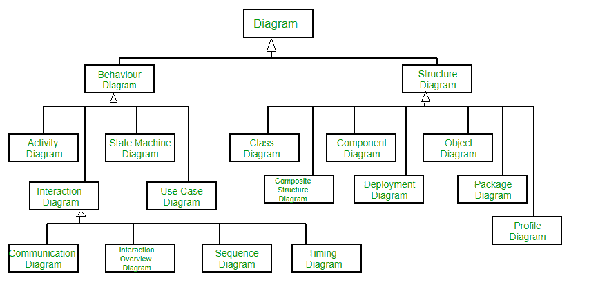

# 统一建模语言(UML) |简介

> 原文:[https://www . geesforgeks . org/unified-modeling-language-UML-introduction/](https://www.geeksforgeeks.org/unified-modeling-language-uml-introduction/)

**统一建模语言(UML)** 是一种通用的建模语言。UML 的主要目的是定义一种标准的方式来**可视化**系统的设计方式。它与其他工程领域使用的蓝图非常相似。

UML**不是编程语言**，而是一种可视化语言。我们使用 UML 图来描述系统的**行为和结构**。UML 帮助软件工程师、商人和系统架构师进行建模、设计和分析。对象管理小组在 1997 年采用统一建模语言作为标准。从那以后，它一直由 OMG 管理。国际标准化组织(ISO)在 2005 年发布了 UML 作为一个被认可的标准。UML 在过去的几年里已经被修改过了，并且被定期审查。

**我们真的需要 UML 吗？**

*   复杂的应用程序需要多个团队的协作和规划，因此需要一种清晰简洁的方式在他们之间进行沟通。
*   商人不懂代码。因此，UML 对于与非程序员交流系统的基本需求、功能和过程变得至关重要。
*   当团队能够可视化流程、用户交互和系统的静态结构时，可以节省大量时间。

UML 与**面向对象**设计分析相链接。UML 利用元素并在它们之间形成关联来形成图表。UML 中的图可以大致分类为:

1.  **结构图–**捕捉系统的静态方面或结构。结构图包括:组件图、对象图、类图和部署图。
2.  **行为图–**捕捉系统的动态方面或行为。行为图包括:用例图、状态图、活动图和交互图。

下图显示了根据 UML 2.2 的图表层次结构

### UML 中使用的面向对象概念–

1.  **类–**类定义了蓝图，即对象的结构和功能。
2.  **对象–**对象帮助我们分解大系统，帮助我们模块化我们的系统。模块化有助于将我们的系统分成可理解的组件，这样我们就可以一点一点地构建我们的系统。对象是用于描述实体的系统的基本单元(构建块)。
3.  **继承–**继承是子类继承父类属性的机制。
4.  **抽象–**对用户隐藏实现细节的机制。
5.  **封装–**将数据绑定在一起并保护其不受外部世界的影响称为封装。
6.  **多态性–**功能或实体能够以不同形式存在的机制。

**UML 2.0 中的新增内容–**

*   像敏捷这样的软件开发方法已经被纳入，并且最初的 UML 规范的范围已经扩大。
*   最初 UML 指定了 9 个图。UML 2.x 将图的数量从 9 个增加到了 13 个。添加的四个图是:时序图、通信图、交互概述图和复合结构图。UML 2.x 将状态图重命名为状态机图。
*   UML 2.x 增加了将软件系统分解成组件和子组件的能力。

### 结构 UML 图–

1.  **类图–**最广泛使用的 UML 图是类图。它是所有面向对象软件系统的构建模块。我们使用类图通过显示系统的类、方法和属性来描述系统的静态结构。类图还帮助我们识别不同类或对象之间的关系。
2.  **复合结构图–**我们使用复合结构图来表示一个类的内部结构及其与系统其他部分的交互点。复合结构图表示部件及其配置之间的关系，这些关系决定了分类器(类、组件或部署节点)的行为。它们表示利用部件、端口和连接器的结构化分类器的内部结构。我们也可以使用复合结构图来建模协作。它们类似于类图，只是与整个类相比，它们详细地表示了单个部分。
3.  **对象图–**对象图可以称为系统中的实例以及它们之间存在的关系的屏幕截图。因为对象图描述了对象被实例化时的行为，所以我们能够研究系统在特定时刻的行为。对象图类似于类图，只是它显示了系统中类的实例。我们利用类图来描述实际的分类器及其关系。另一方面，对象图表示特定时间点的类的具体实例以及它们之间的关系。
4.  **组件图–**组件图用于表示系统中的物理组件是如何组织的。我们用它们来模拟实现细节。组件图描述了软件系统元素之间的结构关系，并帮助我们理解功能需求是否已经被计划的开发所覆盖。当我们设计和构建复杂系统时，组件图变得非常重要。接口被系统的组件用来相互通信。
5.  **部署图–**部署图用于表示系统硬件及其软件。它告诉我们什么硬件组件存在，什么软件组件在上面运行。我们将系统架构描述为软件工件在分布式目标上的分布。工件是由系统软件生成的信息。它们主要用于在具有不同配置的多台机器上使用、分发或部署软件时。
6.  **包图–**我们使用包图来描述包及其元素是如何组织的。包图只是向我们展示了不同包之间的依赖关系以及包的内部组成。包帮助我们将 UML 图组织成有意义的组，并使图易于理解。它们主要用于组织类图和用例图。

### 行为图–

1.  **状态机图–**状态图用于表示系统或部分系统在有限时间内的状态。这是一个行为图，它用有限的状态转换来表示行为。状态图也被称为**状态机**和**状态图**。这些术语经常互换使用。简单来说，状态图被用来模拟一个类响应时间和变化的外部刺激的动态行为。
2.  **活动图–**我们使用活动图来说明系统中的控制流程。我们还可以使用活动图来引用用例执行中涉及的步骤。我们使用活动图对顺序和并发活动建模。因此，我们基本上使用活动图直观地描述工作流。活动图关注的是流动的条件和流动发生的顺序。我们使用活动图来描述或描述导致特定事件的原因。
3.  **用例图–**用例图用于描述系统的功能或系统的一部分。它们被广泛用于说明系统的功能需求及其与外部代理(参与者)的交互。用例基本上是表示系统可以使用的不同场景的图表。用例图为我们提供了系统或系统的一部分所做工作的高级视图，而不涉及实现细节。
4.  **序列图–**序列图简单地以顺序描述了对象之间的交互，即这些交互发生的顺序。我们还可以使用术语事件图或事件场景来指代序列图。序列图描述了系统中的对象如何以及以什么顺序运行。商人和软件开发人员广泛使用这些图表来记录和理解新系统和现有系统的需求。
5.  **通信图–**通信图(在 UML 1.x 中称为协作图)用于显示对象之间交换的有序消息。通信图主要关注对象及其关系。我们可以使用序列图来表示类似的信息，然而，通信图以自由的形式表示对象和链接。
6.  **时序图–**时序图是序列图的一种特殊形式，用于描述对象在一个时间范围内的行为。我们用它们来显示控制对象状态和行为变化的时间和持续时间约束。
7.  **交互概述图–**交互概述图对一系列动作进行建模，并帮助我们将复杂的交互简化为更简单的事件。它是活动图和序列图的混合。

**参考–**
[统一建模语言–维基百科](https://en.wikipedia.org/wiki/Unified_Modeling_Language)
[统一建模语言–IBM](https://www.ibm.com/developerworks/rational/library/769.html)

本文由 [**安基特·贾恩**](https://www.facebook.com/profile.php?id=100000412091676) 供稿。如果你喜欢 GeeksforGeeks 并想投稿，你也可以使用[contribute.geeksforgeeks.org](http://www.contribute.geeksforgeeks.org)写一篇文章或者把你的文章邮寄到 contribute@geeksforgeeks.org。看到你的文章出现在极客博客主页上，帮助其他极客。

如果你发现任何不正确的地方，或者你想分享更多关于上面讨论的话题的信息，请写评论。