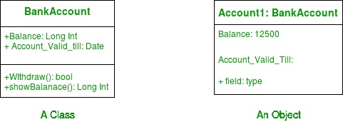
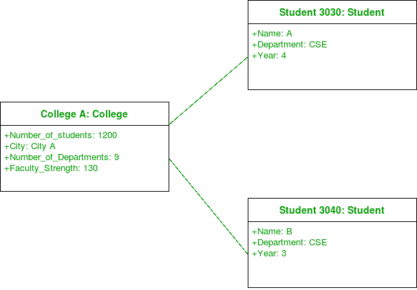
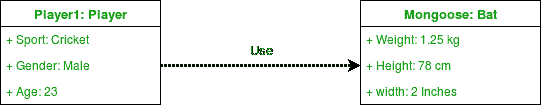
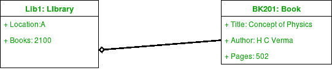
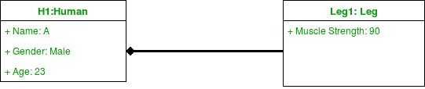

# 统一建模语言(UML) |对象图

> 原文:[https://www . geesforgeks . org/unified-modeling-language-UML-object-diagrams/](https://www.geeksforgeeks.org/unified-modeling-language-uml-object-diagrams/)

一个**对象图**可以被称为系统中的实例以及它们之间存在的关系的截图。因为对象图描述了对象被实例化时的行为，所以我们能够研究系统在特定时刻的行为。对象图对于描述和理解系统的功能需求至关重要。
换句话说，“统一建模语言(UML)中的对象图”，是显示在特定时间建模的系统**的结构的完整或部分视图**的图。”

**对象和类图的区别–**
对象图类似于类图，只是它显示了系统中类的实例。我们利用类图来描述实际的分类器及其关系。另一方面，对象图表示特定时间点的类的具体实例以及它们之间的关系。

**什么是量词？**

在 UML 中，分类器指的是一组具有一些共同特征的元素，比如方法、属性和操作。分类器可以被认为是一个抽象的元类，它为一组具有共同静态和动态特征的实例划定了边界。例如，我们在 UML 中将类、对象、组件或部署节点称为分类器，因为它们定义了一组公共属性。

对象图是一种结构图，它使用类似于类图的符号。我们能够通过实例化分类器来设计对象图。

**对象图**使用**真实世界示例**来描绘特定**时间点**的系统的性质和结构。由于我们能够使用对象中可用的数据，对象图提供了对象之间存在的关系**的**更清晰的视图**。**

**
**图–**一个类及其对应的对象**

### **对象图中使用的符号–**

1.  ****Objects or Instance specifications –** When we instantiate a classifier in a system, the object we create represents an entity which exists in the system.We can represent the changes in object over time by creating multiple instance specifications. We use a rectangle to represent an object in an Object Diagram. An object is generally linked to other objects in an object diagram.

    
    **图–**物体的符号

    例如–在下图中，学生类的两个对象链接到学院类的一个对象。

    
    **图–**使用一个链接和 3 个对象的对象图** 
2.  ****Links –** We use a link to represent a relationship between two objects.

    
    **图–**链接符号

    我们代表链接两端的参与者人数。我们使用术语关联来表示两个分类器之间的关系。术语链接用于指定两个实例规范或对象之间的关系。我们用实线来表示两个物体之间的联系。

    | 注释 | 意义 |
    | --- | --- |
    | 0..1 | 零还是一 |
    | one | 只有一个 |
    | 0..* | 零或更多 |
    | * | 零或更多 |
    | 1..* | 一个或多个 |
    | seven | 只有七个 |
    | 0..2 | 零或两个 |
    | 4..7 | 四点到七点 |** 
3.  ****Dependency Relationships –** We use a dependency relationship to show when one element depends on another element.

    
    **图–**为依存关系的符号

    类图、组件图、部署图和对象图使用依赖关系。依赖关系用于描述系统中依赖实体和独立实体之间的关系。一个元素的定义或结构的任何变化都可能导致另一个元素的变化。这是两个对象之间的一种单向关系。
    依赖关系是用关键字(有时在尖括号内)指定的各种类型。

    抽象、绑定、实现、替换和使用是 UML 中使用的依赖关系类型。
    例如–下图中，Player 类的一个对象依赖(或使用)Bat 类的一个对象。

    
    **图–**使用依赖关系的对象图** 
4.  ****Association –** Association is a reference relationship between two objects (or classes).

    
    **图–**为关联符号

    每当一个对象使用另一个对象时，它就被称为关联。当一个对象引用另一个对象的成员时，我们使用关联。关联可以是单向的或双向的。我们用箭头表示联想。
    例如–订单类的对象与客户类的对象相关联。

    
    **图–**使用关联的对象图** 
5.  ****Aggregation –** Aggregation represents a “has a” relationship.

    
    **图–**表示聚合

    聚合是一种特定的关联形式。聚合比普通关联更具体。这是一种代表部分整体或部分关系的关联。这是一种亲子关系，但不是继承。当所包含对象的生命周期不强烈依赖于容器对象的生命周期时，就会发生聚合。

    
    **图–**使用聚合的对象图

    例如——图书馆与书籍有聚合关系。图书馆有书或者书是图书馆的一部分。书籍的存在独立于图书馆的存在。在实现时，聚合和关联之间没有太大区别。我们在包含对象上使用一个空心菱形，用一条线将它与包含的对象连接起来。** 
6.  ****Composition –** Composition is a type of association where the child cannot exist independent of the other.

    
    **图–**构图符号

    作文也是一种特殊的联想。也是一种亲子关系，但不是继承。以一个男孩 Gurkaran 为例:Gurkaran 由腿和胳膊组成。在这里，古尔卡兰与他的腿和胳膊有一种构成关系。在这里，如果没有它们的父对象的存在，腿和手臂就不能存在。所以每当孩子不可能独立存在的时候，我们就用一种组合关系。我们在包含对象上使用一个填充菱形，用一条线将它连接到包含对象。

    
    **图–**使用构图的物体图

    例如–在下图中，考虑对象 Bank1。在这里，没有银行的存在，账户就不能存在。

    
    **图–**银行是由账户组成的** 

### **关联和依赖的区别–**

**联想和依赖在用法上经常混淆。混乱的一个来源是 UML 1 中临时链接的使用。元模型现在在 UML 2 中以不同的方式处理，这个问题已经解决了。**

**系统中有大量的依赖关系。我们只代表那些对理解系统至关重要的信息。我们需要明白，每一个关联本身都暗示着一种依赖。然而，我们不喜欢单独画它。关联意味着一种类似于一般化的依赖。**

### **如何绘制对象图？**

1.  **为系统绘制所有必要的类图。**
2.  **确定需要系统快照的关键时间点。**
3.  **确定涵盖系统关键功能的对象。**
4.  **确定绘制的对象之间的关系。**

### **对象图的用途–**

*   **使用原型实例和真实数据为系统的静态设计(类似于类图)或结构建模。**
*   **帮助我们理解系统应该向用户提供的功能。**
*   **理解对象之间的关系。**
*   **可视化、记录、构建和设计一个静态框架，展示系统生命动态故事中的对象实例及其关系。**
*   **通过使用对象图作为特定的测试用例来验证类图的完整性和准确性。**
*   **发现特定实例之间的事实和依赖关系，并描述分类器的特定示例。**

**本文由 [**安基特·贾恩**](https://www.facebook.com/profile.php?id=100000412091676) 供稿。如果你喜欢 GeeksforGeeks 并想投稿，你也可以使用[contribute.geeksforgeeks.org](http://www.contribute.geeksforgeeks.org)写一篇文章或者把你的文章邮寄到 contribute@geeksforgeeks.org。看到你的文章出现在极客博客主页上，帮助其他极客。**

**如果你发现任何不正确的地方，或者你想分享更多关于上面讨论的话题的信息，请写评论。**