# 统一建模语言(UML) |序列图

> 原文:[https://www . geesforgeks . org/unified-modeling-language-UML-序列图/](https://www.geeksforgeeks.org/unified-modeling-language-uml-sequence-diagrams/)

在这篇文章中，我们讨论序列图。**统一建模语言(UML)** 是软件工程领域的一种建模语言，旨在建立标准的方式来可视化系统的设计。UML 指导创建多种类型的图，如交互图、结构图和行为图。
A **序列图**是最常用的**交互**图。

**交互图–**
交互图用来展示系统的**交互行为**。由于可视化系统中的交互可能是一项麻烦的任务，我们使用不同类型的交互图来捕捉系统中交互的各种特征和方面。

**序列图–**
序列图简单地描述了对象之间按顺序进行的交互，即这些交互发生的顺序。我们还可以使用术语事件图或事件场景来指代序列图。序列图描述了系统中的对象如何以及以什么顺序运行。商人和软件开发人员广泛使用这些图表来记录和理解新系统和现有系统的需求。

### 序列图符号–

1.  **Actors –** An actor in a UML diagram represents a type of role where it interacts with the system and its objects. It is important to note here that an actor is always outside the scope of the system we aim to model using the UML diagram.
    

    
**Figure –** notation symbol for actor

    我们使用演员来描绘各种角色，包括人类用户和其他外部主体。我们使用棒人符号在 UML 图中表示一个参与者。我们可以在序列图中有多个参与者。
    例如–在这里，座位预订系统中的用户显示为参与者，它存在于系统之外，不是系统的一部分。

    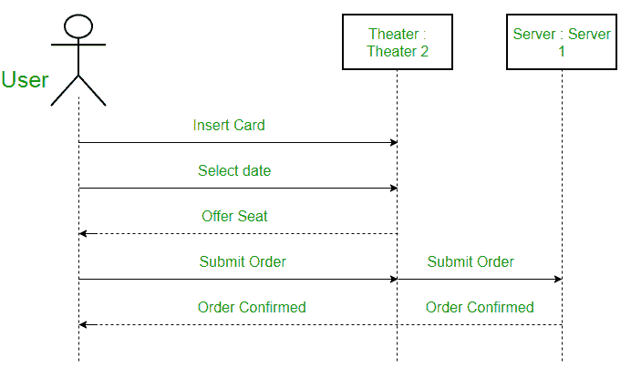

    
**Figure –** an actor interacting with a seat reservation system

2.  **Lifelines –** A lifeline is a named element which depicts an individual participant in a sequence diagram. So basically each instance in a sequence diagram is represented by a lifeline. Lifeline elements are located at the top in a sequence diagram. The standard in UML for naming a lifeline follows the following format – Instance Name : Class Name
    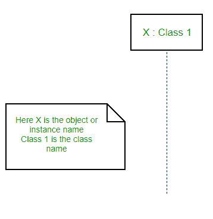

    
**Figure –** lifeline

    我们在一个名为 head 的矩形中显示一条生命线及其名称和类型。头部位于垂直虚线(称为阀杆)的顶部，如上图所示。如果我们想对一个未命名的实例建模，我们遵循相同的模式，只是现在生命线名称的部分保留为空。

    **生命线和行动者之间的区别–**生命线总是描绘系统内部的对象，而行动者用于描绘系统外部的对象。下面是一个序列图的例子:

    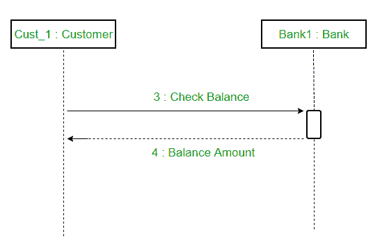

    
**Figure –** a sequence diagram

3.  **消息–**对象之间的通信使用消息来描述。消息在生命线上按顺序出现。我们用箭头表示信息。生命线和消息构成了序列图的核心。
    消息可大致分为以下几类**类别** :
    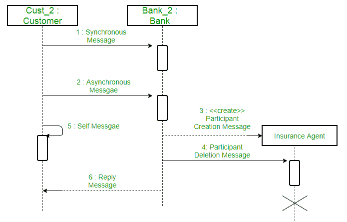

    
**图–**不同类型消息的序列图

    *   **同步消息–**同步消息等待回复，然后交互才能继续。发送者等待，直到接收者完成消息的处理。只有当呼叫者知道接收者已经处理了先前的消息，即它接收到回复消息时，它才继续。面向对象编程中的大量调用是同步的。我们使用实心箭头来表示同步消息。
        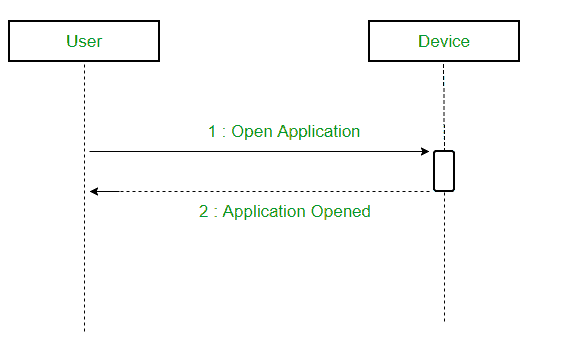

        
**图–**使用同步消息的序列图

    *   **Asynchronous Messages –** An asynchronous message does not wait for a reply from the receiver. The interaction moves forward irrespective of the receiver processing the previous message or not. We use a lined arrow head to represent an asynchronous message.

        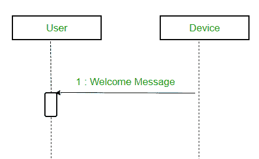

    *   **创建消息–**我们使用一个创建消息来实例化序列图中的一个新对象。在某些情况下，特定的消息调用需要创建对象。它用虚线箭头表示，并在箭头上标注创建单词，以指定它是创建消息符号。
        例如，在电子商务网站上创建新订单需要创建订单类的新对象。
        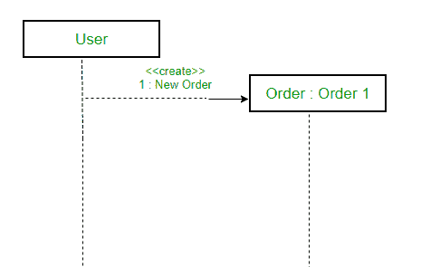

        
**图–**使用创建消息的情况

    *   **删除消息–**我们使用删除消息来删除对象。当一个对象被释放内存或在系统中被销毁时，我们使用删除消息符号。它会破坏系统中对象的出现。它由以 x 结尾的箭头表示。
        例如–在下面的场景中，当用户收到订单时，订单类的对象可以被销毁。
        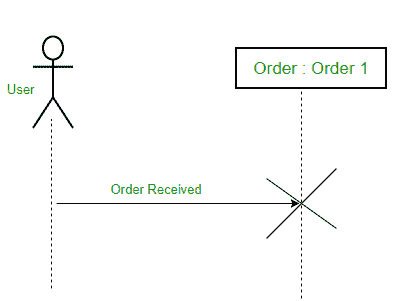

        
**图–**使用删除消息的场景

    *   **Self Message –** Certain scenarios might arise where the object needs to send a message to itself. Such messages are called Self Messages and are represented with a U shaped arrow.
        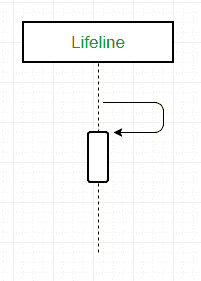

        
**Figure –** self message

        例如–考虑设备想要访问其网络摄像头的场景。这样的场景用一个自我消息来表示。
        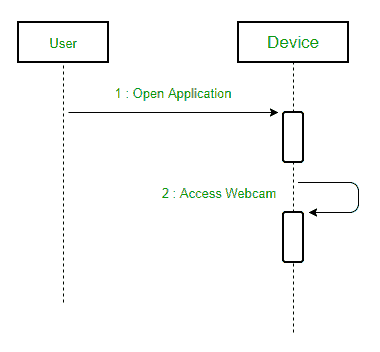

        
**Figure –** a scenario where a self message is used

    *   **Reply Message –** Reply messages are used to show the message being sent from the receiver to the sender. We represent a return/reply message using an open arrowhead with a dotted line. The interaction moves forward only when a reply message is sent by the receiver.

        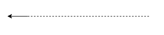

        
**Figure –** reply message

        例如–考虑设备向用户请求照片的场景。这里显示正在发送的照片的消息是回复消息。

        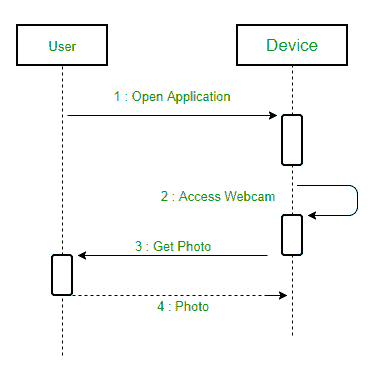

        
**Figure –** a scenario where a reply message is used

    *   **Found Message –** A Found message is used to represent a scenario where an unknown source sends the message. It is represented using an arrow directed towards a lifeline from an end point. For example: Consider the scenario of a hardware failure.

        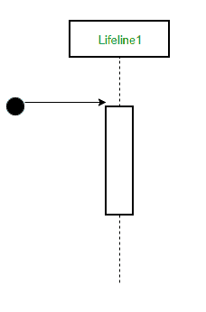

        
**Figure –** found message

        

        这可能是由多种原因造成的，我们不确定是什么原因导致了硬件故障。
        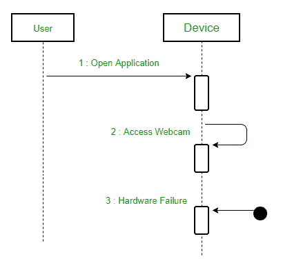

        
**Figure –** a scenario where found message is used

        *   **Lost Message –** A Lost message is used to represent a scenario where the recipient is not known to the system. It is represented using an arrow directed towards an end point from a lifeline. For example: Consider a scenario where a warning is generated.

            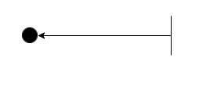

            
**Figure –** lost message

            该警告可能是为用户或生命线与之交互的其他软件/对象生成的。由于事先不知道目的地，我们使用了丢失消息符号。

            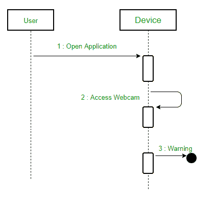

            
**Figure –** a scenario where lost message is used

            

        

4.  **Guards –** To model conditions we use guards in UML. They are used when we need to restrict the flow of messages on the pretext of a condition being met. Guards play an important role in letting software developers know the constraints attached to a system or a particular process.

    例如:为了能够提取现金，余额大于零是必须满足的条件，如下所示。
    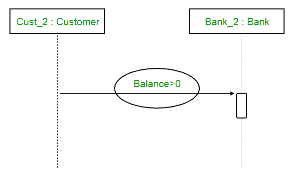

    
**Figure –** sequence diagram using a guard

**基于情感的音乐播放器的序列图–**

**Figure –** a sequence diagram for an emotion based music player

上面的序列图描述了基于情绪的音乐播放器的序列图:

1.  首先，用户打开应用程序。
2.  然后，该设备可以访问网络摄像头。
3.  网络摄像头捕捉用户的图像。
4.  该设备使用算法来检测人脸和预测情绪。
5.  然后，它向数据库请求可能情绪的字典。
6.  从数据库中检索情绪。
7.  情绪被显示给用户。
8.  音乐是从数据库中请求的。
9.  播放列表被生成并最终显示给用户。

### 序列图的使用–

*   用于模拟和可视化复杂功能、操作或程序背后的逻辑。
*   它们也用于显示 UML 用例图的细节。
*   用于了解当前或未来系统的详细功能。
*   可视化消息和任务如何在系统中的对象或组件之间移动。

**参考资料–**
[序列图–IBM](https://www.ibm.com/developerworks/rational/library/3101.html)
[序列图–sparksystems](http://www.sparxsystems.com/resources/uml2_tutorial/uml2_sequencediagram.html)

本文由 [**安基特·贾恩**](https://www.facebook.com/profile.php?id=100000412091676) 供稿。如果你喜欢 GeeksforGeeks 并想投稿，你也可以使用[contribute.geeksforgeeks.org](http://www.contribute.geeksforgeeks.org)写一篇文章或者把你的文章邮寄到 contribute@geeksforgeeks.org。看到你的文章出现在极客博客主页上，帮助其他极客。

如果你发现任何不正确的地方，或者你想分享更多关于上面讨论的话题的信息，请写评论。