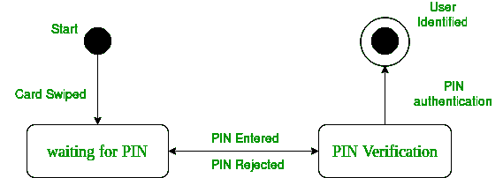
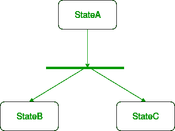
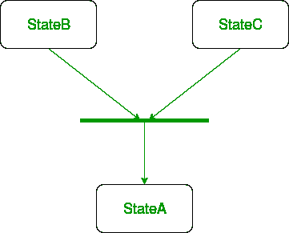
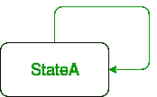
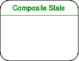
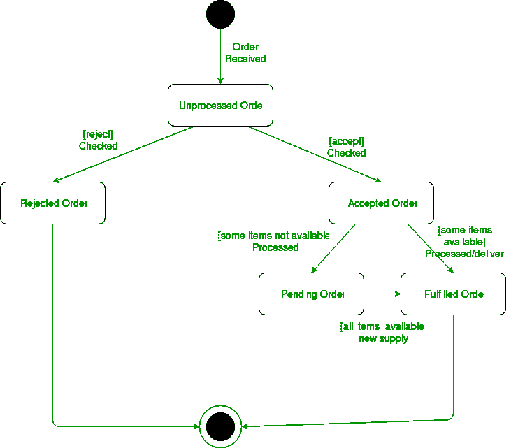

# 统一建模语言(UML) |状态图

> 原文:[https://www . geesforgeks . org/unified-modeling-language-UML-state-diagrams/](https://www.geeksforgeeks.org/unified-modeling-language-uml-state-diagrams/)

一个**状态图**用于表示系统或系统的一部分在有限时间内的状态。这是一个**行为**图，它使用有限状态转换来表示行为。状态图也称为**状态机**和**状态图**。这些术语经常互换使用。简单来说，状态图被用来模拟一个类响应时间和变化的外部刺激的动态行为。我们可以说每一个类都有一个状态，但是我们不会用状态图来建模每一个类。我们更喜欢用三个或更多的州来模拟州。

**状态图的使用–**

*   我们用它来陈述导致状态变化的事件(我们没有显示是什么过程导致了这些事件)。
*   我们用它来模拟系统的动态行为。
*   理解对象/类对内部或外部刺激的反应。

首先让我们了解什么是**行为图**？UML 中有两种类型的图:

1.  **结构图–**用于对系统的静态结构进行建模，例如——类图、包图、对象图、部署图等。
2.  **行为图–**用于模拟系统随时间的动态变化。它们用于建模和构建系统的功能。因此，行为图只是使用用例图、交互图、活动图和状态图来指导我们完成系统的功能。

**状态图和流程图的区别–**
状态图的基本目的是描述类状态的各种变化，而不是引起变化的过程或命令。然而，另一方面**流程图**描绘了在执行时改变类或类的对象的状态的过程或命令。

**Figure –** a state diagram for user verification

上面的状态图显示了特定系统的验证子系统或类存在的不同状态。

### 状态图的基本组件–

1.  **Initial state –** We use a black filled circle represent the initial state of a System or a class.

    

    
**Figure –** initial state notation

2.  **Transition –** We use a solid arrow to represent the transition or change of control from one state to another. The arrow is labelled with the event which causes the change in state.

    

    
**Figure –** transition

3.  **状态–**我们用一个圆角矩形来表示一个状态。状态表示一个类的对象在某一时刻的条件或环境。
    

    
**图–**状态批注

4.  **Fork –** We use a rounded solid rectangular bar to represent a Fork notation with incoming arrow from the parent state and outgoing arrows towards the newly created states. We use the fork notation to represent a state splitting into two or more concurrent states.

    

    
**Figure –** a diagram using the fork notation

5.  **Join –** We use a rounded solid rectangular bar to represent a Join notation with incoming arrows from the joining states and outgoing arrow towards the common goal state. We use the join notation when two or more states concurrently converge into one on the occurrence of an event or events.

    

    
**Figure –** a diagram using join notation

6.  **Self transition –** We use a solid arrow pointing back to the state itself to represent a self transition. There might be scenarios when the state of the object does not change upon the occurrence of an event. We use self transitions to represent such cases.

    

    
**Figure –** self transition notation

7.  **Composite state –** We use a rounded rectangle to represent a composite state also.We represent a state with internal activities using a composite state.

    

    
**Figure –** a state with internal activities

8.  **Final state –** We use a filled circle within a circle notation to represent the final state in a state machine diagram.

    

    
**Figure –** final state notation

### 绘制状态图的步骤–

1.  确定初始状态和最终终止状态。
2.  识别对象可能存在的状态(不同属性对应的边界值指导我们识别不同的状态)。
3.  标记触发这些转换的事件。

**示例–**在线订单的状态图–

**Figure –** state diagram for an online order

我们绘制的 UMl 图取决于我们要表示的系统。以下只是一个在线订购系统的示例:

1.  在收到订单的情况下，我们从初始状态转换到未处理订单状态。
2.  然后检查未处理的订单。
3.  如果订单被拒绝，我们会转到“拒绝订单”状态。
4.  如果订单被接受，并且我们有可用的项目，我们将转移到已履行的订单状态。
5.  但是，如果这些项目不可用，我们会转移到“待定订单”状态。
6.  订单完成后，我们将过渡到最终状态。在本例中，我们将两种状态，即已完成订单和已拒绝订单合并为一个最终状态。

**注意–**在这里，我们也可以将已完成订单和已拒绝订单分别视为最终状态。

**参考–**
[状态图–IBM](https://www.ibm.com/support/knowledgecenter/en/SS6RBX_11.4.2/com.ibm.sa.oomethod.doc/com.ibm.sa.oomethod.doc_eclipse-gentopic9.html)

本文由 [**安基特·贾恩**](https://www.facebook.com/profile.php?id=100000412091676) 供稿。如果你喜欢 GeeksforGeeks 并想投稿，你也可以使用[contribute.geeksforgeeks.org](http://www.contribute.geeksforgeeks.org)写一篇文章或者把你的文章邮寄到 contribute@geeksforgeeks.org。看到你的文章出现在极客博客主页上，帮助其他极客。

如果你发现任何不正确的地方，或者你想分享更多关于上面讨论的话题的信息，请写评论。