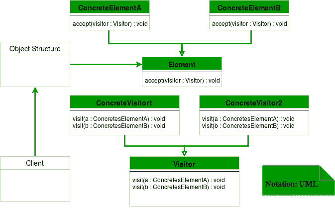

# 访客设计模式

> 原文:[https://www.geeksforgeeks.org/visitor-design-pattern/](https://www.geeksforgeeks.org/visitor-design-pattern/)

访客设计模式是行为设计模式之一。当我们必须对一组相似类型的对象执行操作时，就会用到它。借助访问者模式，我们可以将操作逻辑从对象转移到另一个类。

访问者模式由两部分组成:

*   一个名为 **Visit()** 的方法，由访问者实现，并为数据结构中的每个元素调用
*   提供接受访问者的 **Accept()** 方法的可访问类

**UML 图访问者设计模式**



**设计组件**

*   **客户端:**客户端类是访问者设计模式的类的消费者。它可以访问数据结构对象，并可以指示它们接受访问者来执行适当的处理。
*   **Visitor :** 这是一个接口或抽象类，用于声明所有类型的 visitable 类的访问操作。
*   **具体访问者:**对于每种类型的访问者，必须实现抽象访问者中声明的所有访问方法。每个访问者将负责不同的操作。
*   **visible:**这是一个声明接受操作的接口。这是允许访问者对象“访问”对象的入口点。
*   **混凝土可访问性:**这些类实现了可访问性接口或类，并定义了接受操作。使用接受操作将访问者对象传递给该对象。

**我们来看一个 Java 中 Visitor 设计模式的例子。**

```
interface ItemElement
{
    public int accept(ShoppingCartVisitor visitor);
}

class Book implements ItemElement
{
    private int price;
    private String isbnNumber;

    public Book(int cost, String isbn)
    {
        this.price=cost;
        this.isbnNumber=isbn;
    }

    public int getPrice() 
    {
        return price;
    }

    public String getIsbnNumber() 
    {
        return isbnNumber;
    }

    @Override
    public int accept(ShoppingCartVisitor visitor) 
    {
        return visitor.visit(this);
    }

}

class Fruit implements ItemElement 
{
    private int pricePerKg;
    private int weight;
    private String name;

    public Fruit(int priceKg, int wt, String nm)
    {
        this.pricePerKg=priceKg;
        this.weight=wt;
        this.name = nm;
    }

    public int getPricePerKg() 
    {
        return pricePerKg;
    }

    public int getWeight() 
    {
        return weight;
    }

    public String getName()
    {
        return this.name;
    }

    @Override
    public int accept(ShoppingCartVisitor visitor) 
    {
        return visitor.visit(this);
    }

}

interface ShoppingCartVisitor 
{

    int visit(Book book);
    int visit(Fruit fruit);
}

class ShoppingCartVisitorImpl implements ShoppingCartVisitor
{

    @Override
    public int visit(Book book)
    {
        int cost=0;
        //apply 5$ discount if book price is greater than 50
        if(book.getPrice() > 50)
        {
            cost = book.getPrice()-5;
        }
        else 
            cost = book.getPrice();

        System.out.println("Book ISBN::"+book.getIsbnNumber() + " cost ="+cost);
        return cost;
    }

    @Override
    public int visit(Fruit fruit) 
    {
        int cost = fruit.getPricePerKg()*fruit.getWeight();
        System.out.println(fruit.getName() + " cost = "+cost);
        return cost;
    }

}

class ShoppingCartClient 
{

    public static void main(String[] args) 
    {
        ItemElement[] items = new ItemElement[]{new Book(20, "1234"),
                              new Book(100, "5678"), new Fruit(10, 2, "Banana"),
                              new Fruit(5, 5, "Apple")};

        int total = calculatePrice(items);
        System.out.println("Total Cost = "+total);
    }

    private static int calculatePrice(ItemElement[] items) 
    {
        ShoppingCartVisitor visitor = new ShoppingCartVisitorImpl();
        int sum=0;
        for(ItemElement item : items)
        {
            sum = sum + item.accept(visitor);
        }
        return sum;
    }

}
```

**Output:**

```
Book ISBN::1234 cost =20
Book ISBN::5678 cost =95
Banana cost = 20
Apple cost = 25
Total Cost = 160

```

这里，在实现 if accept()方法中所有的项都是相同的但它可以是不同的。例如，可以有逻辑来检查项目是否空闲，然后根本不调用 visit()方法。

**优势:**

*   如果操作的逻辑改变了，那么我们只需要在访问者实现中进行改变，而不是在所有的项目类中进行改变。
*   向系统中添加一个新项目很容易，只需要在访问者界面和实现中进行更改，现有的项目类不会受到影响。

**缺点:**

*   我们应该在设计时知道 visit()方法的返回类型，否则我们将不得不更改接口及其所有实现。
*   如果访问者接口的实现太多，就很难扩展。

**c++中访问者模式的另一个例子**

```
//Write CPP code here

#include <iostream>
using namespace std;

class Stock
{
  public:
    virtual void accept(class Visitor *) = 0;

};

class Apple : public Stock
{
  public:
    /*virtual*/ void accept(Visitor *);
    void buy()
    {
        cout << "Apple::buy\n";
    }
    void sell()
    {
        cout << "Apple::sell\n";
    }

};
class Google : public Stock
{
  public:
    /*virtual*/ void accept(Visitor *);
    void buy()
    {
        cout << "Google::buy\n";
    }

    void sell()
    {
        cout << "Google::sell\n";
    }
};

class Visitor
{
  public:
    virtual void visit(Apple *) = 0;
    virtual void visit(Google *) = 0;
    //private:
    static int m_num_apple, m_num_google;
    void total_stocks()
    {
        cout << "m_num_apple " << m_num_apple 
             << ", m_num_google " << m_num_google << '\n';
    }
};
int Visitor::m_num_apple = 0;
int Visitor::m_num_google = 0;
class BuyVisitor : public Visitor
{
  public:
    BuyVisitor()
    {
        m_num_apple = m_num_google = 0;
    }
    /*virtual*/ void visit(Apple *r)
    {
        ++m_num_apple;
        r->buy();
        cout << "m_num_apple " << m_num_apple << endl;
    }
    /*virtual*/ void visit(Google *b)
    {
        ++m_num_google;
        b->buy();
        cout << " m_num_google " << m_num_google << '\n';
    }
};

class SellVisitor : public Visitor
{
  public:
    /*virtual*/ void visit(Apple *a)
    {

        --m_num_apple;
        a->sell();
        cout << "m_num_apple " << m_num_apple << endl;
    }
    /*virtual*/ void visit(Google *g)
    {
        --m_num_google;
        g->sell();
        cout << "m_num_google " << m_num_google << endl;
    }
};

void Apple::accept(Visitor *v)
{
    v->visit(this);
}

void Google::accept(Visitor *v)
{
    v->visit(this);
}

int main()
{
    Stock *set[] = { new Apple, new Google, new Google,
                     new Apple, new Apple, 0 };

    BuyVisitor buy_operation;
    SellVisitor sell_operation;
    for (int i = 0; set[i]; i++)
    {
        set[i]->accept(&buy_operation);
    }
    buy_operation.total_stocks();

    for (int i = 0; set[i]; i++)
    {

        set[i]->accept(&sell_operation);
    }
    sell_operation.total_stocks();
}
```

**Output:**

```
Apple::buy
m_num_apple 1
Google::buy
 m_num_google 1
Google::buy
 m_num_google 2
Apple::buy
m_num_apple 2
Apple::buy
m_num_apple 3
m_num_apple 3, m_num_google 2
Apple::sell
m_num_apple 2
Google::sell
m_num_google 1
Google::sell
m_num_google 0
Apple::sell
m_num_apple 1
Apple::sell
m_num_apple 0
m_num_apple 0, m_num_google 0

```

本文由 **[Saket Kumar](https://github.com/saketkumar95)** 供稿。如果你喜欢 GeeksforGeeks 并想投稿，你也可以使用[contribute.geeksforgeeks.org](http://www.contribute.geeksforgeeks.org)写一篇文章或者把你的文章邮寄到 contribute@geeksforgeeks.org。看到你的文章出现在极客博客主页上，帮助其他极客。

如果你发现任何不正确的地方，或者你想分享更多关于上面讨论的话题的信息，请写评论。