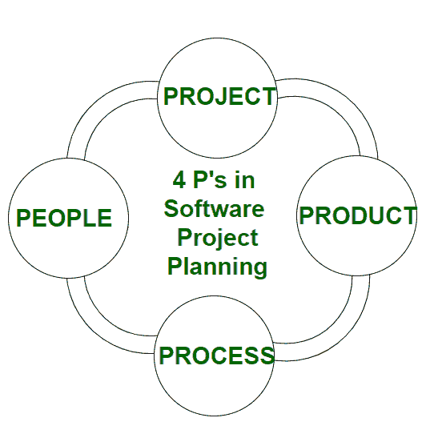

# 软件项目规划中的管理谱| 4p

> 原文:[https://www . geesforgeks . org/4-PS-in-software-project-planning/](https://www.geeksforgeeks.org/4-ps-in-software-project-planning/)

为了正确地构建一个产品，有一个非常重要的概念，我们在开发产品时都应该知道。软件项目规划中有 4 个关键组成部分，被称为**4P**，即:

*   产品
*   过程
*   人
*   项目

这些组件在您的项目中起着非常重要的作用，可以帮助您的团队实现其目标。现在，让我们深入了解其中的每一个细节，以便更好地理解:

*   **人**
    一个产品及其成功实施最重要的组成部分是人力资源。在构建一个合适的产品时，一个管理良好的团队，为每个人/团队定义明确的角色，将导致产品的成功。为了节省时间、成本和精力，我们需要一个好的团队。软件项目规划中的一些指定角色是**项目经理、团队领导、利益相关者、分析师、**和其他**信息技术专业人员**。成功地管理人是一个棘手的过程，一个好的项目经理可以做到。
*   **产品**
    顾名思义，这是项目的可交付成果或成果。项目经理应明确定义产品范围，以确保成功的结果，控制团队成员，以及他或她在产品构建过程中可能遇到的技术障碍。产品可以是有形的，也可以是无形的，比如将公司转移到一个新的地方，或者在一家公司获得一个新的软件。
*   **流程**
    在每一个规划中，一个明确定义的流程是任何产品成功的关键。它规定了团队如何在各自的时间段内进行开发。这个过程包括几个步骤，如文档阶段、实现阶段、部署阶段和交互阶段。
*   **项目**
    软件项目规划最后也是最后一个 P 是 Project。在这个阶段，项目经理起着至关重要的作用。他们负责指导团队成员实现项目的目标和目的，帮助&协助他们解决问题，检查成本和预算，并确保项目在给定的期限内保持正轨。