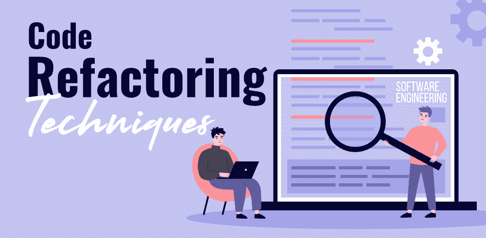
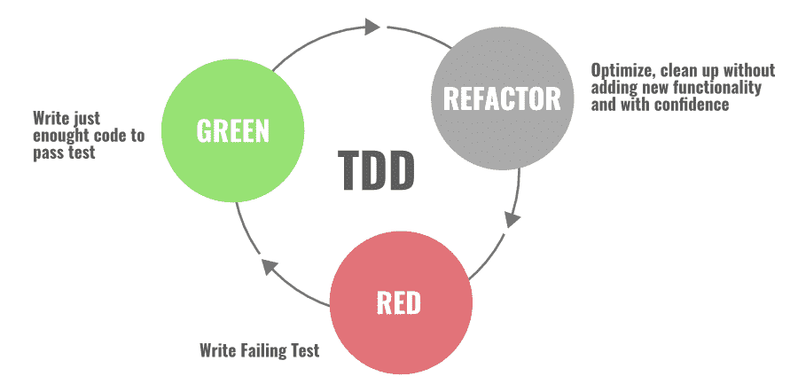
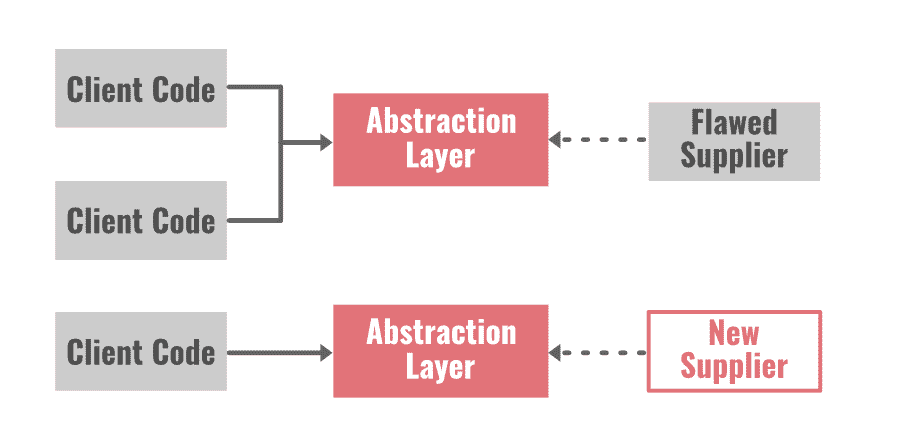
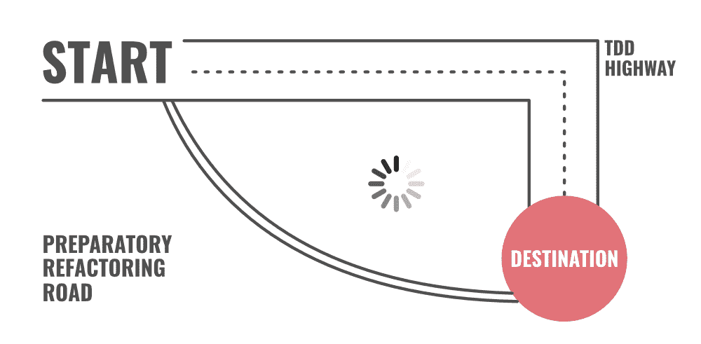

# 7 软件工程中的代码重构技术

> 原文:[https://www . geesforgeks . org/7-代码-重构-软件工程中的技术/](https://www.geeksforgeeks.org/7-code-refactoring-techniques-in-software-engineering/)

**作为一名开发人员，你如何开始一个新项目的工作…？？**

首先你收集一些基本的需求，然后根据需求，你开始一个接一个地实现这个特性。随着项目的进展和对项目的更多了解，您会不断添加和更改代码库中的代码。稍后，您还将更改代码以修复 bug 和边缘情况。

***但是几天或几个月后会发生什么呢……？你的代码看起来怎么样？？复杂吗？很难理解吗？*** 如果是，那么肯定是你没有注意改进代码或者重组代码。你可能在没有查看现有代码的情况下编写了一些重复的代码，或者你可能编写了一些更长的方法/函数、大型类、太多的参数、不直观的变量名、代码放置等。

在不改变软件功能或应用程序外部行为的情况下改进或更新代码被称为代码重构。它降低了技术成本，使代码更加高效和可维护。如果你不早点关注代码重构过程，你将会为你的代码中的错误付出代价。所以不要忽略清理代码。

在软件开发过程中，不同的开发人员有不同的代码编写风格。他们进行更改，维护代码，扩展代码，大多数时候他们离开代码而没有持续的重构。未重构的代码往往会*代码腐烂:*代码中有很多的混乱和杂乱，例如重复的代码、类或包之间不健康的依赖关系、类的不良分配职责、每个方法或类的职责太多等等。为了避免所有这些问题，持续的重构很重要。

现在的问题是……***重构代码有哪些技巧？**T3】*

我们将讨论一些常见的重构代码的技术，但是在此之前，让我们讨论一些快速的技巧…

#### 提示:

*   您需要分几步执行代码重构。在你的程序中做微小的改变，每一个微小的改变都会让你的代码稍微好一点，让应用程序处于工作状态。
*   在重构过程中进行小的更改后，运行测试 TDD 和 CI。如果不运行这些测试，就会产生引入 bug 的风险。
*   在重构过程中，不要创建任何新的特性或功能。在现有代码中添加任何更新或新功能之前，您应该重构代码。
*   重构过程会影响测试结果，所以让你的质量保证和测试团队参与重构过程是很好的。
*   你需要接受你不会完全满意你的代码。您重构的代码将在不久的将来过时，您将不得不再次重构它。

### 最常见的代码重构技术

有许多方法和技术可以重构代码。让我们讨论一些流行的…

### 1.红绿重构

红绿是敏捷软件开发过程中最流行和最广泛使用的代码重构技术。这项技术遵循“测试优先”的设计和实现方法，这为所有形式的重构奠定了基础。开发人员主动将重构引入到测试驱动的开发周期中，并将其分为三个区域步骤。

*   **红色:**第一步从写失败的“红色-测试”开始。你停下来看看需要开发什么。
*   **绿色:**第二步，你编写足够简单的代码，让开发通过“绿色”测试。
*   **重构:**在最后一步和第三步中，您专注于改进和增强代码，保持测试绿色。

因此，基本上，这项技术有两个不同的部分:第一部分涉及编写向系统添加新功能的代码，第二部分涉及重构执行该功能的代码。请记住，在工作流程中，您不应该同时做这两件事。

### 2.抽象重构

当需要进行大量重构时，开发人员通常会使用这种技术。我们主要使用这种技术来减少代码中的冗余(重复)。这包括类继承、 层次结构、创建新的类和接口、 抽取、 用委托替换继承，反之亦然。

**上拉/下推** 法就是这种方法最好的例子。

*   **上拉方法:**将代码部分拉入超类，帮助  消除代码重复。
*   **下推方法:**它从超类中取出代码部分，并将其下移至子类中。

P 拉起构造函数体，提取子类，提取超类，折叠层次，形成模板方法，提取接口，用代替继承委托，用继承代替委托，推下字段这些都是其他例子。

基本上，在这个技术、中，我们为系统中那些需要重构的部分和最终要替换它的对应部分构建抽象层。下面给出了两个常见的例子……

*   **封装** **字段:**我们用 getter 和 setter 方法强制代码访问该字段。
*   **泛化类型:**我们创建了更多的通用类型来允许代码共享，用状态的替换类型检查代码，用多态性替换条件等。

### 3.作曲方法

在应用程序的开发阶段，很多时候我们会在程序中编写长方法。这些 l ong 方法  让你的代码极难理解也很难更改。在这种情况下，主要使用合成方法。

在这种方法中、我们使用流线方法来减少代码中的重复。一些例子有:提取方法，提取一个变量，内联温度，用查询替换温度，内联方法，拆分临时变量，删除参数赋值等。

**提取:**我们将代码分成更小的块，以找到并提取碎片。之后、我们为这些组块、创建单独的方法，然后用对这个新方法的调用来代替、。抽取涉及类、接口、和局部变量。

**内联:**这个方法去掉了我们程序中不必要的方法的数量。我们找到所有对方法的调用，然后我们用方法的内容替换所有的调用。之后、我们从程序中删除该方法。

### 4.简化方法

这种方法涉及两种技术……让我们来讨论这两种技术。

*   **简化条件表达式重构:**编程中的条件语句随着时间的推移变得更加逻辑和复杂。你需要简化代码中的逻辑来理解整个程序。
    重构代码和简化逻辑的方法有很多。其中有:合并条件表达式和复制条件片段、分解条件、用多态替换条件、去掉控制标志、用 guard 子句替换嵌套条件等。
*   **简化方法调用重构:**在这种方法中，我们使方法调用更简单，更容易理解。我们致力于类之间的交互，并为它们简化接口。
    示例有:添加、移除和引入新参数，用显式方法和方法调用替换参数，参数化方法，从修饰符中单独查询，保留整个对象，移除设置方法、等。

### 5。在对象之间移动特征

在这种技术中，我们创建新的类，并在新旧类之间安全地移动功能。我们对公共访问隐藏了实现细节。

***现在的问题是……什么时候在类之间移动功能，或者如何识别是时候在类之间移动功能了？**T3】*

当你发现一个类有如此多的责任，并且有太多的事情正在发生，或者当你发现一个类是不必要的，并且在应用程序中什么都不做时，你可以将代码从这个类移到另一个类中，并将其完全删除。

例如:移动 a 字段，提取类，移动方法，内联类，隐藏委托，引入 a 外方法，移除中间人，引入局部扩展等。

### 6.预备性重构

当您注意到在应用程序中添加一些新功能时需要重构时，最好使用这种方法。所以基本上它是软件更新的一部分，有一个单独的重构过程。如果您注意到代码需要在特性开发的早期阶段进行更新，那么您就为自己节省了未来的技术债务。

最终用户看不到工程团队如此一致的努力，但是开发应用程序的开发人员在构建应用程序时会发现重构代码的价值。如果他们能花些时间更早地更新代码，就能节省时间、金钱和其他资源。

> *“就好像我想往东走 100 英里，但我不会只是在树林里闲逛，我会向北行驶 20 英里到高速公路，然后我会往东走 100 英里，速度是我直接去那里的三倍。当人们推着你直接去那里时，有时你需要说，‘等等，我需要查看地图，找到最快的路线。’预备重构为我做到了这一点。”*
> 
> [杰西卡·克尔](https://twitter.com/jessitron)(软件开发人员)

### **7。用户界面重构**

您可以在用户界面中进行简单的更改，并重构代码。例如:对齐输入字段，应用字体，用活动语音倒带表示格式，应用常用按钮大小，增加颜色对比度等。

### 最后的话

您需要将代码重构过程视为清理有序的房子。家里不必要的杂乱会造成混乱和紧张的环境。书面代码也是如此。一个干净且组织良好的代码总是易于更改、易于理解和维护。如果你早点关注代码重构过程，以后就不会遇到困难了。

两个最有影响力的软件开发人员马丁·福勒和 T2·肯特·贝克花时间解释了代码重构过程及其技术。他们还就这个主题写了一本完整的书[重构:改进现有代码的设计](https://martinfowler.com/books/refactoring.html)。这本书描述了各种重构技术，并清楚地解释了如何处理这些重构过程。如果您想深入了解代码重构过程，我们建议您阅读这本书。