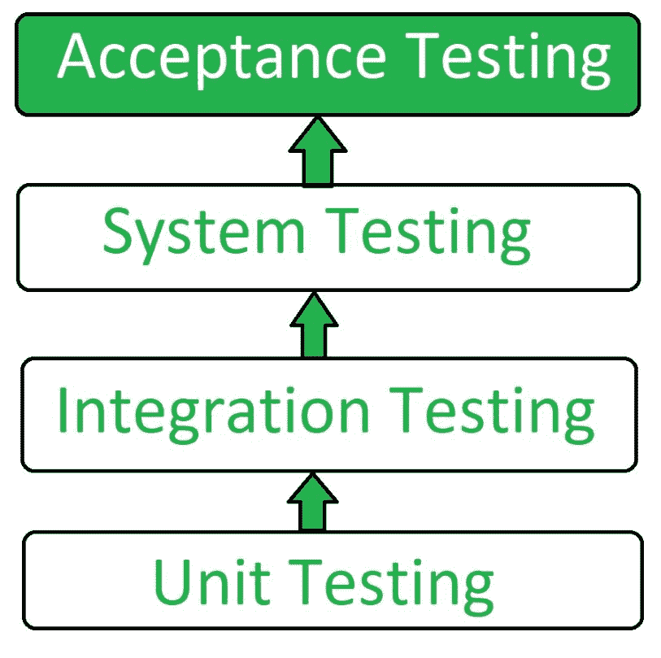

# 验收测试|软件测试

> 原文:[https://www . geesforgeks . org/验收-测试-软件-测试/](https://www.geeksforgeeks.org/acceptance-testing-software-testing/)

先决条件–[软件测试|基础知识](https://www.geeksforgeeks.org/software-testing-basics/)、[软件测试类型](https://www.geeksforgeeks.org/types-software-testing/)
验收测试是一种软件测试方法，在该方法中，对系统进行可接受性测试。该测试的主要目的是评估系统是否符合业务需求，并评估它是否可以交付。

**验收测试的标准定义:**

> 它是根据用户需求、需求和业务流程进行的正式测试，目的是确定系统是否满足验收标准，并使用户、客户或其他授权实体能够确定是否接受系统。

验收测试是软件测试的最后一个阶段，在系统测试之后，系统投入实际使用之前进行。

**验收测试类型:**

1.  **用户验收测试(UAT):**
    用户验收测试用于确定产品是否为用户正常工作。客户经常使用的特定需求主要是为了测试目的而挑选的。这也被称为*最终用户*测试。
2.  **业务验收测试(BAT):**
    BAT 用于确定产品是否符合业务目标和目的。最佳可得技术主要侧重于业务利润，由于市场条件和新技术的不断变化，这些利润极具挑战性，因此当前的实施可能不得不改变，从而导致额外的预算。
3.  **Contract Acceptance Testing (CAT):**
    CAT is a contract which specifies that once the product goes live, within a predetermined period, the acceptance test must be performed and it should pass all the acceptance use cases.
    Here is a contract termed as Service Level Agreement (SLA), which includes the terms where the payment will be made only if the Product services are in-line with all the requirements, which means the contract is fulfilled.

    有时，这个合同发生在产品上线之前。在测试周期、测试领域、后期遇到的问题的条件、付款等方面，应该有一个明确的合同。

4.  **Regulations Acceptance Testing (RAT):**
    RAT is used to determine whether the product violates the rules and regulations that are defined by the government of the country where it is being released. This may be unintentional but will impact negatively on the business.

    一般来说，要在市场上发布的产品或应用程序必须在 RAT 下进行，因为不同的国家或地区有其管理机构定义的不同规则和条例。如果任何国家或地区违反了任何规则和条例，则该产品将不会在该国家或地区发布。如果产品被发布，即使有违规行为，那么只有产品的供应商将直接负责。

5.  **运行验收测试(OAT):**
    OAT 用于确定产品的运行准备状态，属于非功能性测试。主要包括恢复性、兼容性、可维护性、可靠性等测试。
    OAT 保证产品在投放生产前的稳定性。
6.  **Alpha Testing:**
    Alpha Testing 是由一个专门的测试人员团队(通常称为 alpha testers)在开发测试环境中用来确定产品。
7.  **Beta 测试:**
    Beta 测试用于通过将产品展示给真正的最终用户来评估产品，通常在他们的环境中称为 Beta 测试员。从用户那里收集反馈，并修复缺陷。此外，这有助于增强产品以提供丰富的用户体验。

**验收测试的使用:**

*   找出在功能测试阶段遗漏的缺陷。
*   产品开发得有多好。
*   产品是顾客真正需要的。
*   反馈有助于改善产品性能和用户体验。
*   尽量减少或消除生产中出现的问题。