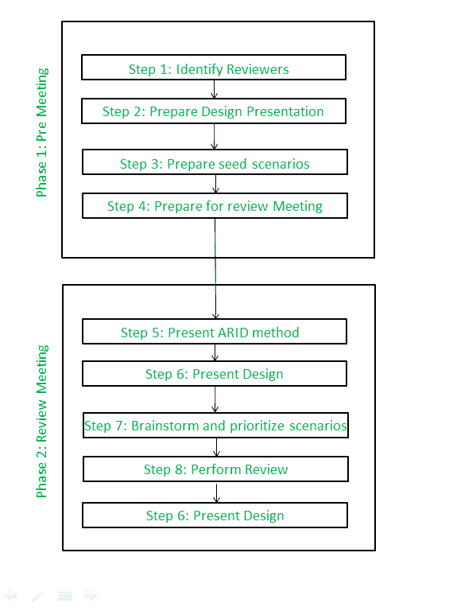

# 软件体系结构中中间设计的主动评审

> 原文:[https://www . geesforgeks . org/active-reviews-for-intermediate-design-and-in-software-architecture/](https://www.geeksforgeeks.org/active-reviews-for-intermediate-designs-arid-in-software-architectures/)

**中间设计的主动评审(ARD):**
主动设计评审和 ATAM 都用于评估初步设计。在主动设计评审中，利益相关者会收到详细的文档，然后自行完成练习问卷。ATAM 被用来评估整个建筑，而不是其中的一部分。

ATAM 和 ADR 在评估软件架构和设计方面都有很强的素质，但是仍然需要一些东西来提供对设计策略的早期洞察。因此，通过结合以利益相关者为中心、基于场景的架构评估方法，像 ATAM 和 ARD 的设计规范，干旱诞生了。

ARD 是一种简单、轻量级的评估方法，它是通过将 ADR 和评估策略(如 ATAM)相结合而形成的，侧重于适用性，不需要完整的架构文档。

**干旱参与者:**
干旱过程的主要参与者是干旱评审团队(主持人、抄写员和提问者)、软件架构师/首席设计师和评审员。

1.  **干旱审查小组:**由三个角色组成:
    *   **主持人–**
        主持人与软件架构师一起准备评审会议，并在会议召开时提供帮助。
    *   **抄写员–**
        抄写员在审查会议中记录问题和结果。
    *   **提问者–**
        一个或多个提问者在审查会议期间提出问题、提问并协助创建场景。
2.  **软件架构师/首席设计师:**
    软件架构师(或设计师)是设计的代言人，负责设计的准备、展示以及参与。
3.  **The reviewers :**
    The reviewers are drawn from the community of stakeholders of the design, people who have an interest in its adequacy and usability, and the software engineers who are expected to use the design.

    **干旱步骤:**
    干旱过程分两个阶段进行，包括九个步骤:

    

    干旱的步骤

    **ARD 的第 1 阶段**是作为主要设计师和评审主持人之间的会议进行的。

    *   **第 1 步:确定评审者–**
        首席设计师和主持人共同确定应该出席评审的人员。
    *   **第二步:准备设计展示–**
        设计师准备设计的简要说明。这一步的目标是展示足够详细的设计，以便有知识的观众可以使用设计。这里，在第一阶段，设计师给评审主持人做了一个演示的演练。
    *   **第三步:准备种子场景–**
        设计师和评审主持人准备一套种子场景。与 ATAM 的种子场景一样，这些场景旨在向有机会看到样本集的审阅者说明场景的概念。
    *   **第 4 步:准备评审会议–**
        演示文稿、种子方案和评审议程的副本将在主评审会议期间分发给评审人员。

    在**第 2 阶段，**评审人员集合，会议开始。

4.  **第 5 步:展示干旱方法–**
    复习辅导者花 30 分钟向参与者解释干旱的步骤。
5.  **Step-6 : Present design –**
    The lead designer presents two – hour overview presentation and walks through examples. During this time, a ground rule is that no questions concerning implementation or rationale are allowed, nor are suggestions about alternate designs. Goal is to see if design is usable, not to find out why things are done in a certain way, or to learn about implementation secrets behind interfaces. Questions of factual clarification are allowed and encouraged. Facilitator enforces this rule during presentation.

    在这段时间里，抄写员抓住了每个问题，或者每个实例，在这些实例中，设计者指出那种资源(通常是一种文档)正在路上，但还不可用。总结结果列表，以显示设计人员在设计完成并准备投入生产之前应解决的潜在问题。

6.  **第 7 步:头脑风暴并优先考虑场景–**
    就像在 ATAM 一样，参与者建议使用设计来解决他们期望面临的问题的场景。在头脑风暴中，所有场景都有公平的机会。然后种子场景也被保存在池中。然后，获得最多投票的场景将用于测试可用性设计。
7.  **第 8 步:执行评审–**
    考虑到投票率最高的场景，主持人要求评审人员共同编写代码，使用设计服务来解决场景带来的问题。在审查考虑的场景后，团队得出结论。
8.  **第 9 步:给出结论–**
    最后，对问题清单进行了重新统计，并对参与者进行了问卷调查，以了解他们对评审工作有效性的看法。