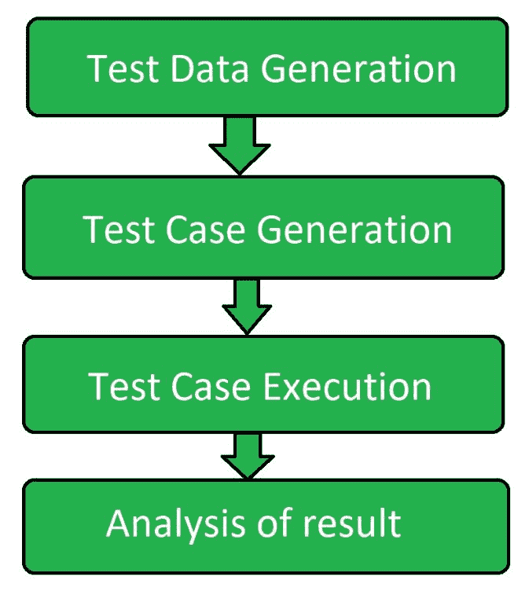

# 主动软件测试

> 原文:[https://www.geeksforgeeks.org/active-software-testing/](https://www.geeksforgeeks.org/active-software-testing/)

**主动测试**是[软件测试](https://www.geeksforgeeks.org/software-testing-basics/)的一种，测试人员引入测试数据并进行结果分析。
在执行主动测试的过程中，测试人员构建了被测软件的虚拟模型，该模型随着与软件的交互的继续而不断发展和完善。
在这种类型的测试中，测试人员自己与软件交互，检查可能会产生哪种类型的问题。

**主动测试的目标:**
主动测试的目标是:

*   验证软件的质量。
*   验证软件的质量。
*   使软件符合用户需求。
*   使软件标准化。
*   检查用户使用软件时的行为。
*   检测软件中可能影响软件功能的问题和缺陷。
*   快速运行可用性测试。

**主动测试流程:**
以下是关于如何执行主动测试的描述。

**测试数据生成:**
为了以适当的方式执行主动测试，首先由测试人员创建一组输入数据。测试人员确保在创建以下数据时，软件中可能存在一些问题。

**测试用例生成:**
测试数据集生成后，由测试人员创建与之相关的不同测试用例。这包含软件行为可能改变的数据集的各种组合。这是根据各种用户便利性创建的，并且测试者期望这种类型的数据可以由终端用户作为输入给出。

**测试用例执行:**
在成功创建测试数据和测试用例之后，进一步执行执行过程，测试人员将测试用例交给软件进行处理。这个阶段是测试过程的主要阶段，因为在这个阶段软件对特定输入的实际行为被观察。

**结果分析:**
测试用例成功执行后，测试人员分析特定测试用例下系统的实际行为，决定软件是否符合最终用户需求。

**主动测试技术:**
有两种技术用于执行主动测试。这些是:

**功能测试:**
该技术根据用户需求生成测试用例，验证软件的正确性。

**结构测试:**
在这种技术中，测试用例是根据测试标准从软件的程序中派生出来的。

**主动测试的优势:**
主动测试的优势有:

*   它有助于快速解决缺陷。
*   它使软件高效工作。
*   验证了软件的正确性。